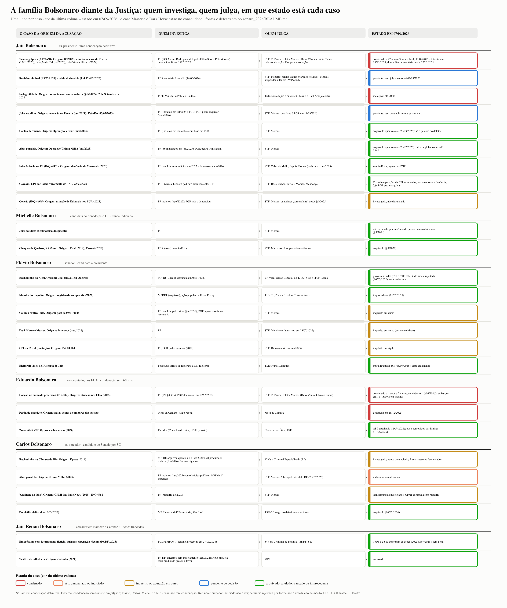

# A família Bolsonaro diante da Justiça: quem investiga, quem julga, quais são as provas e de onde vieram as acusações

**Estado em 07/09/2026.** Este dossiê toma cada membro da família Bolsonaro com processo ou inquérito conhecido e responde, caso a caso, a cinco perguntas: de onde veio a acusação, quem investiga, quem julga, quais provas foram apresentadas e o que a defesa diz, e em que ponto o caso está hoje. Entram também os casos que caíram: arquivados, anulados, trancados ou julgados improcedentes, porque a lista do que não se sustentou diz tanto quanto a do que se sustentou. O caso Banco Master e o filme Dark Horse ficam no [consolidado](../consolidado_2005_2026/README.md), com um ponteiro aqui.

A régua é a mesma do repositório: **[P]** prova ou ato formal (decisão, documento oficial, operação, admissão); **[R]** relato documentado (reportagem que reproduz documento); **[A]** alegação (fonte anônima, coluna, delação sem corroboração); **[N]** refutado pela fonte primária; **[O]** arquivado, absolvido, anulado, trancado ou prescrito.

**O essencial em quatro linhas.** Jair Bolsonaro tem uma condenação definitiva, a da trama golpista, e cumpre pena em prisão domiciliar humanitária. Eduardo Bolsonaro foi condenado por coação, sem trânsito em julgado, e perdeu o mandato por faltas. Flávio, Carlos, Michelle e Jair Renan não têm condenação: os casos deles terminaram em rejeição da denúncia, arquivamento ou trancamento, ou seguem como inquéritos. Em quase todos, o mesmo relator, Alexandre de Moraes, e a mesma origem probatória, a delação de Mauro Cid.

**Como foi feito.** Três frentes de pesquisa (cerca de 460 buscas; mais de 190 fontes lidas na origem: STF, TSE, PGR, Câmara, Senado, Tesouro dos EUA, Agência Brasil, Conjur, Migalhas, Poder360, Metrópoles, Gazeta do Povo, O Tempo, CNN, Folha e Estadão via republicação), mais a varredura das 42 edições do Atlas Brasileiro como ponteiro. Compilação com auxílio de IA (Claude), revisão pelo autor. Fontes inline em cada linha. Divergências entre fontes anotadas.

---

## 1. Em uma página

| Pessoa | Caso | Origem da acusação | Quem investiga | Quem julga | Estado em 07/09/2026 | Grau |
|---|---|---|---|---|---|---|
| **Jair** | Trama golpista (AP 2.668) | 8/1/2023; minuta na casa de Torres (12/01/2023); delação de Cid (set/2023) | PF (Andrei; delegado Fábio Shor); PGR (Gonet) | 1ª Turma, rel. Moraes | Condenado a 27 anos e 3 meses (4 a 1, 11/09/2025); trânsito em 25/11/2025; domiciliar humanitária desde 27/03/2026; revisão criminal e lei da dosimetria pendentes no plenário | [P] |
| Jair | Inelegibilidade | Reunião com embaixadores (jul/2022); 7 de Setembro de 2022 | PDT, PGE | TSE | Inelegível até 2030 (5 a 2, jun e out/2023) | [P] |
| Jair | Joias sauditas | Retenção na Receita (out/2021); Estadão (03/03/2023) | PF; TCU; PGR | Moraes | Indiciado (jul/2024); PGR pediu arquivamento (mar/2026); Moraes devolveu à PGR; pendente | [R] |
| Jair | Cartão de vacina | Operação Venire (mai/2023) | PF | Moraes | Arquivado quanto a ele (28/03/2025): só a palavra do delator | [O] |
| Jair | Abin paralela | Operação Última Milha (out/2023) | PF | Moraes | Arquivado quanto a ele (20/07/2026): fatos englobados na AP 2.668 | [O] |
| Jair | Interferência na PF (INQ 4.831) | Denúncia de Moro (abr/2020) | PF | Celso de Mello, depois Moraes | PF concluiu duas vezes sem indícios (2022 e abr/2026); aguarda PGR | [O] |
| Jair | Covaxin; CPI da Covid; vazamento do TSE; 7/9 eleitoral | CPI (2021); TSE (2021) | PGR | Rosa Weber, Toffoli, Moraes, Mendonça | Covaxin e petições da CPI arquivadas; vazamento em andamento sem denúncia; PGR pediu arquivar o 7/9 | [O] |
| Jair | Coação (INQ 4.995) | Atuação de Eduardo nos EUA (2025) | PF; PGR | Moraes | Investigado, não denunciado; cautelares (tornozeleira) desde jul/2025 | [P] |
| **Michelle** | Joias | Idem | PF | Moraes | Não indiciada "por ausência de provas de envolvimento" (jul/2024) | [O] |
| Michelle | Cheques de Queiroz (R$ 89 mil) | Coaf (2018); Crusoé (2020) | PGR (Aras) | Marco Aurélio; plenário | Arquivado (2021) | [O] |
| **Flávio** | Rachadinha na Alerj | Coaf (jul/2018); Queiroz | MP-RJ (Gaeco) | 27ª Vara; TJ-RJ; STJ; STF 2ª Turma | Provas anuladas (STJ 2021; STF 2021); denúncia rejeitada (TJ-RJ, 16/05/2022); sem reabertura | [O] |
| Flávio | Mansão do Lago Sul | Registro da compra (fev/2021) | MPDFT (arquivou); ação popular | TJDFT | Improcedente (01/07/2025) | [O] |
| Flávio | Calúnia contra Lula | Post de 03/01/2026 | PF; PGR | Moraes | Inquérito; PF concluiu pelo crime (jun/2026); PGR aguarda oitiva ou retratação | [R] |
| Flávio | Dark Horse | Intercept (mai/2026); PF | PF | Mendonça | Inquérito autorizado em 23/07/2026 (ver consolidado) | [A] |
| Flávio | CPI da Covid (incitação) | Pet 10.064 | PF | Dino | PGR pediu arquivar (2022); Dino reabriu (set/2025) | [A] |
| **Eduardo** | Coação (AP 2.782) | Declarações e articulação nos EUA (2025) | PF (INQ 4.995); PGR | 1ª Turma, rel. Moraes | Condenado a 4 anos e 2 meses, semiaberto (16/06/2026); embargos em 11 a 18/09; sem trânsito; residente nos EUA | [P] |
| Eduardo | Perda de mandato | Faltas acima de um terço | Mesa da Câmara | Mesa (Motta) | Declarada em 18/12/2025 | [P] |
| Eduardo | "Novo AI-5" (2019) | Representações de partidos | Conselho de Ética | Conselho de Ética | Arquivado por 12 a 5 (2021) | [O] |
| **Carlos** | Rachadinha na Câmara-RJ | Época (2019) | MP-RJ | 1ª Vara Criminal Especializada | Arquivado quanto a ele (set/2024); reaberto em fev/2026 com 26 investigados; 7 ex-assessores denunciados | [R] |
| Carlos | Abin paralela | Última Milha (2023) | PF; MPF de 1ª instância | Moraes; Justiça Federal do DF | Indiciado (jun/2025); remetido à 1ª instância (20/07/2026); sem denúncia | [R] |
| Carlos | "Gabinete do ódio" | CPMI (2019); INQ 4781 | PF | Moraes | Sem denúncia em sete anos; CPMI encerrada sem relatório | [A] |
| **Jair Renan** | Empréstimo com faturamento fictício | Operação Nexum (PCDF, 2023) | PCDF; MPDFT | 5ª Vara Criminal; TJDFT; STJ | Denúncia recebida (2024); TJDFT e STJ trancaram as ações (2025 a fev/2026); sem pena | [O] |
| Jair Renan | Tráfico de influência | O Globo (2021) | PF-DF | MPF | Encerrado sem indiciamento (ago/2022) | [O] |

---

## 2. De onde vieram as acusações: as três cadeias

Quase tudo o que pesa sobre a família nasce de três fios, e o mais importante deles se enrola nos outros dois.

**Cadeia 1, o Coaf e Queiroz (2018 a 2025).** Em 08/11/2018 a Operação Furna da Onça, do MPF no Rio, anexou um relatório do Coaf sobre Fabrício Queiroz, ex-assessor de Flávio; em 06/12/2018 o Estadão o publicou, com um cheque de R$ 24 mil a Michelle. O MP-RJ abriu apuração em dezembro de 2018 e denunciou Flávio, Queiroz e 15 pessoas em 04/11/2020. Daí em diante a cadeia só perdeu elos: o STJ anulou as quebras de sigilo (fev/2021) e todas as decisões do juiz de primeira instância (nov/2021); o STF anulou quatro dos cinco relatórios do Coaf (30/11/2021); o TJ-RJ rejeitou a denúncia a pedido do próprio MP-RJ (16/05/2022); o STJ negou recurso (nov/2023) e Gilmar negou dois recursos (fev/2025), registrando que o MP-RJ "pode oferecer nova denúncia". Os cheques a Michelle foram arquivados no STF em 2021 por falta de indícios. Ninguém foi julgado no mérito. O que os relatórios do Coaf, a investigação e a denúncia diziam antes das anulações, indício por indício com a defesa e a força de cada um, está no [anexo do mérito](merito_rachadinha_2026-09-07.md). Fontes: https://portal.stf.jus.br/noticias/verNoticiaDetalhe.asp?idConteudo=477496&ori=1 ; https://www.conjur.com.br/2021-fev-23/stj-anula-quebra-sigilo-flavio-bolsonaro-rachadinha/ ; https://conjur.com.br/2022-mai-16/tj-rj-arquiva-denuncia-flavio-bolsonaro-rachadinha/ ; https://www.poder360.com.br/poder-justica/gilmar-nega-pedido-para-reabrir-acao-contra-flavio-por-rachadinha/

**Cadeia 2, o 8 de janeiro (2023).** Em 13/01/2023 Moraes dividiu a apuração em três inquéritos e, a pedido da PGR, incluiu Bolsonaro no INQ 4.921 (autores intelectuais) por um vídeo de 10/01 que questionava a eleição; em 12/01 a PF achou na casa de Anderson Torres a minuta de decreto de "estado de defesa" sobre o TSE; em 14/01 Torres foi preso. Os fatos do 8/1 entraram depois na denúncia da trama golpista como dano qualificado e deterioração de patrimônio tombado. Fontes: https://www.stf.jus.br/arquivo/cms/noticiaNoticiaStf/anexo/DecisaoInclusodeBolsonaro.pdf ; https://www.congressoemfoco.com.br/noticia/19911/casa-de-anderson-torres-tinha-minuta-para-bolsonaro-mudar-resultado-da-eleicao

**Cadeia 3, joias, vacina e a delação de Cid (2023 a 2025).** Em 03/03/2023 o Estadão revelou as joias sauditas retidas em Guarulhos; em 07/03 o então ministro Dino determinou inquérito; em 03/05/2023 a Operação Venire, sobre a fraude no cartão de vacina, apreendeu o celular de Bolsonaro e prendeu Mauro Cid. Em 09/09/2023 Moraes homologou a delação de Cid, negociada com a PF sem a PGR. Dela saíram as linhas das joias (indiciamento em jul/2024), da minuta (Operação Tempus Veritatis, 08/02/2024) e do "Punhal Verde e Amarelo". O relatório final da PF (21/11/2024, 884 páginas, 37 indiciados) virou a denúncia da PGR (18/02/2025, 34 pessoas em quatro núcleos), recebida em 26/03/2025 e julgada entre setembro e dezembro de 2025. A ironia documental: a linha da vacina, que originou a delação, foi arquivada quanto a Bolsonaro em 28/03/2025 porque repousava só na palavra do colaborador, o que a lei veda como base de denúncia. Fontes: https://exame.com/brasil/operacao-venire-o-que-se-sabe-sobre-a-operacao-da-pf-buscas-na-casa-de-bolsonaro-e-prisoes/ ; https://www.conjur.com.br/2023-set-09/alexandre-homologa-delacao-concede-liberdade-mauro-cid/ ; https://agenciabrasil.ebc.com.br/justica/noticia/2024-11/pf-conclui-inquerito-sobre-tentativa-de-golpe-e-indicia-37-pessoas ; https://agenciabrasil.ebc.com.br/justica/noticia/2025-03/cartao-de-vacina-moraes-arquiva-investigacao-contra-bolsonaro

---

## 3. Quem investiga e quem julga

- **Polícia Federal.** Diretor-geral Andrei Rodrigues, chefe da segurança de Lula na campanha de 2022, nomeado em 01/01/2023. O delegado Fábio Alvarez Shor conduziu os inquéritos do golpe (indiciou Bolsonaro em 21/11/2024), do 8/1, das joias e da Abin paralela; em 10/03/2026 foi nomeado assessor do gabinete de Moraes, por ato assinado por Fachin, o que a defesa e aliados criticaram. Em 28/08/2026 Andrei disse que a PF atua "sem proteger ou perseguir". Fontes: https://exame.com/brasil/delegado-andrei-rodrigues-toma-posse-como-novo-chefe-da-policia-federal/amp ; https://www.gazetadopovo.com.br/republica/delegado-pf-inqueritos-bolsonaro-vira-assessor-moraes/ ; https://www.cnnbrasil.com.br/politica/diretor-geral-diz-que-pf-e-autonoma-e-trabalha-sem-proteger-nem-perseguir/
- **Procuradoria-Geral da República.** Augusto Aras (indicado por Bolsonaro, 2019 a 2023) pediu o arquivamento dos cheques de Michelle e de sete das dez apurações da CPI da Covid. Paulo Gonet, indicado por Lula, tomou posse em 18/12/2023 e foi reconduzido em 12/11/2025 (45 a 26); assinou sozinho a denúncia de 272 páginas da trama golpista; em 2026 pediu o arquivamento das joias e a remessa da Abin paralela à primeira instância; está citado no relatório da PF do caso Master (ver consolidado). Fontes: https://www.brasildefato.com.br/2023/12/18/com-presenca-de-lula-paulo-gonet-toma-posse-como-procurador-geral-da-republica-nesta-segunda-18-assista-ao-vivo/ ; https://www.poder360.com.br/poder-justica/pgr-denuncia-bolsonaro-ao-stf-por-planejar-golpe-de-estado/
- **STF, 1ª Turma.** Relator Alexandre de Moraes (indicado por Temer, 2017) em todos os casos da família, salvo a vacina (mesmo relator), o Dark Horse (Mendonça) e a CPI da Covid (Dino). No julgamento de setembro de 2025 a Turma tinha Zanin (presidente), Moraes, Dino, Cármen Lúcia e Fux. Em 21/10/2025 Fux pediu transferência à 2ª Turma pela vaga de Barroso e a 1ª ficou com quatro ministros, todos indicados por Lula ou Temer; os núcleos 2 e 3 foram julgados por quatro. A vaga de Barroso segue aberta desde 18/10/2025: o Senado rejeitou Jorge Messias em 29/04/2026. Fontes: https://agenciabrasil.ebc.com.br/justica/noticia/2025-03/por-unanimidade-turma-do-stf-torna-bolsonaro-e-mais-7-reus-por-golpe ; https://agenciabrasil.ebc.com.br/justica/noticia/2025-10/fachin-autoriza-fux-mudar-para-segunda-turma-do-stf
- **TSE.** Presidido por Fachin (2022), Moraes (ago/2022 a jun/2024), Cármen Lúcia (jun/2024 a mai/2026) e, desde 12/05/2026, Kassio Nunes Marques, indicado por Bolsonaro ao STF, que comanda as eleições de 2026 com Mendonça como vice. Fonte: https://agenciabrasil.ebc.com.br/justica/noticia/2026-05/nunes-marques-toma-posse-na-presidencia-do-tse-e-vai-comandar-eleicoes
- **Rio de Janeiro.** MP-RJ (Gaeco, extinto depois pelo procurador-geral Luciano Mattos), juiz Flávio Itabaiana (27ª Vara Criminal), Órgão Especial do TJ-RJ, 5ª Turma do STJ e 2ª Turma do STF nas rachadinhas de Flávio; promotorias de investigação penal e 1ª Vara Criminal Especializada na de Carlos.
- **Distrito Federal.** Polícia Civil e MPDFT no caso de Renan (5ª Vara Criminal, TJDFT, STJ); MPDFT e TJDFT na ação popular sobre a mansão de Flávio; Justiça Federal do DF (TRF-1) recebeu a Abin paralela em jul/2026.
- **Câmara dos Deputados.** A Mesa, presidida por Hugo Motta, declarou a perda dos mandatos de Eduardo Bolsonaro e de Alexandre Ramagem em 18/12/2025. Fonte: https://www.camara.leg.br/noticias/1234829-mesa-diretora-da-camara-declara-a-perda-dos-mandatos-de-eduardo-bolsonaro-e-delegado-ramagem/
- **Estados Unidos, como ator externo.** Em 18/07/2025 revogaram vistos de Moraes e familiares; em 30/07/2025 impuseram tarifa adicional de 40% ao Brasil citando "perseguição" a Bolsonaro e sancionaram Moraes pela Lei Magnitsky; em 12/12/2025 retiraram as sanções, após negociação Lula–Trump e a aprovação da lei da dosimetria. Em 20/07/2026 concederam green card a Eduardo. Fontes: https://agenciabrasil.ebc.com.br/internacional/noticia/2025-07/trump-assina-tarifa-de-50-e-considera-brasil-ameaca-aos-eua ; https://agenciabrasil.ebc.com.br/internacional/noticia/2025-12/eua-retiram-alexandre-de-moraes-e-esposa-de-lista-da-lei-magnitsky

---

## 4. Caso a caso

### 4.1 Jair Bolsonaro

**Trama golpista, AP 2.668**
- **Origem.** Live de 29/07/2021 contestando as urnas (o relator a usou como marco inicial da organização); minuta na casa de Torres (12/01/2023); Venire e prisão de Cid (03/05/2023); delação homologada em 09/09/2023; Tempus Veritatis (08/02/2024), com o passaporte apreendido e Bolsonaro hospedado na Embaixada da Hungria por dois dias (fev/2024); relatório da PF (21/11/2024); denúncia (18/02/2025). Fontes: https://www.conjur.com.br/2021-ago-09/tse-stf-investigar-bolsonaro-vazar-dados-sigilos-inquerito/ ; https://agenciabrasil.ebc.com.br/politica/noticia/2024-03/bolsonaro-se-hospedou-na-embaixada-da-hungria-apos-perder-passaporte ; https://agenciabrasil.ebc.com.br/justica/noticia/2025-02/pgr-denuncia-bolsonaro-e-mais-33-por-tentativa-de-golpe-de-estado
- **Provas da acusação [P].** O voto do relator listou: a live de 2021; a reunião ministerial de 05/07/2022; a reunião com embaixadores de 18/07/2022; os bloqueios da PRF no segundo turno; o relatório da Defesa sobre urnas; o documento "Presidente TSE" e mensagens de Ramagem; as reuniões com comandantes em que o almirante Garnier ofereceu tropas; a minuta; os atos de 12/12/2022 e a bomba no aeroporto; o documento "Punhal Verde e Amarelo" impresso no Planalto; a agenda de Heleno; o 8/1. Fonte: https://noticias.stf.jus.br/postsnoticias/ap-2668-relator-vota-pela-condenacao-de-todos-os-reus-do-nucleo-1/
- **Defesa [A].** Celso Vilardi, Paulo Cunha Bueno e Daniel Tesser: "golpe imaginado", conversas eram "cogitação" e "brainstorm", a minuta contra Moraes nunca foi encontrada, a transição de governo ocorreu, não houve violência ou grave ameaça, a delação é nula e contraditória (Cid mudou de versão), houve cerceamento (dezenas de terabytes entregues tarde), a Turma é incompetente. Fontes: https://noticias.stf.jus.br/postsnoticias/ap-2668-concluidas-sustentacoes-orais-das-defesas-dos-reus-por-tentativa-de-golpe-de-estado/ ; https://agenciabrasil.ebc.com.br/justica/noticia/2025-08/saiba-o-que-dizem-reus-da-trama-golpista-em-alegacoes-finais-ao-stf
- **Julgamento [P].** 26/03/2025: denúncia recebida por unanimidade, preliminares rejeitadas. 02 a 11/09/2025: Moraes e Dino (09/09), Cármen Lúcia e Zanin (11/09) pela condenação; Fux (10/09), em voto de doze horas, pela absolvição de Bolsonaro e outros cinco: incompetência da Turma, cerceamento, "golpe de Estado exige deposição de governo eleito, e o presidente era Bolsonaro". Pena: 27 anos e 3 meses (24 anos e 9 meses de reclusão em regime fechado e 2 anos e 6 meses de detenção), 124 dias-multa, R$ 30 milhões solidários, inelegibilidade por 8 anos após a pena. Corréus: Braga Netto 26 anos; Torres e Garnier 24; Heleno 21; Nogueira 19; Ramagem 16 anos, 1 mês e 15 dias; Cid 2 anos em regime aberto. Fontes: https://noticias.stf.jus.br/postsnoticias/stf-fixa-penas-de-16-a-27-anos-para-condenados-por-tentativa-de-golpe-de-estado/ ; https://noticias.stf.jus.br/postsnoticias/ministro-luiz-fux-absolve-seis-reus-na-acao-sobre-golpe-de-estado/
- **Depois.** Embargos rejeitados (14/11/2025); infringentes de Garnier e Braga Netto não conhecidos; trânsito em julgado em 25/11/2025; a defesa de Bolsonaro deixou correr o prazo e protocolou infringentes em 28/11, sem desfecho localizado. Cautelares desde 18/07/2025 (tornozeleira, por atuação coordenada com Eduardo nos EUA e remessa de R$ 2 milhões ao filho); domiciliar em 04/08/2025 por falas em manifestação; preventiva em 22/11/2025 após tentar violar a tornozeleira "com ferro de solda" e pela vigília convocada por Flávio (ele admitiu e alegou "paranoia" por remédios); Superintendência da PF, depois Papudinha (15/01/2026); broncopneumonia e domiciliar humanitária desde 27/03/2026, prorrogada sem prazo em 03/07/2026, com o registro de atirador cassado e dez armas apreendidas. Fontes: https://noticias.stf.jus.br/postsnoticias/ap-2668-stf-determina-cumprimento-imediato-da-pena-dos-sete-reus-do-nucleo-1-da-tentativa-de-golpe/ ; https://agenciabrasil.ebc.com.br/justica/noticia/2025-11/bolsonaro-e-preso-preventivamente-em-brasilia ; https://www.poder360.com.br/poder-justica/moraes-mantem-bolsonaro-em-prisao-domiciliar/
- **Pendentes.** Revisão criminal RVC 6.021 no plenário (relator Nunes Marques, revisor Mendonça; PGR contrária em 16/06/2026). Lei 15.402/2026, a "dosimetria", aprovada, vetada por Lula em 08/01/2026, veto derrubado em 30/04/2026 (318 e 49 votos), promulgada em 08/05; Moraes suspendeu sua aplicação em 09/05/2026 até o plenário; cinco ADIs. STM analisa a perda de patente. Fontes: https://www.gazetadopovo.com.br/republica/pgr-se-manifesta-contra-revisao-criminal-de-bolsonaro/ ; https://www12.senado.leg.br/noticias/materias/2026/04/30/congresso-derruba-veto-e-possibilita-reducao-de-penas-pelo-8-de-janeiro ; https://www.conjur.com.br/2026-mai-09/alexandre-suspende-efeitos-da-lei-da-dosimetria-ate-analise-no-stf/
- **Críticas à condução e respostas.** Fux e juristas (Ives Gandra: golpe pressupõe mobilização armada; Eduardo Tozzini: Moraes era alvo e juiz) de um lado; do outro, Serrano e Vilhena Vieira apontando contradições no voto de Fux, a condenação por 4 a 1 e a nota do STF de que a Corte "não se desviará do seu papel". Fontes: https://www.gazetadopovo.com.br/ideias/bolsonaro-preso-juristas-relembram-falhas-em-processo-que-condenou-ex-presidente/ ; https://agenciabrasil.ebc.com.br/justica/noticia/2025-09/fux-foi-contraditorio-e-seletivo-nas-provas-do-golpe-dizem-juristas

**Inelegibilidade (TSE) [P].** 30/06/2023: reunião com embaixadores de 18/07/2022, transmitida pela TV Brasil; 5 a 2 por abuso de poder político e uso indevido dos meios de comunicação (Raul Araújo e Kassio contra); inelegível até 2030. 31/10/2023: 7 de Setembro de 2022, 5 a 2, com Braga Netto, multas de R$ 425 mil e R$ 212 mil. Uma terceira condenação monocrática foi anulada em jun/2024 por falta de defesa plena. Em out/2025 a corregedoria arquivou inquérito administrativo de 2021 sobre ataques às urnas por "inutilidade". Fontes: https://www.tse.jus.br/comunicacao/noticias/2023/Junho/por-maioria-de-votos-tse-declara-bolsonaro-inelegivel-por-8-anos ; https://www.tse.jus.br/comunicacao/noticias/2023/Outubro/tse-declara-inelegiveis-bolsonaro-e-braga-netto-por-abuso-de-poder-no-bicentenario-da-independencia

**Joias sauditas.** Origem: Receita retém joias Chopard (R$ 16,5 milhões na avaliação inicial) na mochila de assessor do ministro Bento Albuquerque em out/2021; Estadão revela em 03/03/2023 [R]. TCU proíbe uso e venda (09/03/2023); Bolsonaro devolve peças (24/03) [P]. PF indicia Bolsonaro e 11 pessoas por peculato, lavagem e associação (04/07/2024): kit vendido nos EUA, Rolex recomprado por Wassef, desvio estimado em R$ 6,8 milhões; defesa: presidente sem "ingerência", presentes "personalíssimos" segundo acórdão do TCU de 2016 [P]. Em 05/03/2026 a PGR pediu arquivamento por "persistente indeterminação normativa" sobre presentes a chefes de Estado; em 19/03 Moraes devolveu à PGR para tratar da parte sobre Wassef; sem decisão localizada. Fontes: https://agenciabrasil.ebc.com.br/justica/noticia/2024-07/pf-indicia-bolsonaro-no-caso-das-joias-sauditas ; https://agenciabrasil.ebc.com.br/justica/noticia/2026-03/pgr-pede-arquivamento-de-inquerito-sobre-desvio-de-joias-por-bolsonaro ; https://agenciabrasil.ebc.com.br/justica/noticia/2026-03/stf-pede-novo-parecer-da-pgr-sobre-caso-das-joias-saudita

**Cartão de vacina [O].** Venire (03/05/2023): inserções falsas para Bolsonaro, a filha Laura e a família Cid. PF indiciou 17 pessoas (19/03/2024) com base em Cid. Em 27 e 28/03/2025 a PGR pediu e Moraes determinou o arquivamento quanto a Bolsonaro: a imputação repousava só na palavra do colaborador; os demais foram remetidos à Justiça Federal do DF. Fonte: https://agenciabrasil.ebc.com.br/justica/noticia/2025-03/cartao-de-vacina-moraes-arquiva-investigacao-contra-bolsonaro

**Abin paralela [O quanto a ele].** Última Milha (out/2023 e jan/2024): software First Mile, mais de 60 mil consultas sem ordem judicial. A PF indiciou 36 pessoas em 17/06/2025 e descreveu Jair e Carlos como "núcleo político" que definia alvos; as fontes divergem se Jair constou como indiciado. Em 19/06/2026 a PGR pediu a remessa à primeira instância; em 20/07/2026 Moraes arquivou quanto a Bolsonaro, Ramagem e dois já condenados (fatos englobados na AP 2.668) e remeteu os demais à Justiça Federal do DF. Fontes: https://agenciabrasil.ebc.com.br/justica/noticia/2025-06/pf-indicia-carlos-bolsonaro-e-ramagem-no-inquerito-da-abin-paralela ; https://www.poder360.com.br/poder-justica/moraes-arquiva-inquerito-da-abin-paralela-contra-bolsonaro/

**Os que caíram ou dormem.** Interferência na PF (INQ 4.831, denúncia de Moro em 2020): a PF concluiu sem crime em 2022; Moraes reabriu a pedido da PGR em out/2025; a PF concluiu de novo sem indícios em 12/04/2026; aguarda a PGR [O]. Covaxin: arquivado por Rosa Weber em 22/04/2022 [O]. CPI da Covid: relatório com 80 pedidos de indiciamento (out/2021); a PGR pediu arquivamento de 7 de 10 apurações; Toffoli arquivou duas petições (fev/2023) [O]; em set/2025 Dino abriu inquérito sobre as conclusões da CPI, com Jair, Flávio, Eduardo e Carlos como alvos, sob sigilo [A]. Vazamento de inquérito sigiloso da PF em live (ago/2021): PGR pediu arquivamento duas vezes; a 1ª Turma negou agravo de Bolsonaro em out/2024; em andamento sem denúncia. Uso eleitoral do 7/9 (relator Mendonça): PGR pediu arquivamento em out/2025. Fontes: https://diariodopoder.com.br/brasil-e-regioes/pf-afirma-que-nao-houve-suposta-interferencia-de-bolsonaro-em-investigacoes ; https://www.brasildefato.com.br/2022/04/23/stf-arquiva-inquerito-contra-bolsonaro-no-caso-covaxin/ ; https://www.aosfatos.org/noticias/bolsonaro-acusacoes-cpi-covid-19/

### 4.2 Michelle Bolsonaro

- **Joias.** Destinatária dos três pacotes segundo a PF; a mensagem periciada "já sumiu um que foi com a DONA MICHELLE" (Marcelo Câmara a Cid, fev/2023) [R]; negou conhecimento e depois admitiu que peças entraram por "trâmite administrativo" no Alvorada [A]. **Não indiciada** no relatório final de 04/07/2024 "por ausência de provas de envolvimento nas negociações" [O]. Fontes: https://www.cartacapital.com.br/politica/ja-sumiu-um-com-dona-michelle-as-conversas-de-assessores-de-bolsonaro-sobre-presentes-recebidos/ ; https://www.terra.com.br/noticias/brasil/politica/bolsonaro/michelle-bolsonaro-nao-e-indiciada-pela-pf-em-caso-das-joias-entenda,d21010db931c1c24b898c43a1b84f9eeqr2k5zdf.html
- **Cheques de Queiroz.** Coaf (2018): cheque de R$ 24 mil; Bolsonaro falou em devolução de empréstimo de R$ 40 mil [A]; Crusoé (ago/2020): 21 cheques de Queiroz e da mulher dele, R$ 89 mil, entre 2011 e 2016 [R]. A PGR de Aras não viu indícios; Marco Aurélio arquivou e o plenário confirmou (jul/2021) [O]. A denúncia do MP-RJ nas rachadinhas não a incluiu. Fontes: https://exame.com/brasil/coaf-ex-assessor-de-flavio-bolsonaro-fez-movimentacao-atipica-de-r12-mi/ ; https://www.cnnbrasil.com.br/politica/stf-forma-maioria-para-arquivar-noticia-crime-de-cheques-de-queiroz-a-michelle/
- **2026.** Deixou a presidência do PL Mulher em 30/06/2026 após dizer-se "maltratada e desrespeitada" por Flávio; oficializada candidata ao Senado pelo DF em 02/08/2026; declarou R$ 4,49 milhões ao TSE. O relatório da PF no inquérito da coação registra transferência de R$ 2 milhões de Bolsonaro a ela na véspera do depoimento dele, "sem justificativa apresentada", sem imputação a ela [R]. Nenhuma fonte a aponta como investigada em qualquer inquérito. Fontes: https://www.gazetadopovo.com.br/eleicoes/2026/michelle-bolsonaro-e-oficializada-como-candidata-ao-senado-pelo-df/ ; https://revistaforum.com.br/politica/michelle-bolsonaro-patrimonio/

### 4.3 Flávio Bolsonaro

- **Rachadinha na Alerj.** Origem no relatório espontâneo do Coaf (RIF 27.746, jan/2018) e nos quatro relatórios pedidos pelo MP-RJ a partir de jul/2018; o MP-RJ (Gaecc) investigou e denunciou 17 pessoas em 04/11/2020 por peculato, lavagem, apropriação indébita e organização criminosa (2007 a 2018), com ao menos R$ 2,7 milhões em espécie que teriam voltado ao senador via despesas pessoais, loja de chocolates e imóveis [A, denúncia]. Defesa: vícios processuais, erros de narrativa e de matemática, quebras ilegais. Desfecho: foro reconhecido pelo TJ-RJ (jun/2020); STJ anula as quebras de sigilo de 95 pessoas por falta de fundamentação (23/02/2021) e todas as decisões do juiz (09/11/2021); STF, 2ª Turma (Gilmar relator, 3 a 1), anula quatro RIFs do Coaf (30/11/2021); Órgão Especial do TJ-RJ rejeita a denúncia a pedido do MP-RJ (16/05/2022), registrando que "não há óbice legal" a nova investigação; nada foi reaberto até 07/09/2026. **O mérito nunca foi julgado.** Fontes: https://agenciabrasil.ebc.com.br/justica/noticia/2020-11/mp-do-rio-denuncia-17-investigados-por-lavagem-de-dinheiro-e-peculato ; https://www.brasildefato.com.br/2021/11/10/stj-anula-todas-as-decisoes-da-justica-do-rj-contra-flavio-bolsonaro-no-caso-das-rachadinhas/ ; https://agenciabrasil.ebc.com.br/politica/noticia/2022-05/justica-do-rio-arquiva-processo-de-caso-de-supostas-rachadinhas O mérito reconstruído com o que era público, e o que sobreviveria sem as provas anuladas: [anexo](merito_rachadinha_2026-09-07.md).
- **Mansão do Lago Sul.** Compra por R$ 5,97 milhões em 02/02/2021 com empréstimo de R$ 3,1 milhões do BRB; o MPDFT arquivou o procedimento em 2021 e passou a atuar na ação popular da deputada Erika Kokay; o TJDFT cassou a primeira sentença (nov/2023) e mandou requisitar a análise de risco do BRB; em 01/07/2025 a ação foi julgada improcedente: contrato "dentro da prática comercial regular", renda líquida do casal de R$ 65,4 mil comprovada [O]. Fontes: https://www.correiobraziliense.com.br/politica/2023/11/6661850-tjdft-rejeita-sentenca-que-livrou-flavio-bolsonaro-no-caso-da-mansao-de-rs-6-mi.html ; https://www.metropoles.com/colunas/grande-angular/juiz-do-df-considera-regular-emprestimo-de-flavio-bolsonaro-no-brb
- **Calúnia contra Lula.** Post de 03/01/2026, dia da captura de Maduro: "Lula será delatado. É o fim do Foro de São Paulo: tráfico internacional de drogas e armas, lavagem de dinheiro..." [R]. Moraes abriu inquérito em abr/2026; a PF concluiu em 26/06/2026 que ele "imputou falsamente" crimes a Lula; a PGR pediu a oitiva do senador pela possibilidade de retratação, que isenta de pena; Flávio não compareceu (28/07) e entregou manifestação escrita dizendo que Lula "sequer consta da segunda oração"; Moraes deu 15 dias à PGR; sem denúncia ou arquivamento localizados. Fontes: https://agenciabrasil.ebc.com.br/justica/noticia/2026-06/pf-conclui-que-flavio-bolsonaro-cometeu-calunia-contra-lula-nas-redes ; https://agenciabrasil.ebc.com.br/justica/noticia/2026-07/em-manifestacao-escrita-flavio-bolsonaro-nega-ter-caluniado-lula
- **Dark Horse e Master.** Inquérito autorizado por Mendonça em 23/07/2026 sobre os US$ 12,3 milhões de Vorcaro ao filme; ver consolidado. O pedido de Lindbergh Farias para incluí-lo na ação de Eduardo não prosperou: a AP 2.782 foi julgada só contra Eduardo [N]. Fonte: https://www.jota.info/stf/do-supremo/mendonca-abre-investigacao-que-envolve-flavio-bolsonaro-sobre-repasses-ao-filme-dark-horse
- **Outros.** Não está entre os 36 indiciados da Abin paralela, embora a PF tenha apontado monitoramento de auditores da Receita ligados ao seu caso [N]. A PF, no inquérito da interferência, registrou que "nos casos que envolviam Flávio não foram identificadas ingerências políticas" [N]. Eleitoral: o TSE rejeitou por 4 a 3 multa por vídeo de IA que recriou Jair na convenção (06/09/2026) [O]; a carta manuscrita de Jair lida por ele em 11/07 está sob análise do MP Eleitoral [A]. Fontes: https://www.gazetadopovo.com.br/republica/pf-abin-paralela-proteger-filhos-bolsonaro-carlos-flavio-negam/ ; https://ndmais.com.br/politica/tse-rejeita-multa-contra-flavio-bolsonaro-por-video-com-ia-que-recriou-jair-bolsonaro-e-define-criterios-para-deepfake-nas-eleicoes-2026/

### 4.4 Eduardo Bolsonaro

- **Coação no curso do processo, AP 2.782.** Origem nas próprias declarações e postagens desde fev/2025, quando se licenciou da Câmara e se mudou aos EUA para articular sanções a ministros; notícia-crime de Lindbergh e pedido da PGR. Moraes abriu o INQ 4.995 em 26/05/2025 [P]. A PF indiciou Jair e Eduardo em 20/08/2025 com áudios e mensagens de backup apagado e uma minuta de pedido de asilo a Milei (fev/2024) no computador de Jair [R]. A PGR denunciou Eduardo e Paulo Figueiredo em 22/09/2025 por coação em ao menos nove ocasiões (viagens, contatos com o governo Trump, ameaças de sanções, Magnitsky, tarifas, pressão por anistia); Jair não foi denunciado [P]. Réu em nov/2025 (4 a 0); condenado por unanimidade em 16/06/2026 a 4 anos e 2 meses em regime inicial semiaberto, 50 dias-multa, inelegibilidade por 8 anos após a pena e perda do cargo de escrivão da PF [P]. Defesa (DPU): liberdade de expressão e atividade política legítima; não interferiu em processo; não foi notificado validamente (tese rejeitada). Embargos da DPU pautados para o plenário virtual de 11 a 18/09/2026; sem trânsito; sem pedido de extradição localizado; green card concedido em 20/07/2026; diz que só volta com anistia. Fontes: https://agenciabrasil.ebc.com.br/justica/noticia/2025-05/moraes-abre-inquerito-para-investigar-eduardo-bolsonaro ; https://www.poder360.com.br/poder-justica/pgr-denuncia-eduardo-bolsonaro-e-paulo-figueiredo-por-coacao/ ; https://www.mpf.mp.br/o-mpf/unidades/procuradoria-geral-da-republica-pgr/noticias/stf-condena-eduardo-bolsonaro-a-quatro-anos-e-dois-meses-de-prisao-pelo-crime-de-coacao-no-curso-do-processo ; https://www.otempo.com.br/politica/judiciario/2026/9/1/moraes-marca-para-setembro-julgamento-de-recurso-contra-condenacao-de-eduardo-bolsonaro-por-coacao
- **Perda do mandato [P].** Notificado por Motta em 09/12/2025 por faltar a mais de um terço das sessões; a Mesa declarou a perda em 18/12/2025, junto com a de Ramagem; Missionário José Olímpio assumiu. Eduardo: cassação de "um parlamentar inocente" com 700 mil votos. Fonte: https://www.camara.leg.br/noticias/1234829-mesa-diretora-da-camara-declara-a-perda-dos-mandatos-de-eduardo-bolsonaro-e-delegado-ramagem/
- **Outros.** Contrato de produtor executivo do Dark Horse (nov/2023) e apuração da PF sobre o fundo Havengate, ver consolidado [A]. "Novo AI-5" (2019): Conselho de Ética arquivou por 12 a 5 em 2021 [O]. CPI da Covid: PGR pediu arquivamento em 2022; Dino reabriu em set/2025 [A]. Em 31/08/2026 o TSE (Kassio) mandou remover posts dele ligando as urnas à Venezuela [P]. Fontes: https://www.camara.leg.br/noticias/744226-conselho-de-etica-arquiva-processo-contra-eduardo-bolsonaro/ ; https://g1.globo.com/politica/eleicoes/2026/noticia/2026/09/02/nunes-marques-manda-remover-publicacoes-em-que-eduardo-bolsonaro-contesta-seguranca-de-urnas.ghtml

### 4.5 Carlos Bolsonaro

- **Rachadinha na Câmara do Rio.** Origem: reportagens da Época (2019) sobre parentes da ex-madrasta Ana Cristina Valle nomeados no gabinete; MP-RJ abriu procedimentos; STF derrubou o foro de vereadores (abr/2021); quebras de sigilo em 2021; em 05/09/2024 o MP-RJ denunciou sete ex-assessores por desvio de cerca de R$ 1,7 milhão (2005 a 2021) e arquivou quanto a Carlos, sem "movimentações financeiras irregulares para as contas do parlamentar" [O]; em 09/02/2026 o subprocurador-geral rejeitou o arquivamento como "prematuro" e reabriu a apuração contra Carlos e outros 25, inclusive Ana Cristina [R]. Nunca denunciado. Fontes: https://agenciabrasil.ebc.com.br/justica/noticia/2024-09/mp-denuncia-7-por-rachadinha-no-gabinete-do-vereador-carlos-bolsonaro ; https://www.poder360.com.br/poder-justica/mp-rj-reabre-investigacao-contra-carlos-bolsonaro-por-rachadinha/
- **Abin paralela.** A PF o indiciou em 17/06/2025 como parte do "núcleo político" que definia alvos e o descreve como coordenador do "gabinete do ódio" [R]; Carlos: "alguém tinha alguma dúvida que a PF do Lula faria isso comigo?". Moraes remeteu o inquérito à Justiça Federal do DF em 20/07/2026; o MPF de primeira instância decidirá; sem denúncia. Fontes: https://www.conjur.com.br/2025-jun-18/stf-retira-sigilo-da-abin-paralela-pf-aponta-bolsonaro-e-carlos-como-lideres/ ; https://www.cnnbrasil.com.br/politica/abin-paralela-carlos-bolsonaro-sera-investigado-na-1a-instancia-entenda/
- **"Gabinete do ódio".** Joice Hasselmann o acusou na CPMI das Fake News (2019) de comandar uma "milícia digital" [A]; a PF o apontou como articulador em relatório de 2020 [R]; a CPMI acabou sem relatório; em sete anos do INQ 4781 não houve denúncia contra ele. Fonte: https://www.cartacapital.com.br/politica/o-inquerito-das-fake-news-sete-anos-de-uma-investigacao-sem-fim/
- **2026.** Renunciou ao mandato de vereador em dez/2025 para disputar o Senado por Santa Catarina; o MP Eleitoral arquivou questionamento sobre o domicílio (16/07/2026) [O]; registrou candidatura em 11/08/2026 com R$ 2,7 milhões declarados. Fonte: https://www.gazetadopovo.com.br/eleicoes/2026/mp-eleitoral-arquiva-questionamento-sobre-domicilio-eleitoral-de-carlos-bolsonaro/

### 4.6 Jair Renan Bolsonaro

- **Tráfico de influência (2021 a 2022).** O Globo revelou carro elétrico de R$ 90 mil recebido de empresa com agenda em ministério; a PF-DF encerrou sem indiciamento em 31/08/2022 e registrou interferência da Abin, que em 2024 a PF descreveu como produção de provas favoráveis a ele pela "Abin paralela" [O]. Fonte: https://www.correiobraziliense.com.br/politica/2022/08/5033582-pf-nao-ve-trafico-de-influencia-e-encerra-investigacao-sobre-jair-renan.html
- **Empréstimo com faturamento fictício.** Operação Nexum (PCDF, ago/2023); denúncia do MPDFT recebida em 27/03/2024 por lavagem, falsidade ideológica e uso de documento falso (faturamento fictício de R$ 4,6 milhões para lastrear empréstimo de cerca de R$ 500 mil) [P]. O TJDFT trancou falsidade e uso de documento falso (empréstimo quitado, sem dolo específico) e o STJ trancou a lavagem em fev/2026 (sem crime antecedente). **Não houve condenação**; a defesa diz que ele foi vítima de estelionatário [O]. Fonte: https://www.metropoles.com/colunas/manoela-alcantara/ministro-do-stj-tranca-acao-por-lavagem-de-dinheiro-contra-jair-renan
- Vereador de Balneário Camboriú desde 2025, o mais votado em 2024; ações por fraude à cota de gênero julgadas improcedentes em primeiro grau (jul/2026).

### 4.7 Os personagens-chave das acusações

| Quem | Papel | Estado |
|---|---|---|
| Mauro Cid | ajudante de ordens; delator (homologado em 09/09/2023, negociado com a PF sem a PGR) | 2 anos em regime aberto; pedido de extinção negado em 27/05/2026; agravo pendente |
| Fabrício Queiroz | ex-assessor de Flávio; origem da cadeia do Coaf | preso em jun/2020, domiciliar em jul/2020; denúncia rejeitada em 2022; sem condenação |
| Anderson Torres | ex-ministro da Justiça; minuta em sua casa | 24 anos; na Papuda desde 25/11/2025 |
| Walter Braga Netto | ex-ministro, vice na chapa de 2022; preso em dez/2024 por obstrução | 26 anos (uma fonte diz 26 anos e 6 meses); Vila Militar |
| Alexandre Ramagem | ex-diretor da Abin, ex-deputado | 16 anos, 1 mês e 15 dias; mandato cassado; saiu do país por Roraima; detido e solto pela imigração dos EUA em abr/2026; foragido |
| Filipe Martins | ex-assessor internacional | 21 anos e 6 meses (núcleo 2); prisão definitiva em 24/04/2026; juristas falam em "crime de pensamento" |
| Augusto Heleno | ex-GSI | 21 anos; domiciliar humanitária desde dez/2025 (demência inicial) |
| Paulo Sérgio Nogueira e Almir Garnier | ex-ministro da Defesa; ex-comandante da Marinha | 19 e 24 anos; unidades militares |
| Núcleos 2, 3 e 4 | operacional, "kids pretos", desinformação | 29 condenações e 2 absolvições no total dos quatro núcleos (17/12/2025) |

Fontes: https://noticias.stf.jus.br/postsnoticias/stf-concluiu-julgamento-de-acoes-contra-reus-que-planejaram-golpe-de-estado/ ; https://agenciabrasil.ebc.com.br/internacional/noticia/2026-04/ice-prende-alexandre-ramagem-nos-eua ; https://www.gazetadopovo.com.br/republica/defesa-de-mauro-cid-pede-extincao-da-pena-e-revogacao-de-cautelares/

---

## 5. O que os fatos sustentam e o que não sustentam

**Sustentam [P].**
1. A condenação de Jair Bolsonaro é definitiva, foi tomada por quatro votos a um, com base em documentos apreendidos (minuta, "Punhal Verde e Amarelo", agenda de Heleno), mensagens periciadas e uma delação que a própria Turma, inclusive Fux, considerou válida. A pena está em execução.
2. Eduardo Bolsonaro foi condenado por unanimidade por coação, com base em atos públicos e mensagens recuperadas; falta o trânsito em julgado. Perdeu o mandato por um critério objetivo, as faltas.
3. A inelegibilidade de Jair até 2030 tem duas decisões do TSE por 5 a 2.

**Não sustentam, ou caíram [O].**
1. A "rachadinha" de Flávio nunca foi julgada no mérito: caiu por forma (Coaf sem juiz, quebras sem fundamentação, juízo incompetente), e o MP-RJ não a reabriu em quatro anos.
2. Os cheques de Queiroz a Michelle foram arquivados por falta de indícios; ela nunca foi indiciada em nada.
3. A fraude no cartão de vacina caiu porque só a palavra do delator a sustentava. A Abin paralela e o INQ 4.831 caíram quanto a Jair. A Covaxin e as petições da CPI da Covid foram arquivadas.
4. Os processos de Jair Renan foram trancados por falta de crime; a mansão de Flávio foi considerada regular.
5. Carlos foi indiciado e é investigado, mas nunca denunciado, em nenhum dos três casos.

**O que está em disputa [A].** A competência da 1ª Turma para julgar réus sem foro; a imparcialidade de um relator que a denúncia descreve como alvo do plano; o volume e o tempo de acesso às provas; a voluntariedade e a coerência da delação de Cid; a tipificação de "golpe" sem mobilização armada. São as teses da defesa e de Fux, rejeitadas por 4 a 1 e por 10 a 0 nas preliminares, e levadas agora ao plenário na revisão criminal.

---

## 6. O que se repete

1. **Um relator para tudo.** Moraes relata a trama golpista, o 8/1, as joias, a vacina, a Abin paralela, a coação de Eduardo, a calúnia de Flávio e o inquérito das fake news, e foi presidente do TSE que julgou a inelegibilidade. A concentração é legal pela conexão dos casos e é o principal argumento de quem contesta a imparcialidade.
2. **Uma delação como espinha dorsal.** A colaboração de Cid, negociada no inquérito da vacina, sustenta as joias, a minuta e o golpe; onde era prova única (vacina), caiu; onde veio acompanhada de documentos (golpe), a Turma a manteve.
3. **Forma contra mérito.** Nos casos dos filhos, o que decidiu foi a forma: anulações, trancamentos, foro, competência. Nenhum dos quatro filhos teve o mérito de uma acusação julgado até hoje, com exceção de Eduardo.
4. **Origem na imprensa e no Coaf.** Estadão (Coaf, joias), Crusoé (cheques), Época (Carlos), O Globo (Renan), Intercept (Dark Horse): a maior parte das cadeias nasce de reportagem, não de investigação de ofício.
5. **O ator externo.** A atuação de Eduardo nos EUA produziu tarifas, sanções e a revogação delas; virou a única condenação de um filho e o motivo das cautelares que levaram o pai à prisão preventiva.
6. **Os mesmos nomes do outro lado.** Quem investiga e julga a família (Andrei, Gonet, Moraes, Toffoli, Kassio, Mendonça, Alcolumbre) está no centro do caso Master, por conflito de interesse ou por atos institucionais; ver o [consolidado](../consolidado_2005_2026/README.md) e o [dossiê dos ministros](../ministros_stf_2026/README.md).

## 7. O que não está confirmado

- Desfecho dos embargos infringentes de Bolsonaro de 28/11/2025; decisão de Mendonça sobre o inquérito do 7/9; decisão final sobre as joias.
- Parecer da PGR sobre incluir Jair e Flávio na ação de Eduardo; manifestação da PGR na calúnia após agosto de 2026.
- Se Jair constou como indiciado na Abin paralela (as fontes divergem); número de indiciados remetidos (28 ou 36).
- Multa de Eduardo (R$ 162 mil ou R$ 165 mil); número exato de faltas (59 na imprensa; "um terço" no ato).
- Decisão do TRE-SC sobre o registro de Carlos; recurso na ação da mansão; reportagem original do Estadão sobre as joias, não lida na origem.

## 8. Ressalvas

Condenação com trânsito em julgado há uma só, a de Jair. Réu não é culpado; indiciado não é réu; investigado não é indiciado; denúncia rejeitada por forma não é absolvição de mérito, e arquivamento por falta de prova não é prova de inocência. As críticas à condução dos processos estão registradas ao lado das respostas das instituições, e o leitor decide o peso de cada uma. Palavras como "golpe" aparecem aqui como nome do tipo penal ou entre aspas. Corte em 07/09/2026. Licença CC BY 4.0. Correções por issue ou pull request.
