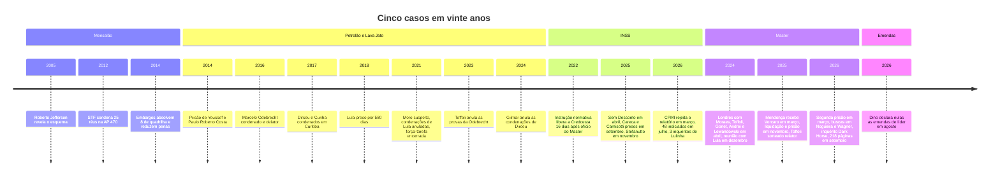
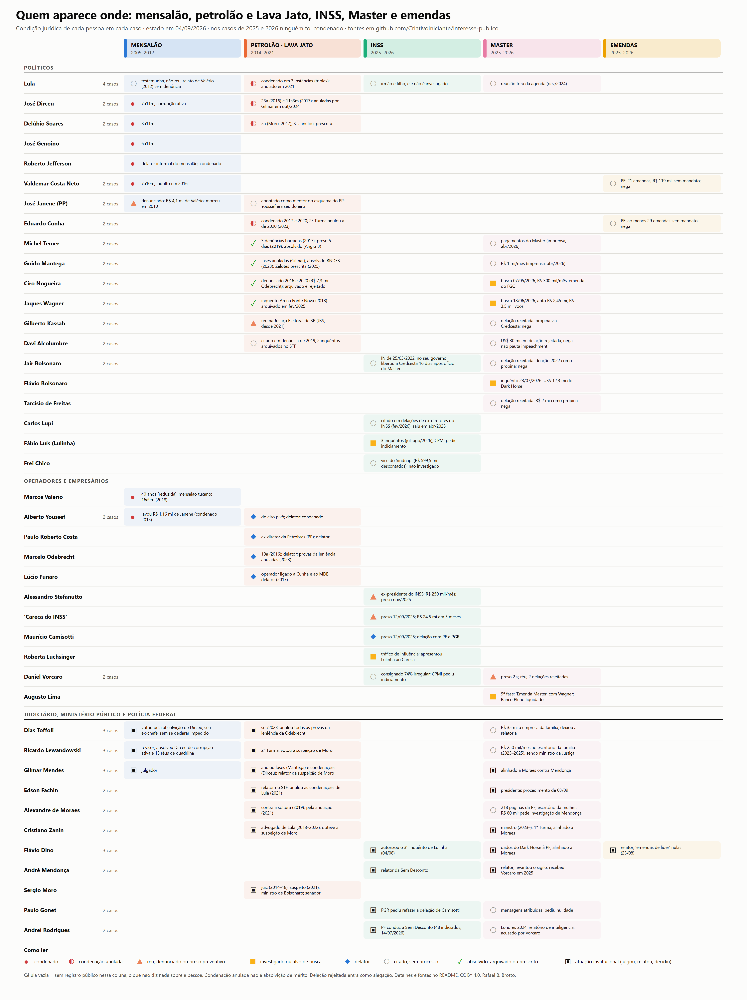
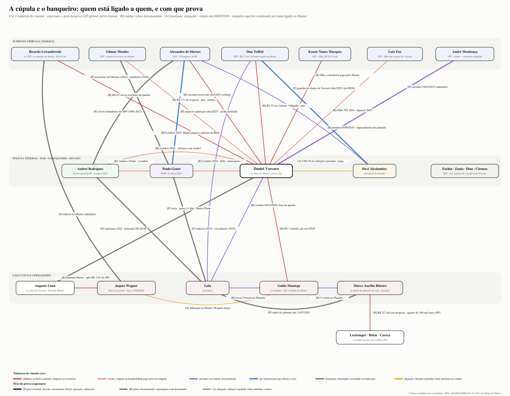
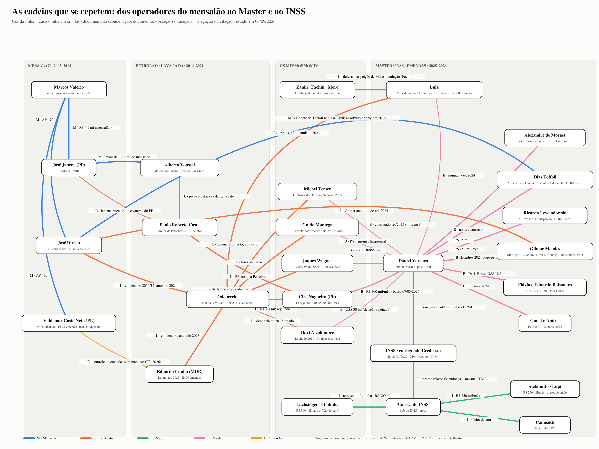
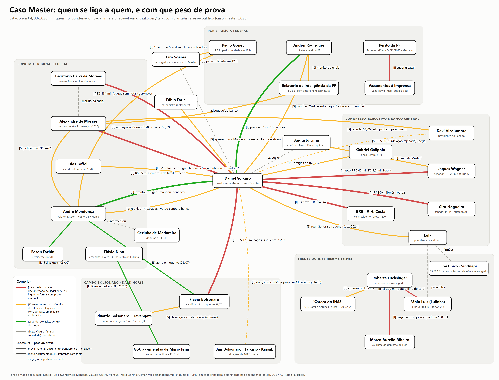

# Vinte anos, cinco casos, os mesmos nomes: o consolidado (2005 a 2026)

**Estado em 06/09/2026.** Este é o documento de entrada do repositório. Ele junta, numa leitura só, o que as três pesquisas detalhadas apuraram sobre o mensalão, o petrolão e a Lava Jato, a fraude do INSS, o caso do Banco Master e a investigação das emendas parlamentares, e sobre as pessoas que aparecem em mais de um deles. Cada afirmação aqui tem uma fonte publicada por trás e está graduada pelo peso da prova. Nada aqui é tese de campanha; onde a fonte é fraca, isso está dito.

**Resumo executivo:** [conclusoes_2026-09-07.md](conclusoes_2026-09-07.md), sete conclusões que o material sustenta e três que ainda não. **Versão visual em página única:** https://criativoiniciante.github.io/interesse-publico/ (GitHub Pages, gerada de `dossie_visual.html`).

**Como ler a régua.** Toda afirmação carrega uma letra:

| Letra | Significa | Exemplos |
|---|---|---|
| **[P]** | prova formal | decisão judicial, documento oficial, operação policial, admissão do próprio envolvido |
| **[R]** | relato documentado | reportagem que reproduz documento (contrato, extrato, relatório da PF, mensagem periciada) |
| **[A]** | alegação | delação rejeitada, fonte anônima, coluna sem documento |
| **[N]** | refutado | a fonte primária contradiz a afirmação |
| **[O]** | inocência formal | absolvição, arquivamento, prescrição ou anulação (são coisas distintas; o texto diz qual) |

**De onde vem o que está aqui.** Os três documentos de pesquisa desta semana, todos com fontes primárias listadas:

1. [Verificação dos 30 perfis do caso Master](../caso_master_2026/verificacao_personagens_2026-09-06.md), nome a nome, contra o Atlas Brasileiro e a reportagem de origem.
2. [Materialidade da matriz pessoa × caso](../quem_se_repete_2005_2026/materialidade_2026-09-06.md), 85 células conferidas em fonte oficial, e o teste da hipótese de que a cúpula está envolvida entre si.
3. Checagem do caso Flávio Bolsonaro e Dark Horse contra as fontes primárias citadas pelo Atlas (05/09/2026, no workspace do autor; a síntese está na seção 3 deste documento).

A pergunta de fundo, se existe um sistema de poder que atravessa os três Poderes, é testada com fatos em [A República em teste](../republica_2026/README.md). Dois dossiês irmãos, de 07/09/2026, aprofundam o que aqui é ponteiro: [os ministros do STF, um a um](../ministros_stf_2026/README.md) e [a família Bolsonaro diante da Justiça](../bolsonaro_2026/README.md). E os dois dossiês anteriores, agora corrigidos: [caso_master_2026](../caso_master_2026/README.md) e [quem_se_repete_2005_2026](../quem_se_repete_2005_2026/README.md).

---

## 1. Os cinco casos em uma página

| Caso | Anos | O pivô | O que ficou provado [P] | Onde está hoje |
|---|---|---|---|---|
| **Mensalão** (AP 470) | 2005 a 2014 | Marcos Valério, publicitário | 25 condenados em 2012 (Dirceu, Delúbio, Genoino, Valdemar, Jefferson, Valério); em 27/02/2014 os embargos infringentes absolveram 8 réus de quadrilha e reduziram penas | Encerrado. Lula foi testemunha, não réu |
| **Petrolão e Lava Jato** | 2014 a 2021 | Alberto Youssef, doleiro (fora doleiro de Janene no mensalão) | 285 condenações em Curitiba; delações de Youssef, Paulo Roberto Costa, Odebrecht, Funaro; Lula 580 dias preso; Temer preso 10 dias | Desmontada pelo STF sem julgamento de mérito: Moro suspeito (2021), condenações de Lula (2021), Cunha (2023), Dirceu (2024) anuladas; provas da Odebrecht imprestáveis (Toffoli, 2023) |
| **INSS** (Sem Desconto) | 2025 a 2026 | "Careca do INSS" (Antônio Carlos Camilo Antunes) | R$ 6,3 bilhões descontados sem autorização (2019 a 2024); Stefanutto, Careca e Camisotti presos; 48 indiciados (14/07/2026); 3 inquéritos contra o filho do presidente | Sem condenação. O relatório da CPMI que pedia 216 indiciamentos foi rejeitado por 19 a 12 |
| **Master** (Compliance Zero) | 2025 a 2026 | Daniel Vorcaro, banqueiro | Liquidação e prisão (17/11/2025); segunda prisão (04/03/2026); relatório da PF de 218 páginas sobre o celular dele com o ministro Moraes, o PGR e o diretor da PF, sigilo levantado em 01/09/2026 | Sem condenação. Crise aberta entre STF, PGR e PF; procedimento de Fachin (PET 16.704) com prazo de cinco dias úteis, até 11/09; o despacho não marca data para o plenário |
| **Emendas** (ADPF 854) | 2025 a 2026 | quem controla emendas sem mandato | Dino declarou nulas as "emendas de líder" (23/08/2026); bens de Valdemar (21 emendas, R$ 119 milhões) e Cunha (29 emendas, R$ 6 milhões bloqueados) | Sem condenação. Ambos negam |

---

## 2. As imagens

Todas geradas por código a partir dos dados conferidos, para que qualquer pessoa possa refazê-las ou corrigi-las. Clique para abrir em tamanho cheio.

### 2.1 Quem aparece onde, e com que prova

Cada linha é uma pessoa, cada coluna um caso. O símbolo diz a condição jurídica (condenado, anulado, réu, investigado, delator, citado, absolvido, atuação institucional). A borda é nova nesta versão e diz o peso da prova: grossa [P], fina [R], tracejada [A], verde [O]. Gerador: [gen.py](../quem_se_repete_2005_2026/mapa/gen.py). Célula vazia quer dizer sem registro público, e nada mais.

### 2.2 A cúpula e o banqueiro

Trinta vínculos entre dezoito nomes, cada um com a letra da prova. Cor é a natureza do vínculo (dinheiro a parente ou escritório, evento pago, encontro, ato institucional, nomeação, alegação); espessura é o peso. Quatro ministros do STF aparecem numa caixa à parte porque não há registro de vínculo algum deles com Vorcaro. Gerador: [mapa/gen_cupula.py](mapa/gen_cupula.py).

### 2.3 As cadeias de operadores

Do publicitário do mensalão ao doleiro da Lava Jato, do doleiro ao PP, do PP a Vorcaro; e da Odebrecht a cinco nomes que reaparecem no Master.

### 2.4 O caso Master em detalhe

O mapa do dossiê do Master, com status [I]/[S]/[L] por relação. Leitura completa em [caso_master_2026](../caso_master_2026/README.md).

---

## 3. Quem é quem

Uma linha por pessoa. A coluna "grau" é a letra mais forte que existe contra ou a favor da pessoa no conjunto dos casos. "Contrário" registra o que pesa a favor dela.

### 3.1 Supremo Tribunal Federal (atuais e recém-saídos)

| Nome | Grau | O que está documentado | Alegação, refutação ou inocência formal | Contrário ou ressalva |
|---|---|---|---|---|
| **Alexandre de Moraes** | [R] | Escritório da mulher contratado pelo Master (R$ 131,2 milhões brutos, cerca de R$ 80 milhões pagos; minuta editada às 23h04 de 15/01/2024 por usuário com o nome dele); segundo contrato de R$ 50 milhões com jato e helicóptero; dois cartões de R$ 300 mil aos filhos (out/2025); 52 notas de Vorcaro na véspera da liquidação; Londres 2024. Negou cinco vezes o que a perícia depois mostrou | [N] a versão de que não havia contato direto | Não há teor das respostas dele a Vorcaro. Nunca foi investigado formalmente: Gonet arquivou a apuração sobre ele e o BC (dez/2025) |
| **Dias Toffoli** | [R] | R$ 35 milhões de fundo ligado ao Master (Arleen) a empresa da família (Maridt); sorteado relator em 28/11/2025 e no mesmo dia voou a Lima em jato com advogado do banco; saiu da relatoria em 12/02/2026 depois de relatório da PF que cita mais de dez encontros presenciais com Vorcaro em 2023 e 2024 e um convite para a festa de aniversário dele (UOL, 19/02/2026); Londres 2024; irmãos venderam participação no resort Tayayá a fundos de Zettel; entregou a guarda dos dados de Vorcaro a Alcolumbre [P] | [A coluna] encontro reservado com Lula e Haddad sobre o caso (dez/2025) | No mensalão votou pela absolvição do ex-chefe Dirceu; na Lava Jato anulou todas as provas da Odebrecht (2023) [P] |
| **Gilmar Mendes** | [R] | Relator de recurso do Master (CSLL) e presente no fórum de Londres em que o Master pagou a palestra de Tony Blair (abr/2024); fundou o IDP com Gonet (1998), parte vendida à família Mendes em 2017 [P]; propôs vetar delegados da PF em gabinetes do STF | [A coluna] "alinhado a Moraes" contra Mendonça | Sem mensagem dele com Vorcaro noticiada. Anulou as condenações de Dirceu (2024) e fases contra Mantega [P] |
| **Kassio Nunes Marques** | [R] | Filho recebeu R$ 281,6 mil da Consult Inteligência Tributária, que recebeu R$ 18 milhões do Master (R$ 6,6 milhões) e da JBS (R$ 11,3 milhões); telefone particular do ministro no celular de Vorcaro; extinguiu a ação do TSE contra o filme de Flávio sem analisar o mérito | | Coaf classificou os pagamentos como incompatíveis com a empresa; não há investigação sobre o ministro |
| **Luiz Fux** | [R] | Filho Rodrigo em degustação em Nova York paga por Vorcaro (mai/2024) e no camarote dele na Sapucaí (2025) | [N] a versão de que o filho foi a Londres | O ministro foi convidado e não foi; o filho diz não ter relação comercial |
| **André Mendonça** | [P] | Relator do Master e do INSS; recebeu Vorcaro em 14/03/2025 no Instituto Iter, de que era sócio (saiu em 03/09/2026), e admite; ouviu Vorcaro em 27/08 sem a PF; levantou o sigilo das 218 páginas (01/09); pediu o afastamento cautelar de Moraes (03/09) | [A relatório de inteligência sem valor probatório] "alvo estratégico" | É o relator que expôs o caso; recusou a "delação seletiva"; manteve as prisões |
| **Edson Fachin** | [P] | Presidente; abriu procedimento (PET 16.704) e deu 5 dias úteis a Moraes, Mendonça, Gonet e Andrei; separou a petição de Moraes do inquérito das fake news (04/09); o despacho não fixa data para o plenário | | Relator que anulou as condenações de Lula em 2021. **Sem registro de vínculo com Vorcaro** |
| **Cristiano Zanin** | [P] | Advogado de Lula (2013 a 2022), obteve a suspeição de Moro; ministro desde 2023 | | **Sem registro de vínculo com Vorcaro** |
| **Flávio Dino** | [P] | Relator das emendas (ADPF 854), declarou nulas as emendas de líder; autorizou o 3º inquérito de Lulinha e o de Marco Aurélio Ribeiro; bloqueou bens de Valdemar e Cunha; enviou dados do Dark Horse à PF | | **Sem registro de vínculo com Vorcaro** |
| **Cármen Lúcia** | | | | **Sem registro de vínculo com Vorcaro** |
| **Ricardo Lewandowski** (aposentado; ex-ministro da Justiça) | [P] | Escritório da família recebeu R$ 6,5 milhões do Master (R$ 250 mil por mês, ago/2023 a set/2025), R$ 5,25 milhões já com ele ministro da Justiça; integrou o conselho consultivo do banco; indicação admitida por Jaques Wagner [P]; Londres 2024 | | No mensalão, revisor: absolveu Dirceu de corrupção ativa; na Lava Jato votou a suspeição de Moro |
| **Luís Roberto Barroso** (aposentado) | [A] | | [A coluna] jantar do Lide em Nova York (2022) bancado por Vorcaro, com Gilmar, Moraes e Lewandowski (Elio Gaspari) | Nada além da coluna |

### 3.2 Procuradoria-Geral, Polícia Federal e Banco Central

| Nome | Grau | O que está documentado | Alegação ou ressalva | Contrário |
|---|---|---|---|---|
| **Paulo Gonet** (PGR) | [P] | Londres 2024 pago por Vorcaro; filho incluído em comitiva às custas de Vorcaro (2025, cancelada); arquivou a apuração sobre Moraes e o BC (dez/2025); pediu a rejeição da denúncia contra Ciro Nogueira (2023); pediu a nulidade do relatório que o cita 33 vezes em menos de 12 horas; indicado (2023) e reconduzido (2025) por Lula; fundou o IDP com Gilmar. Conselho Superior do MPF abriu procedimento (04/09); associação dos delegados pede que se declare impedido (05/09) | [R atribuído] mensagens com Vorcaro conhecidas só por intermediário ("Andrei e Paulo") | A PGR dele rejeitou as duas delações de Vorcaro e fechou o acordo com Freixo (set/2026) |
| **Andrei Rodrigues** (diretor-geral da PF) | [R] | Londres 2024 ("Moraes, Vorcaro e Andrei degustaram Macallan juntos"); citado por Vorcaro a Moraes ("reforçar com Andrei e Paulo", 30/10/2025); foi secretário de Segurança para Grandes Eventos sob Moraes ministro (2013 a 2016) e chefe da segurança de Lula em 2022, que o nomeou [P]; a PF dele produziu relatório de inteligência sobre o relator e o entregou a Moraes; chamou a ordem de Mendonça de "abuso de poder" | [A] que barrou a delação de Vorcaro para se proteger (Vorcaro, 27/08); "proximidade inadequada" com Lula (relatório sem valor probatório) | A PF dele prendeu Vorcaro duas vezes, escreveu as 218 páginas, recuperou as notas apagadas e fez as buscas em Wagner, Nogueira e Castro. **Ato de proteção não está provado** |
| **Gabriel Galípolo** (BC) | [R] | É o "G" das mensagens segundo a PF; Vorcaro pediu a Moraes um encontro com ele "para resolver tudo"; O Globo apurou ao menos quatro contatos Moraes–Galípolo; estava na reunião de 04/12/2024 com Lula como diretor do BC | [N] a versão de um encontro em 22/12/2025 (é a data da reportagem) | Moraes e o BC dizem que os encontros (14/08 e 30/09/2025) trataram da Lei Magnitsky; o BC liquidou o Master |

### 3.3 Congresso

| Nome | Grau | O que está documentado | Alegação | Inocência formal ou contrário |
|---|---|---|---|---|
| **Davi Alcolumbre** (presidente do Senado) | [P] | Recebeu de Toffoli a guarda dos dados de Vorcaro (dez/2025 a fev/2026) e teve de devolvê-los por ordem de Mendonça; a CPI do Master não foi instalada; não pauta os pedidos de impeachment; reuniu-se com Moraes em 03/09/2026, dia da petição contra Mendonça [R] | [A delação rejeitada] US$ 30 milhões via Augusto Lima; [A coluna] pedido de "blindagem" a Lula | Não aparece nas 218 páginas. Dois inquéritos eleitorais de 2014 arquivados em 2019 [O]; citado em denúncia de 2019 sem desdobramento |
| **Jaques Wagner** (líder do governo) | [P] | Busca em 18/06/2026 (9ª fase); admitiu ter indicado Lewandowski ao Master e acompanhado o ex-ministro ao banco; disse que os contratos da nora com o Master passavam de R$ 3,5 milhões; mensagens com Augusto Lima sobre a "Emenda Master" (ago/2024) [R]; PF: apartamento de R$ 2,45 milhões, cerca de R$ 66,8 mil em ingressos de shows de Taylor Swift pagos pela Reag (2023) e ao menos quatro usos de aeronaves de Augusto Lima, dois detalhados (Ilha da Paixão, out/2023; Rio, abr/2024) [R] | [A] que indicou Mantega (nega) | Inquérito da Arena Fonte Nova (Lava Jato) arquivado em fev/2025 [O]. É o nome político com mais fatos admitidos pela própria boca |
| **Ciro Nogueira** (PP) | [P] | Busca em 07/05/2026 (5ª fase); PF documenta R$ 300 mil mensais de Vorcaro e a emenda que ampliava o FGC; malotes, BMW e moto apreendidos; primo Felipe Vorcaro preso; R$ 18,85 milhões bloqueados | | Denúncia da Lava Jato (R$ 7,3 milhões da Odebrecht) rejeitada pelo STF a pedido da PGR de Gonet (2023) [O]. Elo do PP: Janene (mensalão), Paulo Roberto Costa (Lava Jato), Nogueira (Master) |
| **Eduardo Cunha** (MDB) | [P] | PF: ao menos 29 emendas indicadas sem mandato, a 29 cidades de Minas Gerais, 21 delas já pagas; Dino bloqueou R$ 6,15 milhões em 10/07/2026 (Operação Transparência) | | Condenação de Curitiba (2017) anulada pela 2ª Turma em 2023; a de Brasília (Sépsis, 2018, 24 anos e 10 meses) permanece. Nega |
| **Valdemar Costa Neto** (PL) | [P] | PF: 21 emendas, R$ 119 milhões, sem mandato; bens bloqueados por Dino contra parecer da PGR | | Condenado no mensalão (7 anos e 10 meses), indultado em 2016. Nega |
| **Michel Temer** | [R] | Contratado pelo Master (set/2025) para destravar a venda ao BRB; intermediário com investidores árabes | | Lava Jato: 2 denúncias barradas pela Câmara (2017), preso 10 dias em duas prisões (2019), absolvido em Angra 3 (2022) [O] |
| **Gilberto Kassab** (PSD) | [A] | | [A delação rejeitada] propina via Credcesta | Absolvido do caso JBS com trânsito em julgado em 29/11/2023 [O]; Moraes reteve inquérito no STF em 2025 |
| **Tarcísio de Freitas** | [A] | Zettel, cunhado de Vorcaro, foi seu maior doador pessoa física em 2022 (R$ 2 milhões) [P] | [A delação rejeitada] a doação como propina | Chamou a delação de "beira o ridículo"; não há investigação |
| **Lindbergh Farias** (PT) | [P] | Autor dos pedidos contra Eduardo Bolsonaro e do pedido de incluir Flávio e Jair no inquérito | | Atuação parlamentar; sem vínculo com os investigados |
| **Hugo Motta** (presidente da Câmara) | [R] | Recebeu de Dino prazo de dez dias sobre as emendas (14/07/2026); mobilizou a Câmara contra a decisão | [R não lida na origem] hospedagem em Lisboa com Ciro Nogueira, segundo reportagem citada pelo Atlas (jun/2026) | Sem investigação |

### 3.4 Executivo e entorno

| Nome | Grau | O que está documentado | Alegação | Inocência formal ou contrário |
|---|---|---|---|---|
| **Lula** | [R] | Recebeu Vorcaro em 04/12/2024, fora da agenda, por cerca de uma hora, com Rui Costa, Alexandre Silveira e Galípolo; Vorcaro chegou com Mantega (pago pelo Master) e Augusto Lima; nomeou Andrei e Gonet [P] | [A coluna] encontro reservado com Toffoli sobre o caso (dez/2025) | **Não há registro de pagamento, favor ou investigação sobre ele no Master ou no INSS.** Mensalão: testemunha; Lava Jato: condenações anuladas em 2021 por competência e suspeição, sem mérito [O] |
| **Marco Aurélio Santana Ribeiro (Marcola)** (ex-chefe de gabinete) | [P] | Inquérito autorizado por Dino (04/08/2026); recebeu Mantega quatro vezes no Planalto enquanto Mantega trabalhava para o Master; recebeu André Esteves. PF: Luchsinger pagou mais de R$ 217 mil em despesas dele entre fev e nov/2024 (cartão de crédito R$ 95 mil, consórcio R$ 48 mil, financiamento de carro R$ 26 mil, boletos e Pix R$ 27,5 mil, joias de diamante R$ 9,2 mil) e ele pediu a ela um quadro de 100 mil euros, no Carrousel du Louvre, em 19/12/2024 ("E meu quadro??") [R]. Saiu do Planalto em 21/07/2026, oficialmente para a campanha, e deixou a campanha em agosto, depois das revelações | | Defesa: empréstimo pessoal de R$ 249 mil, quitado com juros e correção, joias incluídas; o quadro nunca foi recebido, e a PF não tem confirmação de entrega |
| **Guido Mantega** | [R] | R$ 1 milhão por mês do Master (jul a nov/2025), a pedido de Wagner segundo o banco; levou Vorcaro a Lula | | Lava Jato: fases anuladas por Gilmar, absolvido no BNDES (2023), Zelotes prescrita (fev/2025) [O] |
| **Fábio Luís Lula da Silva (Lulinha)** | [P] | Três inquéritos (30/07, 31/07 e 04/08/2026): World Cannabis e Ministério da Saúde, 3Structure e Dataprev, rede com Marco Aurélio Ribeiro; mensagem do Careca pede R$ 300 mil "para o filho do cara"; Luchsinger admitiu à PF tê-lo apresentado ao Careca. A PF investiga uma "sociedade oculta" dele com Fernando Bittar e Roberta Luchsinger para obter contratos e mudanças de regra no governo federal (Saúde, Dataprev, Telebras), a partir do grupo de WhatsApp "Musaranhos" ("Fefe, Fábio e eu somos uma coisa só") [R]; pagou R$ 750 mil (R$ 50 mil por mês, jan/2024 a out/2025) a Kalil Bittar, filho de Fernando, alvo da PF por lobby no MEC [R] | | Não é réu. O relatório da CPMI que pedia seu indiciamento foi rejeitado (19 a 12). Defesa: nunca negociou, investiu ou recebeu |
| **José Ferreira da Silva (Frei Chico)** | [P] | Vice-presidente do Sindnapi, 3ª entidade que mais descontou (R$ 599,5 milhões); 96,8% dos beneficiários não reconhecem a filiação | | Não é investigado; a convocação à CPMI foi rejeitada por 19 a 11 |
| **Carlos Lupi** (ex-ministro) | [A] | Deixou o cargo em abr/2025; indicou Stefanutto | [A] delatado por dois ex-diretores do INSS (fev/2026) | Sem denúncia |
| **Alessandro Stefanutto** (ex-presidente do INSS) | [P] | R$ 250 mil por mês (jun/2023 a set/2024); preso em 13/11/2025 | | |
| **Jair Bolsonaro** | [R] | Instrução normativa de 25/03/2022, no seu governo, liberou a Credcesta 16 dias após ofício do Master; Zettel doou R$ 3 milhões à campanha de 2022 [P] | [A delação rejeitada] a doação como propina | Sem investigação nestes casos (a condenação dele pela trama golpista é outro processo, fora deste escopo) |
| **Flávio Bolsonaro** | [P] | Inquérito autorizado por Mendonça em 23/07/2026 sobre US$ 12,3 milhões de Vorcaro ao filme Dark Horse; encontro na casa de Vorcaro (dez/2024), áudios e mensagens (Intercept, mai/2026); Coaf registra US$ 1,67 milhão em set/2025, contradizendo "último pagamento em maio de 2025" | | Negou conhecer Vorcaro (mar/2025 e mar/2026) e depois admitiu a visita (19/05/2026) [N]. Não é réu. Detalhe na seção 3.7 |
| **Eduardo Bolsonaro** | [R] | Aparece nas mensagens sugerindo alternativas de remessa (21/03/2025); PF suspeita de desvio para lobby dele; agente legal do Havengate ligado a trust que comprou casa no Texas | | Nega receber dinheiro; não é investigado por isso |
| **Cláudio Castro** (ex-governador do RJ) | [P] | Busca em 26/05/2026 (8ª fase) por R$ 3 bilhões do Rioprevidência aplicados no Master; renunciou em 23/03/2026; TSE o declarou inelegível por oito anos (24/03/2026) | [A delação] Vorcaro passou a chamar de propina as vantagens a Castro | |

### 3.5 Os operadores de 2025 e 2026

| Nome | Grau | O que está documentado | Ressalva |
|---|---|---|---|
| **Daniel Vorcaro** | [P] | Preso em 17/11/2025 (Guarulhos, jato para Malta e Dubai) e em 04/03/2026; réu; duas propostas de delação rejeitadas (PF 20/05; PF 10/06 e PGR 15/06/2026), terceira em preparação desde agosto e não apresentada; o celular dele é a fonte das 218 páginas | Tudo o que ele diz em delação rejeitada entra como [A] |
| **Fabiano Zettel** | [P] | Cunhado de Vorcaro, apontado pela PF como operador financeiro; doador de Tarcísio (R$ 2 milhões) e Bolsonaro (R$ 3 milhões) em 2022; fundos dele compraram a participação dos irmãos de Toffoli no Tayayá (R$ 6,6 milhões) | |
| **Augusto Lima** | [P] | Ex-sócio; preso de 18 a 29/11/2025; Banco Pleno liquidado em 18/02/2026; alvo da 9ª fase com Wagner; "Emenda Master" | |
| **Antônio Carlos Freixo Jr.** | [P] | Dono da Entre Investimentos, por onde passaram os pagamentos ao Havengate; acordo com a PGR enviado a Mendonça em 03/09/2026 | Homologação pendente no STF |
| **João Carlos Mansur** | [P] | Reag liquidada em jan/2026; delação sem a PF enviada em 02/09/2026: 17 anexos, multa de R$ 40 milhões, promete o paradeiro de R$ 20 bilhões | Mendonça deve checar a voluntariedade |
| **Paulo Henrique Costa** (ex-BRB) | [P] | Preso em 16/04/2026, prisão mantida pelo STF por unanimidade; PF: seis imóveis, R$ 146,5 milhões prometidos, R$ 74,6 milhões pagos | |
| **Fábio Faria** | [R] | Compartilhou quatro contatos de Moraes com Vorcaro (26/12/2023); jatinho com Toffoli e Vorcaro (abr/2026); conversas sobre voto de Toffoli em causa bilionária | |
| **Ciro Rocha Soares** | [R] | Intermediou o encontro Mendonça–Vorcaro de 14/03/2025 (ligações e áudios) | |
| **"Careca do INSS"** | [P] | Preso em 12/09/2025; R$ 24,5 milhões em cinco meses; "epicentro" do esquema segundo a PF | |
| **Maurício Camisotti** | [P] | Preso em 12/09/2025; delação refeita com PF e PGR (2026); cerca de R$ 400 milhões movimentados | |
| **Roberta Luchsinger** | [P] | Ex-mulher de Protógenes Queiroz; candidata pelo PT em 2018; admitiu à PF ter apresentado Lulinha ao Careca; pagamentos a Marco Aurélio Ribeiro; "sociedade oculta" com Lulinha e Bittar segundo a PF | |
| **Fernando Bittar** | [R] | Dono formal do sítio de Atibaia; a PF investiga "sociedade oculta" dele com Lulinha e Luchsinger (grupo "Musaranhos") para obter contratos e mudanças de regra no governo federal; o filho Kalil recebeu R$ 750 mil de Lulinha (2024 a 2025) e foi alvo da operação Coffee Break (lobby no MEC) | A defesa de Lulinha fala em "vazamento criminoso" e diz que o material não tem prova incriminadora |

### 3.6 Os nomes históricos (mensalão e Lava Jato)

| Nome | Condição | Nota |
|---|---|---|
| **Marcos Valério** | condenado [P] | 40 anos, corrigida para 37 anos e 5 meses; mensalão tucano: 16 anos e 9 meses (2018) |
| **José Dirceu** | mensalão condenado [P]; Lava Jato anulada [O] | 7 anos e 11 meses por corrupção ativa; absolvido de quadrilha em 2014; condenações da Lava Jato (2016 e 2017) anuladas por Gilmar em out/2024 |
| **Delúbio Soares** | mensalão condenado [P]; Lava Jato anulada e prescrita [O] | 8 anos e 11 meses, reduzida a 6 anos e 8 meses (2014) |
| **José Genoino** | condenado [P] | 6 anos e 11 meses, reduzida a 4 anos e 8 meses (2014) |
| **Roberto Jefferson** | condenado [P] | 7 anos e 14 dias; revelou o mensalão |
| **José Janene** (PP) | denunciado [P] | R$ 4,1 milhões de Valério; morreu em 2010; apontado como mentor do esquema do PP na Petrobras [R] |
| **Alberto Youssef** | condenado e delator [P] | Lavou R$ 1,16 milhão do mensalão para Janene (condenado em 2015); pivô da Lava Jato |
| **Paulo Roberto Costa** | delator [P] | Ex-diretor da Petrobras indicado pelo PP |
| **Marcelo Odebrecht** | condenado e delator [P] | 19 anos (2016); provas da leniência anuladas por Toffoli (2023) |
| **Lúcio Funaro** | delator [P] | Operador ligado a Cunha e ao MDB |
| **Sergio Moro** | juiz, suspeito [P] | Juiz da Lava Jato (2014 a 2018); declarado suspeito pelo STF (2021); ministro de Bolsonaro; senador |

### 3.7 O caso Flávio Bolsonaro e o Atlas, em resumo

A checagem de 05/09/2026 leu as fontes primárias que o Atlas Brasileiro cita sobre o Dark Horse. O que confere [P/R]: o encontro marcado por Thiago Miranda na casa de Vorcaro (dez/2024), as remessas via Entre Investimentos ao Havengate (US$ 10,6 milhões entre fev e mai/2025), os áudios de Flávio ("não pode vacilar"), o registro do Coaf de set/2025 e a abertura do inquérito em 23/07/2026. O que o Atlas omite ou distorce: as negações anteriores de Flávio (documentadas nas próprias fontes que o Atlas cita), a apresentação da perícia da defesa (R$ 75 milhões) como prova, e a frase "fundo fiscalizado pela SEC", sem registro na SEC. Rachadinha, mansão, Barclay e indulto não constam do Atlas e ficaram fora desta checagem.

---

## 4. O que os fatos provam, e o que não provam

A pergunta que motivou a pesquisa: a cúpula do poder (STF, PGR, PF, Senado, Presidência) está envolvida entre si e com os operadores de modo demonstrável? Resposta em duas colunas, com a mesma régua.

### O que está provado [P] ou documentado [R]

1. **Dinheiro do grupo Master chegou a familiares ou empresas de quatro ministros do STF**, em exercício ou recém-saídos (Moraes, Toffoli, Kassio, Lewandowski), e a um ex-ministro da Fazenda que fazia lobby no Planalto (Mantega).
2. **Vorcaro custeou um evento em Londres (25/04/2024) com o diretor-geral da PF, o procurador-geral, três ministros do STF e um do STJ**, e o Master pagou a palestra de um fórum em que estava o relator de causa sua (Gilmar).
3. **O procurador-geral e o diretor-geral da PF têm conflito de interesse documentado** no caso que investigam, e o procurador-geral praticou atos que beneficiaram colegas: arquivou a apuração sobre Moraes e pediu a rejeição da denúncia contra Ciro Nogueira.
4. **O presidente do Senado teve, por decisão de Toffoli, a guarda das provas de um caso em que é citado**, e a CPI do caso não foi instalada.
5. **O líder do governo no Senado admite ter indicado o ministro da Justiça ao banco investigado** e acompanhado o ministro ao banco; é alvo de busca.
6. **O presidente da República recebeu o banqueiro fora da agenda**, levado por um consultor pago pelo banco, e nomeou o diretor-geral e o procurador-geral cujos conflitos estão documentados.

### O que não está provado

1. **Que Lula, Alcolumbre ou Andrei tenham recebido dinheiro ou vantagem.** Para Alcolumbre há só a palavra de Vorcaro em delação rejeitada; para Lula e Andrei, nada.
2. **Que Andrei ou Gonet tenham agido para proteger Vorcaro.** A PF prendeu-o duas vezes e rejeitou as delações; a PGR rejeitou as delações e fechou o acordo com Freixo. O que está provado é conflito, não obstrução.
3. **Que "os ministros do STF" sejam um bloco.** Quatro não têm registro algum (Fachin, Cármen Lúcia, Zanin, Dino), e o relator que expôs o caso (Mendonça) tem um encontro admitido.
4. **Que exista um esquema único ligando mensalão, Lava Jato, INSS e Master.** O que se repete são pessoas, partidos-ponte e o padrão do operador que compra acesso; não há documento que ligue os casos como uma organização só.

**Em uma frase, sem exagero:** em setembro de 2026 a cúpula do STF, da PGR, da PF e do Senado tem conflitos de interesse documentados com o principal investigado do maior caso financeiro do país, e parte dela recebeu dinheiro dele por vias indiretas; o governo tem o líder no Senado sob busca, o ex-chefe de gabinete sob inquérito e dois ex-ministros pagos pelo banco. O que a frase **não** pode dizer com fatos: que todos estão comprometidos, que houve proteção provada, ou que Lula, Alcolumbre e Andrei receberam algo.

---

## 5. Os padrões que se repetem (observação, não tese)

1. **O operador financeiro é o pivô**: Valério, Youssef, Funaro, Vorcaro, Careca. É por ele que a prova entra (delação ou celular) e é ele que liga políticos de campos opostos.
2. **Os partidos-ponte se repetem**: PP (Janene, Paulo Roberto Costa, Nogueira), MDB (Cunha, Temer), PT (Dirceu, Delúbio, Wagner) e, em 2026, o PL (Valdemar, Bolsonaro, Flávio).
3. **O STF é o palco final**, e o destino das condenações depende dele: anulações por competência e suspeição (Lula, Dirceu, Cunha, Delúbio, Mantega) e a anulação das provas da Odebrecht mudaram o resultado da Lava Jato sem julgamento de mérito.
4. **Ministros com vínculo prévio julgando, e famílias de ministros recebendo**: Toffoli e Dirceu; Zanin e Lula; famílias de Moraes, Lewandowski, Toffoli e Kassio no Master.
5. **A forma de acesso mudou**: em 2005 foi o caixa dois; em 2014, a doação e a propina de obra; em 2024 a 2026, o custeio de eventos e a contratação de parentes e escritórios. O padrão é o mesmo, o instrumento é outro.
6. **A delação move tudo e é disputada**: Jefferson abriu o mensalão; Youssef, Costa e Odebrecht abriram a Lava Jato; Camisotti, Freixo e Mansur movem 2026; a de Vorcaro foi rejeitada duas vezes.
7. **Em 2026 os dois campos estão no mesmo caso**: PT (Wagner, Lulinha, Frei Chico, Mantega, Lewandowski) e PL (Flávio, Eduardo, Nogueira, Valdemar, a delação sobre Bolsonaro e Tarcísio). Quem lê só metade do quadro não está lendo o quadro.

---

## 6. O que corrigimos nas nossas próprias pesquisas

Transparência sobre os erros dos dossiês anteriores, encontrados na conferência de 05 e 06/09 e já corrigidos nos arquivos:

| Onde estava | O que dizia | O que a fonte primária diz |
|---|---|---|
| personagens.md, Toffoli | sorteado relator em 29/11/2025 | 28/11/2025 (nota do gabinete; Conjur) |
| personagens.md, Galípolo | encontrou Moraes em 22/12/2025 | 22/12 é a data da reportagem do Globo; os encontros foram em 14/08 e 30/09/2025 |
| personagens.md, Lewandowski e Mantega | revelações de abril de 2026; "family office" | reveladas em janeiro de 2026; é o escritório de advocacia da família, R$ 6,5 milhões |
| personagens.md e READMEs, CPMI do INSS | "a CPMI pediu o indiciamento" | o relatório do relator foi rejeitado pela comissão por 19 a 12; nada foi aprovado |
| README do Master, Fux | filho convidado a Londres | degustação em Nova York (mai/2024) e Sapucaí (2025); Londres foi o filho de Gonet |
| README do Master, Kassio | consultoria paga pelo banco | a consultoria recebeu R$ 18 milhões do Master e da JBS |
| personagens.md, Freixo | delação homologada | acordo enviado a Mendonça; homologação pendente |
| personagens.md, Vorcaro | preso em 18/11 rumo a Malta | preso na noite de 17/11 (operação deflagrada em 18/11), rumo a Malta e Dubai |
| matriz, Kassab | réu na Justiça Eleitoral desde 2021 | absolvido, trânsito em julgado em 29/11/2023 |
| matriz, Temer | 3 denúncias, preso 5 dias | 2 denúncias (2017), 10 dias em duas prisões (2019) |
| matriz, Cunha | condenação de 2020 | Curitiba 2017 (anulada em 2023) e Brasília 2018 (Sépsis) |
| matriz, Delúbio e Genoino | penas de 2012 | reduzidas nos embargos de 27/02/2014 |
| matriz, Alcolumbre | dois inquéritos arquivados | eram inquéritos eleitorais de 2014, arquivados em 2019 |
| matriz, Gilmar × Master | "alinhado a Moraes" (coluna) | fatos: relator de recurso do Master; fórum de Londres pago pelo Master; IDP com Gonet |
| matriz, Zanin e Dino | célula de "atuação institucional" sem nota | acrescentado "sem registro de vínculo com Vorcaro" |

Acrescentados em 06/09, a pedido de leitura, Marco Aurélio Ribeiro e Fernando Bittar na matriz e no mapa da cúpula.

### Os cinco itens que estavam sem confirmação, conferidos em 06/09

| Item | O que dizíamos | O que a fonte de origem diz | Veredito |
|---|---|---|---|
| Terceira delação de Vorcaro | "entregue e rejeitada" (uma das fontes) | Duas propostas (início de maio; 01 e 02/06) e três rejeições: PF em 20/05, PF em 10/06, PGR em 15/06/2026. Em agosto a defesa trocou de escritório (Bialski) e "prepara" a terceira, com pedido a Mendonça de seis horas diárias de acesso; nada apresentado até 06/09 | [N] não houve terceira delação |
| "Ao menos dez encontros" Toffoli e Vorcaro | sem a fonte de origem | Relatório da PF enviado ao STF na semana de 12/02/2026, revelado pelo UOL (Natália Portinari) em 19/02: mais de dez encontros presenciais em 2023 e 2024, em eventos, jantares e festas em Brasília, e convite por WhatsApp para a festa de aniversário do ministro; o gabinete chamou de "ilações" | [R] confirmado |
| 29 emendas de Cunha | número da imprensa, sem decisão | Decisão de Dino de 10/07/2026: bloqueio de R$ 6.150.378; a PF atribui a Cunha a indicação de ao menos 29 emendas sem mandato, a 29 cidades de Minas Gerais, 21 já pagas (Operação Transparência, dez/2025) | [P] confirmado |
| R$ 66,8 mil em ingressos e cinco voos de Wagner | valor e número sem fonte | Documentos com sigilo levantado por Mendonça em 30/07/2026: R$ 63.339 pagos pela Reag em 30/06/2023 (Taylor Swift, Los Angeles) mais camarote em São Paulo em nov/2023, total de cerca de R$ 66.839; lote de 66 ingressos, três (O Tempo) ou cinco (Poder360, CNN) para Wagner. Voos: "ao menos quatro" usos de aeronaves de Augusto Lima, dois detalhados (Ilha da Paixão, 11 a 13/10/2023; Rio, abr/2024) | [R] valor confere; "cinco voos" não tem fonte, corrigido para "ao menos quatro" |
| Sessão do STF na segunda quinzena de setembro | dado como decisão de Fachin | O despacho de 03/09 (PET 16.704), lido na íntegra, não marca data: fala em apreciação colegiada "a tempo e modo" e dá cinco dias úteis (até 11/09). A "segunda quinzena" é cálculo do Poder360; em 05/09 o mesmo veículo recalculou para depois de 22/09 na petição de Moraes contra Mendonça; em 06/09 Mendonça formalizou o pedido de plenário, ainda sem data | [A] era inferência; corrigido para "sem data marcada" |

Fontes desta conferência: despacho de Fachin de 03/09/2026 (PDF divulgado pelo Poder360); Poder360 03, 05 e 06/09; Migalhas 03/09; CNN 03/06, 11/06 e 10/08/2026; Agência Brasil mai e jun/2026; Oeste 19/02 e 06/08/2026; Brasil de Fato 19/02/2026; Migalhas 12/07/2026; O Tempo 13/07 e 30/07/2026; Metrópoles 16/07/2026; Poder360 18/06/2026; CNN 01/08/2026.

---

## 7. Ressalvas de leitura

- **Condenação anulada não é absolvição de mérito**; absolvição, arquivamento e prescrição são desfechos distintos, e o texto diz qual foi.
- **Delação rejeitada é palavra de réu preso**: entra como alegação, nunca como fato. Isso vale para o que Vorcaro diz de Alcolumbre, Bolsonaro, Tarcísio e Kassab, e para o que ele diz de Andrei.
- **Relatório de inteligência da PF sobre Mendonça e Alcolumbre declara-se sem valor probatório**; nada dele entra como fato.
- **Ninguém dos casos de 2025 e 2026 foi condenado.** Todos os investigados negam.
- **O Atlas Brasileiro é um ponteiro, não uma fonte.** Cada informação apontada por ele foi lida na reportagem ou no documento de origem; onde isso não foi possível, está dito.
- **Corte:** 06/09/2026. O procedimento de Fachin, os prazos de Moraes, Mendonça, Gonet e Andrei, a homologação das delações de Freixo e Mansur e a sessão do STF são os próximos marcos; nada depois desta data está aqui.

## 8. Como foi feito

Texto de todos os Atlas (42 edições, jan/2023 a jun/2026) varrido por nome e palavra-chave; os links citados por página foram extraídos e as 441 publicações do X resolvidas na origem; 26 reportagens lidas na íntegra e mais de 90 buscas na internet; 85 células da matriz e 30 perfis conferidos um a um em decisão, documento oficial ou reportagem de origem. Compilação com auxílio de IA (Claude, Anthropic), revisão e publicação pelo autor. As fontes, com link, estão nos três documentos de pesquisa e nos dois dossiês listados no início. Licença CC BY 4.0. Correções por issue ou pull request.
