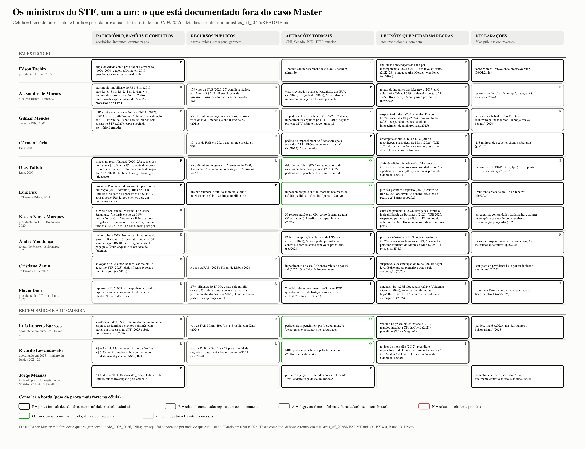

# Os ministros do STF, um a um: o que está documentado fora do caso Master (2005 a 2026)

**Estado em 07/09/2026.** O [consolidado](../consolidado_2005_2026/README.md) mostrou o Supremo pelo ângulo do Banco Master. Este dossiê inverte a lente: toma cada ministro, em exercício ou recém-saído, e reúne o que está documentado sobre ele em cinco blocos, sem repetir o Master (que fica como ponteiro): **patrimônio, família e conflitos de interesse**; **uso de recursos públicos**; **apurações formais** (CNJ, Senado, PGR, TCU, exterior) e seu desfecho; **decisões e atos que mudaram regras do jogo**, com a crítica e a defesa; e **declarações públicas**. A régua é a mesma de todo o repositório:

| Letra | Significa |
|---|---|
| **[P]** | prova formal: decisão, documento oficial, operação, admissão do próprio |
| **[R]** | relato documentado: reportagem que reproduz documento |
| **[A]** | alegação: fonte anônima, coluna, delação sem corroboração |
| **[N]** | refutado pela fonte primária |
| **[O]** | inocência formal: arquivado, absolvido, anulado, prescrito |

**Aviso de leitura.** Nenhum ministro do STF foi condenado por nada do que está aqui. O CNJ não tem competência disciplinar sobre ministros do Supremo; a única via de responsabilização é o impeachment no Senado, e nenhum dos 109 pedidos acumulados foi admitido. Boa parte do que segue é conflito de interesse documentado, não ilícito provado. Onde a fonte de origem não pôde ser lida, está marcado.

**A composição em 07/09/2026.** O STF tem **dez ministros** e uma cadeira vaga desde 18/10/2025: Edson Fachin (presidente), Alexandre de Moraes (vice), Gilmar Mendes, Cármen Lúcia, Dias Toffoli, Luiz Fux, Kassio Nunes Marques, André Mendonça, Cristiano Zanin e Flávio Dino. Jorge Messias, indicado por Lula, foi **rejeitado pelo Senado em 29/04/2026 por 42 a 34**, a primeira rejeição em 132 anos; não pode ser votado de novo na mesma sessão legislativa, e o Planalto avaliava outro nome sem ter enviado mensagem ao Senado. Barroso (aposentado em 18/10/2025) e Lewandowski (aposentado em 2023, ministro da Justiça de fev/2024 a jan/2026) entram por terem decidido e influído até há pouco.

**Como foi feito.** Quatro frentes de pesquisa em paralelo (cerca de 250 buscas, mais de 190 fontes lidas na origem: STF, TSE, Senado, Câmara, Tesouro dos EUA, Conjur, Migalhas, Agência Brasil, Poder360, Metrópoles, Gazeta do Povo, Folha e Estadão via republicação), mais a varredura das 42 edições do Atlas Brasileiro como ponteiro. Compilação com auxílio de IA (Claude), revisão pelo autor. Fontes inline em cada linha.

---

## Quadro-resumo

Uma linha por ministro, cinco blocos por coluna; a letra e a borda de cada célula dizem o peso da prova mais forte do bloco. Gerador: [mapa/gen_ministros.py](mapa/gen_ministros.py). O detalhe, a defesa de cada um e as fontes estão na seção 1.

| Ministro | Indicação | Patrimônio, família, conflitos | Recursos públicos | Apurações | Decisões marcantes |
|---|---|---|---|---|---|
| Fachin | Dilma, 2015 | nada além do questionado na sabatina | não figura nas listas | 4 pedidos de impeachment | anulação das condenações de Lula (2021); ADPF das favelas; presidência na crise de 2026 |
| Moraes | Temer, 2017 | patrimônio de R$ 8,6 mi a R$ 31,5 mi [R]; escritório da esposa; sanção dos EUA à esposa e à holding [P] | 154 voos da FAB com lista sigilosa [R] | Magnitsky (2025, revogada); 66 pedidos de impeachment; ação na Flórida | inquérito das fake news; X e Starlink; 8/1; AP 2.668 |
| Gilmar | FHC, 2002 | IDP; Fórum de Lisboa com partes em causas no STF [R]; IDP e CBF [R]; escritório da esposa [P] | passagens de R$ 112 mil [R] | 18 pedidos até 2020; ONU sobre marco temporal | suspeição de Moro; anulações de Dirceu; maconha; foro ampliado; lei do impeachment |
| Cármen Lúcia | Lula, 2006 | nada localizado | 10 voos da FAB em 2024 [R] | impeachment pela frase dos "tiranos" (2025) | desempate contra HC de Lula (2018); TSE 2022 e 2024 |
| Toffoli | Lula, 2009 | Tayayá [R]; J&F e escritório da esposa [P]; Odebrecht "amigo do amigo" [A] | R$ 350 mil em viagens num semestre; voos solitários [R] | delação de Cabral anulada [O]; 25 pedidos de impeachment | abriu o inquérito das fake news; Coaf a pedido de Flávio; anulou provas da Odebrecht |
| Fux | Dilma, 2011 | procurou Dirceu em 2010 [P]; filho com 544 processos [R]; filha no TJ-RJ [P] | auxílio-moradia à magistratura (2014 a 2018) [P] | 2 pedidos de impeachment | juiz das garantias suspenso; André do Rap; absolvição de Bolsonaro e troca de Turma |
| Kassio | Bolsonaro, 2020 | currículo contestado [R]; esposa em gabinete; filho com R$ 27,7 mi e consultoria Master/JBS [R] | nada fora do Master | 33 representações no CNJ como desembargador [R] | cultos na pandemia; TSE: pesquisa suspensa, Dark Horse, urnas |
| Mendonça | Bolsonaro, 2021 | Iter: 55 contratos públicos, 54 sem licitação [R]; Israel paga pela Conib [R] | sem número individual | LSN contra críticos (PGR 2021); pedido de Moraes (2026) | LSN como ministro; votos no 8/1; INSS; relator do Master |
| Zanin | Lula, 2023 | esposa em 14 ações no STF [R]; ex-advogado de Lula [P] | 3 voos da FAB; Lisboa 2024 [R] | 3 pedidos; impedimento rejeitado 10 a 0 | desoneração; condenação de Bolsonaro |
| Dino | Lula, 2023 | nepotismo cruzado representado à PGR [R] | carro blindado do TJ-MA usado pela família [R]; busca contra o jornalista [P] | 7 pedidos de impeachment | emendas (ADPF 854); ADPF 1178; Marco Civil |
| Barroso (aposentado) | Dilma, 2013 | apartamento em Miami via empresa da família [R]; eventos com partes [R] | voo FAB com Zanin [R] | pedidos por "perdeu, mané" e UNE [O] | prisão em 2ª instância (vencido); CPI da Covid |
| Lewandowski (aposentado) | Lula, 2006 | Master via escritório da família [R]; filho no caso INSS [R] | jato da FAB ao casamento de Bruno Dantas [R] | MBL pediu impeachment (2016) [O] | mensalão; fatiamento do impeachment de Dilma |
| Messias (rejeitado) | Lula, 2025 | "Bessias" (2016) [P] | | rejeitado 42 a 34 | |

## 1. Um a um

### 1.1 Edson Fachin (presidente)

Nascido em 08/02/1958 no Rio Grande do Sul; professor da UFPR; procurador do Estado do Paraná (1990 a 2006). Indicado por Dilma Rousseff; aprovado por 52 a 27 em 19/05/2015, após sabatina de onze horas; posse em 16/06/2015. Presidiu o TSE em 2022 e o STF desde 29/09/2025.

**Patrimônio, família e conflitos**
- [P] Foi procurador do Estado e advogado privado ao mesmo tempo (1990 a 2006); questionado na sabatina, respondeu que a lei anterior permitia a dupla atividade. Em 2010 assinou manifesto e gravou vídeo de apoio a Dilma no segundo turno ("exercício da cidadania"); foi procurador do Incra e ligado à Associação Brasileira de Reforma Agrária, o que a oposição leu como proximidade com o MST; ele respondeu que "a propriedade é um direito fundamental". Fontes: https://www12.senado.leg.br/noticias/materias/2015/05/19/senado-aprova-indicacao-de-fachin-para-o-stf ; https://www.sedep.com.br/noticias/conhea-4-polmicas-a-que-fachin-indicado-ao-stf-deve-responder-no-senado/
- [P] A esposa, Rosana Fachin, foi desembargadora do TJ-PR (2004 a 2022). Fonte: https://www.tjpr.jus.br/destaques/-/asset_publisher/1lKI/content/desembargadora-rosana-fachin-se-aposenta-do-judiciario-paranaense/18319
- Nada localizado sobre empresas de parentes, palestras pagas ou eventos patrocinados.

**Recursos públicos**
- Não figura na lista individual de voos da FAB de 2023 a 2025 nem entre os participantes do Fórum de Lisboa de 2026. Fontes: https://jornaldebrasilia.com.br/noticias/politica-e-poder/governo-empresta-avioes-da-fab-ao-stf-e-poe-lista-de-passageiros-em-sigilo-por-5-anos/ ; https://ohoje.com/2026/05/31/viagens-de-autoridades-a-forum-de-gilmar-mendes-em-lisboa-terao-custeio-publico/

**Apurações formais**
- [R] Quatro pedidos de impeachment no Senado desde 2021, nenhum admitido. Fonte: https://www.congressoemfoco.com.br/noticia/114511/pedidos-de-impeachment-de-ministro-batem-recorde-em-2025

**Decisões que mudaram regras**
- [P] 08/03/2021, HC 193.726: anulou as condenações de Lula (triplex, Atibaia, Instituto Lula) por incompetência da 13ª Vara de Curitiba; o plenário confirmou por 8 a 3 em 15/04/2021. Crítica: senadores pediram "CPI da Lava Toga"; defesa: a competência era do DF. Fonte: https://portal.stf.jus.br/noticias/verNoticiaDetalhe.asp?idConteudo=464261&ori=1
- [P] 23/03 e 23/06/2021: relator vencido na suspeição de Moro (3 a 2 na 2ª Turma; 7 a 4 no plenário); sustentou que a suspeição devia preceder a incompetência. Fonte: https://portal.stf.jus.br/noticias/verNoticiaDetalhe.asp?idConteudo=462854&ori=1
- [P] 18/06/2020, ADPF 572: relator; validou por 10 a 1 o inquérito das fake news, condicionado a parâmetros (acompanhamento do MP, acesso da defesa). Fonte: https://portal.stf.jus.br/noticias/verNoticiaDetalhe.asp?idConteudo=445860&ori=1
- [P] 05/06/2020 em diante, ADPF 635 ("ADPF das favelas"): limitou operações policiais no Rio na pandemia; em 2025 manteve parâmetros e homologou em parte o plano do estado; após a operação Penha/Alemão de 28/10/2025 (119 a 121 mortos), o governador Castro falou em "ADPF maldita"; o voto de Fachin cita queda de 18,4% nas mortes violentas e de 52% nas mortes em operações entre 2019 e 2023. Fontes: https://www.conjur.com.br/2025-out-28/castro-culpa-adpf-635-por-violencia-no-rio-mas-dados-apontam-queda-da-criminalidade/ ; https://agenciabrasil.ebc.com.br/justica/noticia/2025-02/fachin-vota-para-manter-restricoes-operacoes-policiais-no-rio
- [P] Armas: liminares nas ADIs 6119, 6139 e 6466 em 05/09/2022 por "risco de violência política" na campanha; plenário manteve e, no mérito (30/06/2023, unânime), fixou que a posse exige necessidade concreta. Fontes: https://portal.stf.jus.br/noticias/verNoticiaDetalhe.asp?idConteudo=493519&ori=1 ; https://portal.stf.jus.br/noticias/verNoticiaDetalhe.asp?idConteudo=510073&ori=1
- [P] 2017: relator da Lava Jato após a morte de Teori Zavascki; a "lista de Fachin" de 11/04/2017 abriu inquéritos contra 9 ministros, 29 senadores e 42 deputados. Fonte: https://www.diariodepernambuco.com.br/noticia/politica/2017/04/fachin-divulga-lista-de-inqueritos-na-lava-jato.html (não lida na origem)
- [P] 02 a 04/09/2026: como presidente, abriu a PET 16.704 sobre a crise Moraes–Mendonça, deu cinco dias úteis aos quatro envolvidos e colocou o encerramento do inquérito das fake news entre as prioridades da gestão (ver consolidado). Fonte: https://www.poder360.com.br/poder-justica/entenda-a-cronologia-da-crise-no-stf-com-embate-entre-moraes-e-mendonca/
- [R] 2026: limite de 35% do subsídio para "penduricalhos" e grupo de trabalho sobre supersalários. Fonte: https://agenciabrasil.ebc.com.br/justica/noticia/2026-06/fachin-diz-que-espera-regras-do-stf-para-supersalarios-ainda-em-junho (não lida na origem)

**Declarações**
- [P] 08/01/2026, sobre Moraes: "esteve onde precisava estar". Fonte: JOTA, via https://tagteam.harvard.edu/hub_feeds/3884/feed_items/17174091/content

**Sem registro de vínculo com Vorcaro.** Não confirmado: conteúdo dos quatro pedidos de impeachment.

### 1.2 Alexandre de Moraes (vice-presidente)

Nascido em 13/12/1968, São Paulo; promotor, secretário de Segurança de SP, ministro da Justiça de Temer. Indicado por Temer; aprovado por 55 a 13 em 22/02/2017; posse em 22/03/2017. Presidiu o TSE em 2022 a 2024.

**Patrimônio, família e conflitos**
- [R] 06/04/2026: pelos cartórios, o patrimônio imobiliário do casal passou de R$ 8,6 milhões (2017) para R$ 31,5 milhões (17 imóveis em SP, Brasília e Campos do Jordão), com R$ 23,4 milhões comprados à vista entre 2021 e 2025, boa parte via Lex Instituto de Estudos Jurídicos, empresa da esposa e dos filhos (ele não é sócio; regime de comunhão parcial). Moraes e a esposa não se pronunciaram; não há apuração formal conhecida. Fonte: Estadão via https://www.gazetadopovo.com.br/republica/patrimonio-moraes-triplica-se-tornou-ministro-31-5-milhoes/ (lida)
- [R] 08/04/2026: o escritório Barci de Moraes passou de 27 processos no STJ e STF antes de 2017 para 159 depois. Fonte: https://www.gazetadopovo.com.br/republica/por-que-as-acoes-do-escritorio-da-esposa-de-moraes-cresceram-500percent-no-stf/
- [P] 22/09/2025: o Tesouro dos EUA sancionou Viviane Barci e o Lex Instituto como "rede de apoio" (holding que administra imóveis e patrimônio da família); Moraes chamou a sanção de "ilegal e lamentável". Revogada em 12/12/2025. Fontes: https://home.treasury.gov/news/press-releases/sb0257 ; https://ofac.treasury.gov/recent-actions/20251212 (ambas lidas)
- [P] Ago/2023: votou com a maioria (7 a 4) pela derrubada do inciso do CPC que impedia o juiz de julgar cliente do escritório do cônjuge. Fonte: https://www.metropoles.com/sao-paulo/toffoli-regra-caso-jf
- Master: ver [consolidado](../consolidado_2005_2026/README.md).

**Recursos públicos**
- [R] Dez/2023: em dois anos, 16 viagens de assessores e seguranças custaram R$ 248 mil; o STF restringe a divulgação desde 2019. Fonte: https://www.gazetadopovo.com.br/vozes/lucio-vaz/ministros-do-stf-viajam-sob-sigilo-seus-segurancas-e-assessores-gastam-r-39-milhoes/
- [R] Abr/2025: 154 voos de ministros em aviões da FAB entre 2023 e fev/2025, Moraes entre os que mais usaram; a lista de passageiros ficou sob sigilo de cinco anos com aval do TCU. STF: "em conformidade com a legislação". Fonte: https://pleno.news/brasil/ministros-do-stf-fizeram-mais-de-150-viagens-em-jatos-da-fab.html
- [R] 13/08/2024: o gabinete usou fora do rito a assessoria de combate à desinformação do TSE para produzir ao menos 20 relatórios sobre investigados do inquérito das fake news; Moraes não se manifestou. O ex-assessor Eduardo Tagliaferro foi indiciado (abr/2025) e denunciado (ago/2025) por violação de sigilo; virou réu por 4 a 0 com Moraes relator. Fontes: https://www.poder360.com.br/poder-justica/pf-indicia-ex-assessor-de-moraes-por-vazamento-de-informacoes/ ; https://www.gazetadopovo.com.br/republica/pgr-denuncia-eduardo-tagliaferro-ex-assessor-de-moraes/

**Apurações formais**
- [P] 18/07/2025: os EUA revogaram vistos de Moraes e familiares; 30/07/2025: sanção pela Lei Global Magnitsky ("detenções preventivas arbitrárias", "supressão da liberdade de expressão"); 12/12/2025: retirado da lista após negociação Lula–Trump e aprovação da dosimetria. Moraes: "a verdade prevaleceu". Fontes: https://home.treasury.gov/news/press-releases/sb0211 ; https://www.migalhas.com.br/quentes/446354/eua-revogam-sancoes-da-lei-magnitsky-contra-moraes-e-esposa
- [P] 17/04/2024: o Comitê Judiciário da Câmara dos EUA publicou 51 ordens sigilosas de Moraes e 37 do TSE ao X, atingindo mais de 300 contas. Fonte: https://judiciary.house.gov/media/press-releases/brazilian-government-forced-censorship-x-new-report-reveals
- [P] Fev/2025: Trump Media e Rumble o processam na Flórida; em 25/05/2026 a juíza negou liminar por "provas insuficientes" e autorizou citação por e-mail; pendente. Fonte: https://www.poder360.com.br/poder-justica/entenda-o-processo-que-envolve-moraes-rumble-e-trump-media-nos-eua/
- [O] 15/08/2024: a PGR arquivou notícia-crime do Novo sobre os relatórios do TSE. Fonte: https://www.poder360.com.br/poder-justica/pgr-arquiva-noticia-crime-do-novo-contra-alexandre-de-moraes/
- [P] Impeachment: é o alvo de 66 dos 109 pedidos contados por Alcolumbre em 01/09/2026, mais três só nesse dia; nenhum admitido. Fontes: https://www12.senado.leg.br/noticias/materias/2026/09/01/senadores-pedem-impeachment-do-ministro-alexandre-de-moraes-do-stf ; https://www.poder360.com.br/poder-congresso/alcolumbre-diz-que-109-pedidos-de-impeachment-contra-stf-nao-e-normal/
- [P] Roma, jul/2023: a PF concluiu que o filho foi agredido e indiciou Roberto Mantovani, a esposa e o genro (calúnia e injúria real); inquérito com Toffoli, pendente. Fonte: https://www.migalhas.com.br/quentes/408550/pf-volta-atras-e-indicia-familia-por-ofensas-a-moraes-em-roma

**Decisões que mudaram regras**
- [P] 14/03/2019: relator do INQ 4781, aberto de ofício por Toffoli. Em 15/04/2019 mandou a Crusoé retirar reportagem sobre Toffoli e a Odebrecht; a PGR Raquel Dodge pediu o arquivamento do inquérito ("o sistema acusatório não autoriza que a investigação seja conduzida pelo Judiciário"); em 18/04 revogou a ordem, reconhecendo que o documento existia. O inquérito segue em 2026; a OAB pediu o encerramento em fev/2026. Fontes: https://www.conjur.com.br/2019-abr-15/moraes-manda-revista-tirar-ar-noticia-ligando-toffoli-odebrecht/ ; https://conjur.com.br/2019-abr-18/alexandre-moraes-revoga-decisao-tirou-reportagem-ar/
- [P] 16/02/2021: prisão em flagrante do deputado Daniel Silveira por vídeo com ataques ao STF e defesa do AI-5; plenário referendou por 11 a 0; condenado em 20/04/2022 a 8 anos e 9 meses; a graça concedida por Bolsonaro no dia seguinte foi anulada pelo STF em maio/2023 por 8 a 2. Fonte: https://agenciabrasil.ebc.com.br/justica/noticia/2023-05/stf-anula-decreto-de-bolsonaro-que-suspendeu-condenacao-de-silveira
- [P] 20/10/2022: como presidente do TSE, aprovou entre os turnos a Resolução 23.714 (remoção de conteúdo em duas horas, extensão de decisões, suspensão de perfis, multa por hora). A PGR questionou no STF (ADI 7.261); o STF negou a cautelar por unanimidade e formou maioria pela validade em dez/2023. Fonte: https://www.migalhas.com.br/quentes/399159/stf-maioria-reafirma-validade-de-resolucao-do-tse-contra-fake-news
- [P] 30/08/2024: suspendeu o X no Brasil por falta de representante legal e bloqueou contas da Starlink para garantir multas; R$ 18,35 milhões transferidos à União; retorno em 08/10/2024 após R$ 28,6 milhões pagos. Fonte: https://agenciabrasil.ebc.com.br/justica/noticia/2024-08/moraes-bloqueia-contas-da-starlink-para-garantir-multas-contra-o-x
- [P] 8 de janeiro: relator; balanço de 08/01/2026: 1.734 ações penais, 1.399 condenados (979 com pena até um ano ou acordo; 254 com 12 a 14 anos; 119 com 16 a 18), 179 presos. Fonte: https://agenciabrasil.ebc.com.br/justica/noticia/2026-01/stf-condenou-1399-pessoas-por-atos-golpistas-179-estao-presas (lida)
- [P] 11/09/2025: relator da AP 2.668; a 1ª Turma condenou Bolsonaro e sete réus por 4 a 1 (Fux pela absolvição); 22/11/2025: prisão preventiva por violação da tornozeleira e pela vigília convocada por Flávio; 15/01/2026: transferência à Papuda. Fontes: https://agenciabrasil.ebc.com.br/justica/noticia/2025-09/por-4-1-stf-condena-bolsonaro-e-mais-sete-pela-trama-golpista ; https://www.conjur.com.br/2025-nov-22/alexandre-determina-prisao-preventiva-de-jair-bolsonaro/
- [P] 26/06/2025: na maioria (8 a 3) que declarou parcialmente inconstitucional o art. 19 do Marco Civil. Fonte: https://conjur.com.br/2025-jun-26/supremo-fixa-tese-sobre-responsabilizacao-de-plataformas-por-conteudo-de-usuarios/
- [P] 03/09/2026: pediu a Fachin, dentro do inquérito das fake news, providências contra Mendonça com base em relatório de inteligência da PF que se declara sem valor probatório (ver consolidado). Fonte: https://www.metropoles.com/brasil/relatorio-da-pf-usado-por-moraes-contra-mendonca-nao-tem-valor-probatorio

**Declarações**
- [R] 26/02/2026, em falha técnica no julgamento do caso Marielle: "querem me derrubar faz tempo", "cabeças vão rolar". Fonte: https://www.gazetadopovo.com.br/sem-rodeios/querem-me-derrubar-moraes-causa-polemica-em-fala-no-stf/
- [P] 22/09/2025: "não havendo possibilidade constitucional de impunidade, omissão ou covarde apaziguamento". Fonte: https://www.metropoles.com/brasil/moraes-se-manifesta-sobre-novas-sancoes-da-lei-magnitsky-veja-nota

**Não confirmado:** origem dos recursos do patrimônio de R$ 31,5 milhões (só cartórios); teor das mensagens do TSE (sigilo); mérito da ação na Flórida.

### 1.3 Gilmar Mendes (decano)

Nascido em 30/12/1955, Diamantino (MT); procurador da República; AGU de FHC. Indicado por FHC; aprovado por 57 a 15 em 22/05/2002; posse em 20/06/2002. Presidiu o STF (2008 a 2010) e o TSE (2016 a 2018). Sócio-fundador do IDP.

**Patrimônio, família e conflitos**
- [R] O IDP, fundado em 1998, teve contrato sem licitação com o TJ-BA em 2012 (R$ 10,5 milhões mais aditivo de R$ 2,45 milhões) e devolveu R$ 650 mil de patrocínio da J&F em 2017; Gilmar diz que "não é, nem nunca foi, administrador do IDP". Fonte: https://jornalggn.com.br/justica/idp-gilmar/
- [R] Fórum de Lisboa: em 2017 patrocinadores tinham ações no STF (Fecomércio-RJ, Itaipu); em 2024 os irmãos Batista circularam com credencial de autoridades; em 2025 o 13º Fórum deu palco a 64 grupos privados com causas na Corte (Aprosoja-MT, cuja tese do marco temporal Gilmar relata; Vale, JBS, BRF, Meta, iFood, Light; BTG com cinco representantes); em 2026 o 14º teve 2.435 credenciados. Gilmar: "a legislação não prevê impedimento ou suspeição"; críticas vêm de "leituras apressadas, incompreensões ou oportunismos". Fontes: https://exame.com/brasil/patrocinadores-de-evento-de-gilmar-mendes-tem-acoes-no-stf/ ; https://apublica.org/nota/quem-nao-foi-perdeu-gilmarpalooza-deu-palco-a-64-empresas-e-entidades-privadas/ ; https://www.estadao.com.br/politica/gilmarpalooza-escala-seis-ministros-do-stf-e-executivos-do-btg-pactual-banco-com-acoes-na-corte/ ; https://www.migalhas.com.br/quentes/457448/gilmar-fala-em-versao-mundial-do-forum-de-lisboa-e-rebate-criticas
- [R] IDP e CBF: desde 2023 o instituto tem contrato com a CBF Academy; em 2024 e 2025 Gilmar foi relator, por sorteio, de ação que devolveu Ednaldo Rodrigues à presidência da CBF, sem se declarar impedido; à UOL negou conflito e disse que o acordo é privado e legal. Fontes: https://piaui.folha.uol.com.br/caneta-amiga-gilmar-mendes-cbf/ (não lida na origem; apontada pelo Atlas abr/2025 p. 210 e 211) ; Atlas mai/2025 p. 207
- [P] A esposa, Guiomar Mendes, é sócia responsável pelo escritório Sergio Bermudes em Brasília. Em 2017 a PGR arguiu impedimento nos casos Eike Batista e Jacob Barata Filho; Gilmar negou (art. 252 do CPP). Fontes: https://istoe.com.br/gilmar-mendes-nega-impedimento-para-julgar-liberdade-de-eike-batista/ ; https://www.jb.com.br/pais/noticias/2017/08/21/janot-pede-impedimento-de-gilmar-mendes-para-julgar-jacob-barata-filho/
- [P] Ago/2023: abriu a divergência vencedora (7 a 4) que derrubou o inciso do CPC sobre clientes do escritório do cônjuge. Fonte: https://www.em.com.br/politica/2023/12/6774821-decisao-expoe-conflito-apos-stf-liberar-julgamento-de-clientes-de-escritorios-de-parentes.html
- Master: ver consolidado (relator de recurso do banco; fórum de Londres pago pelo Master; IDP fundado com Gonet).

**Recursos públicos**
- [R] Passagens "institucionais" de R$ 112 mil em dois anos; a esposa embarcou em voos da FAB (2023 a 2025). Fontes: Gazeta do Povo (Lúcio Vaz, 14/12/2023) e Pleno/Jovem Pan (abr/2025), acima.
- [R] Mar/2018, perguntado em Lisboa sobre quem custeou a viagem: "manda ele enfiar isso na b...". Fonte: https://www.gazetadopovo.com.br/ideias/onze-vezes-em-que-gilmar-mendes-disse-o-que-um-ministro-do-stf-nao-deveria-dizer/

**Apurações formais**
- [P] 18 pedidos de impeachment entre 2015 e 2020, sete ativos em dez/2025, nenhum admitido. Fonte: https://fiquemsabendo.com.br/transparencia/impeachment-gilmar-mendes
- [R] Fev/2025: três relatores da ONU manifestaram "profunda preocupação" com a conciliação do marco temporal que ele conduz. Fonte: https://cimi.org.br/2025/02/onu-conciliacao-stf-violacao-direito/ (não lida na origem)

**Decisões que mudaram regras**
- [P] 18/03/2016: suspendeu a nomeação de Lula para a Casa Civil por "desvio de finalidade". Fonte: https://www.conjur.com.br/2016-mar-18/gilmar-mendes-suspende-nomeacao-lula-casa-civil/
- [P] 23/03/2021: voto vencedor (3 a 2) pela suspeição de Moro; 28/10/2024: anulou todas as condenações de José Dirceu assinadas por Moro. Fonte: https://agenciabrasil.ebc.com.br/justica/noticia/2024-10/gilmar-mendes-anula-condenacoes-de-dirceu-na-lava-jato
- [P] 26/06/2024, RE 635.659: relator da descriminalização do porte de até 40 g de maconha (6 a 5); o Senado respondeu com a PEC das drogas. Fonte: https://www.stf.jus.br/arquivo/cms/noticiaNoticiaStf/anexo/RE635659Tema506informaosociedaderev.LCFSP20h10.pdf
- [P] Marco temporal: criou câmara de conciliação (2024) da qual a Apib se retirou ("conciliação forçada"); em 10/12/2025 declarou a Lei 14.701 inconstitucional, mas com regime de transição, prazo de um ano e indenização de posses; Fachin divergiu em sete pontos; julgamento virtual em ago/2026 com resultado não localizado. Fontes: https://www.brasildefato.com.br/2024/08/28/apib-se-retira-de-comissao-de-conciliacao-no-stf-sobre-marco-temporal/ ; https://www.gazetadopovo.com.br/republica/stf-retoma-julgamento-de-recursos-do-marco-temporal-fachin-diverge-de-gilmar-em-7-pontos/
- [P] 11/03/2025: relator da ampliação do foro privilegiado para depois do cargo (7 a 4). Fonte: https://agenciabrasil.ebc.com.br/justica/noticia/2025-03/stf-amplia-foro-privilegiado-na-corte-para-apos-fim-do-mandato-do-reu
- [P] 03/12/2025: suspendeu trechos da Lei 1.079/1950 (só a PGR poderia denunciar ministros do STF; quórum de dois terços; mérito de decisão não é crime de responsabilidade); em 10/12 recuou da exclusividade da PGR a pedido do Senado e manteve os dois terços; Alcolumbre: "vai de encontro ao que está claramente previsto"; Moro: "11 ministros, e não 11 imperadores"; Gilmar: a lei "caducou". Pendente de plenário. Fontes: https://agenciabrasil.ebc.com.br/justica/noticia/2025-12/gilmar-mendes-suspende-parte-de-decisao-sobre-impeachment-de-ministros (lida) ; https://www12.senado.leg.br/noticias/materias/2025/12/03/senado-reage-a-decisao-que-dificulta-impeachment-de-ministros-do-stf

**Declarações**
- [R] "Lei feita por bêbados" (Ficha Limpa, 2016); "método de gângster" e "cretinos" sobre o MP (2019); "Curitiba tem o germe do fascismo" (2023); a Moro: "você e Deltan roubavam galinhas juntos" (2024); "às três da tarde, Janot já estava bêbado" (14/04/2026); a Lava Jato "se transformou no maior escândalo judicial do mundo" (23/06/2026). Fontes: Gazeta do Povo, acima; https://www.gazetadopovo.com.br/republica/lava-jato-se-transformou-no-maior-escandalo-judicial-do-mundo-diz-gilmar/

**Não confirmado:** valores dos patrocínios do Fórum de Lisboa; rendimentos atuais do IDP; desfecho formal das arguições de impedimento de 2017.

### 1.4 Cármen Lúcia

Nascida em 19/04/1954, Montes Claros (MG); procuradora do Estado de Minas (1983 a 2006). Indicada por Lula; aprovada por 55 a 1 em 24/05/2006; posse em 21/06/2006. Presidiu o STF (2016 a 2018) e o TSE (2012 a 2013 e 2024 a 2026).

**Patrimônio, família e conflitos:** nada localizado em fonte pública sobre empresas de parentes, palestras pagas ou imóveis.

**Recursos públicos**
- [R] Dez voos da FAB em 2024, ano em que presidia o TSE e coordenou o transporte de urnas a comunidades isoladas na seca do Norte. Fonte: https://jornaldebrasilia.com.br/noticias/politica-e-poder/governo-empresta-avioes-da-fab-ao-stf-e-poe-lista-de-passageiros-em-sigilo-por-5-anos/

**Apurações formais**
- [P] 17/07/2025: senadores Girão, Magno Malta e Portinho protocolaram pedido de impeachment pela frase dos "213 milhões de pequenos tiranos soberanos" e pelos votos de 2022 no TSE; sem andamento. Cinco pedidos acumulados desde 2021. Fonte: https://www.migalhas.com.br/quentes/435003/senadores-pedem-impeachment-de-carmen-lucia-veja-se-medida-e-possivel

**Decisões que mudaram regras**
- [P] 04/04/2018: desempate (6 a 5) contra o habeas corpus preventivo de Lula, sem pautar as ações sobre prisão em segunda instância; Marco Aurélio: "vence a estratégia". Fonte: https://agenciabrasil.ebc.com.br/politica/noticia/2018-04/maioria-do-stf-nega-habeas-corpus-preventivo-lula
- [P] 23/03/2021: reajustou o voto e reconheceu a suspeição de Moro (3 a 2). Fonte: https://portal.stf.jus.br/noticias/verNoticiaDetalhe.asp?idConteudo=462854&ori=1
- [P] 13/05/2022: relatora que declarou inconstitucional o "dossiê antifascista" do Ministério da Justiça. Fonte: https://portal.stf.jus.br/noticias/verNoticiaDetalhe.asp?idConteudo=487103&ori=1
- [P] 20/10/2022, TSE: votou pela desmonetização de quatro canais (Brasil Paralelo, Foco do Brasil, Folha Política, Dr. News) e pela suspensão do documentário "Quem mandou matar Jair Bolsonaro?" até 31/10, por situação "excepcionalíssima". Fonte: https://www.poder360.com.br/justica/tse-confirma-desmonetizacao-de-canais-com-conteudo-pro-bolsonaro/ (não lida na origem; o Atlas mar/2024 p. 277 chama a decisão de censura)
- [P] 27/02/2024: relatora das 12 resoluções das eleições de 2024 (proibição de deepfake, rótulo em conteúdo sintético, responsabilidade solidária das plataformas). Fonte: https://www.migalhas.com.br/quentes/402507/tse-regulamenta-inteligencia-artificial-nas-eleicoes-e-proibe-deepfake
- [P] 11/09/2025: votou pela condenação de Bolsonaro: "o 8 de janeiro não foi um acontecimento banal, depois de um almoço de domingo". Fonte: https://agenciabrasil.ebc.com.br/justica/noticia/2025-09/carmen-lucia-forma-maioria-pela-condenacao-de-bolsonaro-e-aliados
- [P] 12/02/2026, TSE: liberou samba-enredo sobre Lula: "a Constituição não proíbe a censura prévia, mas a censura em geral"; a Gazeta apontou contraste com 2022. Fonte: https://www.gazetadopovo.com.br/vida-e-cidadania/carmen-liberou-samba-de-lula-mas-situacao-excepcionalissima-censurar-brasil-paralelo/

**Declarações**
- [P] 25/06/2025: "impedir que 213 milhões de pequenos tiranos soberanos dominem os espaços digitais"; contexto: cada um pode criticar e até insultar, mas não "levar à morte pessoas, instituições e a democracia". Fonte: https://www.cartacapital.com.br/justica/homem-se-revolta-com-declaracao-de-carmen-lucia-e-aciona-o-stf-mas-perde-e-leva-multa/

**Sem registro de vínculo com Vorcaro.** Não confirmado: patrimônio e gastos de gabinete.

### 1.5 Dias Toffoli

Nascido em 15/11/1967, Marília (SP); advogado do PT; AGU de Lula (2007 a 2009). Indicado por Lula; aprovado por 58 a 9 em 30/09/2009; posse em 23/10/2009, aos 41 anos. Presidiu o TSE (2014 a 2016) e o STF (2018 a 2020).

**Patrimônio, família e conflitos**
- [R] Resort Tayayá (Ribeirão Claro, PR): os irmãos José Carlos (cônego, afastado pela diocese) e José Eugênio compraram 33,3% via holding Maridt em dez/2020 (R$ 370 mil) e venderam em 2025; o ministro frequentou o local (168 dias desde dez/2022) e visitou em jato privado (set/2024); os demais sócios têm ligação com Vorcaro e Zettel (ver consolidado). Fontes: https://www.nsctotal.com.br/noticias/heliponto-toboagua-e-cassino-como-e-o-resort-milionario-ligado-a-familia-do-ministro-dias-toffoli ; https://iclnoticias.com.br/os-rolos-toffoli-resort-fez-padre-largar-batina/ (datas da venda divergem entre as fontes)
- [A] 11/04/2019: a Crusoé revelou e-mail de Marcelo Odebrecht de 2007 que chamava Toffoli, então AGU, de "amigo do amigo de meu pai"; Moraes mandou retirar a reportagem e depois reconheceu que o documento existia; sem investigação instaurada. Fonte: https://www.metropoles.com/brasil/justica/marcelo-odebrecht-delata-a-pf-toffoli-e-o-amigo-do-amigo-do-meu-pai
- [A] 15/09/2016: na delação de Pedro Barusco, o escritório Rangel Advocacia (Roberta Rangel, esposa) recebeu ao menos R$ 300 mil (2008 a 2011) de consórcio com contrato na Petrobras; o escritório fala em serviços prestados; Toffoli, em não impedimento. Fonte: https://www.metropoles.com/brasil/justica/escritorio-de-mulher-de-toffoli-ganhou-r-300-mil-de-alvo-da-lava-jato
- [P] 19/12/2023: quatro meses depois de votar pela derrubada da regra do CPC sobre escritórios de cônjuges, suspendeu a multa de R$ 10,3 bilhões da leniência da J&F por "dúvida razoável" sobre a voluntariedade e liberou à empresa o material da Operação Spoofing; a esposa advoga para a J&F em outra disputa (Eldorado). A PGR recorreu em 06/02/2024; em 19/03/2025 o mecanismo anticorrupção da OEA disse que decisões assim podem "minar a confiança pública". Fontes: https://www.poder360.com.br/justica/toffoli-suspende-multa-de-r-103-bilhoes-do-acordo-de-leniencia-da-jf/ (lida) ; https://www.gazetadopovo.com.br/republica/oea-critica-decisao-de-toffoli-que-anulou-provas-obtidas-pela-lava-jato/

**Recursos públicos**
- [R] Primeiro semestre de 2020, como presidente: R$ 350 mil em viagens, R$ 277 mil em FAB, 13 viagens nacionais, em três delas único passageiro, sete em fins de semana sem agenda; Marrocos (mar/2020) por R$ 67 mil. Fonte: https://www.gazetadopovo.com.br/vozes/lucio-vaz/toffoli-stf-supremo-fab-jatinhos-bolsonaro-tribunais-passagens-diarias-marrocos/

**Apurações formais**
- [O] Delação de Sérgio Cabral (2020): afirmou que R$ 4 milhões foram pagos ao escritório da esposa para favorecer prefeitos no TSE; Toffoli negou; a PF pediu inquérito e Fachin indeferiu, seguindo a PGR; o plenário anulou a delação por 7 a 4 em 27/05/2021. Fonte: https://www.gazetadopovo.com.br/republica/stf-rejeita-delacao-de-sergio-cabral-que-envolve-ministro-dias-toffoli/
- [P] 25 pedidos de impeachment (16 até 2019, todos indeferidos; 4 em 2025 pela J&F; 3 em 2026 pelo Master), sem admissão. Fonte: https://www.amodireito.com.br/2026/02/senado-25-pedidos-impeachment-contra-ministro-dias-toffoli.html

**Decisões que mudaram regras**
- [P] 14/03/2019: abriu de ofício o inquérito das fake news (Portaria GP 69) e escolheu Moraes como relator; chamou-a de "a decisão mais difícil da minha gestão". Fonte: https://www.brasilagro.com.br/conteudo/as-polemicas-de-toffoli-no-stfda-indicacao-por-lula-as-criticas-do-master.html
- [P] 16/07/2019: a pedido de Flávio Bolsonaro, suspendeu em todo o país processos com dados do Coaf sem autorização judicial (935 ações paradas, segundo o MPF); em 25/10 pediu à UIF relatórios de três anos de cerca de 600 mil pessoas; revogou em 18/11; em 28/11 o plenário liberou o compartilhamento por 9 a 2 e ele votou com a maioria. Fontes: https://www.conjur.com.br/2019-jul-19/leia-decisao-toffoli-suspendeu-processos-dados-coaf/ ; https://agenciabrasil.ebc.com.br/justica/noticia/2019-11/mpf-decisao-de-toffoli-sobre-dados-financeiros-suspende-935-acoes
- [P] 06/09/2023: anulou "em definitivo e com efeitos erga omnes" as provas dos sistemas da Odebrecht (cadeia de custódia) e escreveu que a prisão de Lula foi "armação" e "um dos maiores erros judiciários da história"; procuradores e o TCU reagiram; a OCDE registrou preocupação. Fontes: https://portal.stf.jus.br/noticias/verNoticiaDetalhe.asp?idConteudo=513517&ori=1 ; Atlas set e out/2023 (pp. 147 a 218; 366 a 371)
- [P] 26/06/2025: relator do Marco Civil (art. 19), com a posição mais ampla (inconstitucionalidade total), que não prevaleceu. Fonte: Conjur, acima.
- No mensalão votou pela absolvição do ex-chefe Dirceu, sem se declarar impedido; em 2019 deu o voto de desempate que soltou Lula (ver quem_se_repete).

**Declarações**
- [P] 01/10/2018: "eu me refiro a movimento de 1964", não a golpe. Fonte: https://agenciabrasil.ebc.com.br/politica/noticia/2018-10/toffoli-diz-que-militares-fizeram-movimento-e-nao-golpe-em-1964

**Não confirmado:** qualquer pagamento ao ministro ou à esposa ligado a decisões (Barusco e Cabral são alegações; a de Cabral foi anulada); procedimento formal na PGR sobre o e-mail de 2007.

### 1.6 Luiz Fux

Nascido em 26/04/1953, Rio de Janeiro; promotor, juiz, TJ-RJ, STJ (2001 a 2011, indicado por FHC). Indicado ao STF por Dilma; aprovado por 68 a 2 em fevereiro de 2011; posse em 03/03/2011. Presidiu o TSE (2018) e o STF (2020 a 2022). Em 22/10/2025 mudou-se para a 2ª Turma. Aposentadoria compulsória em abril de 2028.

**Patrimônio, família e conflitos**
- [P] 02/12/2012: a Folha revelou que em 2010 Fux procurou José Dirceu, então réu do mensalão, para apoiar sua indicação; ele confirmou ("eu levei o meu currículo e pedi que ele levasse ao Lula"). Em 2013 Dirceu disse ter recebido promessa de absolvição [A]; Fux: "um ministro do Supremo não controverte com o réu do processo". Fontes: https://www.gazetadopovo.com.br/vida-publica/fux-procurou-dirceu-para-ser-indicado-para-o-stf-diz-jornal-1y1oeo2pj6xzoxnck81poqdla/ ; https://www.correiobraziliense.com.br/app/noticia/politica/2013/04/11/interna_politica,359712/ministro-nao-polemiza-com-reu-diz-luiz-fux-sobre-jose-dirceu.shtml
- [P] 14/03/2016: a filha Marianna Fux tomou posse como desembargadora do TJ-RJ pelo quinto constitucional, escolhida pelo governador Pezão após impugnações sobre credenciais. Fonte: https://www.conjur.com.br/2016-mar-14/processo-polemico-mariana-fux-toma-posse-tj-rj/
- [R] 24/05/2021: Fux julgou no STF processos de empresas que eram clientes do escritório do filho Rodrigo em outras instâncias (Estácio, Embraer, H.Stern, CEG, Light, Golden Cross); o gabinete: a suspeição vale "em relação aos casos que envolvem o filho ou o escritório do filho", não a empresas que o contrataram para outros processos. Fonte: https://www.otempo.com.br/politica/fux-julga-no-supremo-processos-de-clientes-do-filho-em-outra-instancia-1.2489406
- [R] 05/02/2026: os processos de Rodrigo Fux no STF e no STJ passaram de 5 para 544 após a posse do pai (49 no STF, 500 no STJ); Rodrigo: crescimento "natural e gradativo", nunca contratado para casos "em vias de remessa ao STF". Em 25/02/2026 o ministro se declarou impedido em ação da Rioprevidência em que o filho advoga. Fontes: https://www.brasil247.com/brasil/filho-de-luiz-fux-multiplicou-acoes-no-stf-e-no-stj-apos-posse-do-pai-aponta-levantamento ; https://www.gazetadopovo.com.br/republica/fux-se-afasta-de-acao-da-rioprevidencia-filho-advoga-no-processo/
- [N] 17/06/2025: post ligava a esposa de Fux a escritório com liminar contra documentário sobre a XP; o STF esclareceu que ela "sequer é advogada" (a petição era de Rodrigo). Fonte: https://www.migalhas.com.br/quentes/432851/stf-desmente-post-no-x-que-associa-esposa-de-luiz-fux-a-escritorio
- Master: o filho esteve em eventos pagos por Vorcaro (ver consolidado).

**Recursos públicos**
- [P] 15/09/2014: liminar estendeu o auxílio-moradia (cerca de R$ 4,3 mil por mês) a toda a magistratura; revogou-a em 26/11/2018, no dia em que Temer sancionou o reajuste de 16,38% dos ministros; impacto estimado em bilhões. Fonte: https://agenciabrasil.ebc.com.br/justica/noticia/2018-11/fux-revoga-liminar-que-autoriza-pagamento-de-auxilio-moradia-juizes

**Apurações formais**
- [O] 01/06/2016: pedido de impeachment de advogados pelo auxílio-moradia não recebido por Renan Calheiros ("agenda corporativa"). [A] 2022: pedido baseado na "Vaza Jato" (reunião com CEO do Itaú), parado. Dois pedidos ativos em dez/2025. Fontes: https://www12.senado.leg.br/noticias/materias/2016/06/01/renan-nao-recebe-denuncia-com-pedido-de-impeachment-do-ministro-luiz-fux ; https://www.metropoles.com/colunas/igor-gadelha/o-pedido-de-impeachment-contra-fux-no-senado

**Decisões que mudaram regras**
- [P] 23/03/2011: voto decisivo contra aplicar a Ficha Limpa às eleições de 2010. [P] 09/06/2017, TSE: votou pela cassação da chapa Dilma–Temer, vencido por 4 a 3. [P] 24/10/2019: a favor da prisão após segunda instância, vencido. Fontes: https://www.correiobraziliense.com.br/app/noticia/politica/2017/06/09/interna_politica,601531/fux-vota-a-favor-da-cassacao-da-chapa-dilma-temer.shtml ; https://agenciabrasil.ebc.com.br/justica/noticia/2019-10/fux-vota-favor-da-prisao-em-segunda-instancia
- [P] 22/01/2020: no plantão, suspendeu por prazo indeterminado o juiz das garantias; o mérito só veio em 2023. Fonte: https://agenciabrasil.ebc.com.br/justica/noticia/2020-01/fux-suspende-atuacao-do-juiz-de-garantias-ate-decisao-do-merito
- [P] 10/10/2020: como presidente, suspendeu a soltura de André do Rap (PCC), que segue foragido. Fonte: https://g1.globo.com/politica/noticia/2020/10/10/fux-atende-pedido-da-pgr-e-suspende-decisao-que-soltou-traficante-andre-do-rap.ghtml
- [P] 10/09/2025, AP 2.668: em voto de mais de doze horas, absolveu Bolsonaro e outros cinco por incompetência da Turma, cerceamento (volume dos autos) e ausência de ato executório; condenou só Cid e Braga Netto por abolição violenta; juristas apontaram contradição com votos anteriores; Gilmar o chamou de "incoerente". Em 21/10/2025 pediu transferência à 2ª Turma pela vaga de Barroso, deixando a 1ª com quatro indicados por Lula. Fontes: https://agenciabrasil.ebc.com.br/justica/noticia/2025-09/fux-foi-contraditorio-e-seletivo-nas-provas-do-golpe-dizem-juristas ; https://www.otempo.com.br/politica/judiciario/2025/10/21/em-meio-ao-julgamento-do-golpe-fux-pede-mudanca-de-turma-no-stf
- [P] 08/09/2021, após o 7 de Setembro: "ninguém fechará" a Corte; desprezo a decisões judiciais pelo chefe de um Poder "configura crime de responsabilidade". Fonte: https://www.correiobraziliense.com.br/politica/2021/09/4948498-ninguem-fechara-esta-corte-avisa-fux.html

**Declarações**
- [P] 10/04/2026, após críticas de colegas: "Deus tenha piedade do Rio de Janeiro"; "se esses políticos tiverem que ir para o inferno, eles vão acompanhados de altas autoridades". Fonte: https://www.metropoles.com/colunas/mario-sabino/luiz-fux-da-o-troco-em-quem-o-esculachou-por-causa-de-bolsonaro

**Não confirmado:** orientação acadêmica do filho na UERJ (CartaCapital, não lida); reunião com CEO do Itaú; a promessa a Dirceu (versões opostas); patrimônio.

### 1.7 Kassio Nunes Marques

Nascido em 16/05/1972, Teresina; desembargador do TRF-1 pelo quinto constitucional (nomeado por Dilma em 2011). Indicado por Bolsonaro em 30/09/2020; aprovado por 57 a 10 em 21/10/2020; posse em 05/11/2020. Membro efetivo do TSE desde maio de 2023 e seu presidente desde 12/05/2026, comandando as eleições de 2026.

**Patrimônio, família, currículo e conflitos**
- [R] Out/2020: o currículo chamava de "pós-doutorado" um ciclo de seminários em Messina e de "pós-graduação" um curso de quatro dias em La Coruña como ouvinte; Salamanca não achou o pós-doutorado em direitos humanos; na sabatina, sobre suposto plágio no mestrado em Lisboa: "havia inconsistências de 11 por cento", e citar autor citado por outro "não é plágio". Fontes: https://www.metropoles.com/brasil/justica/no-curriculo-kassio-marques-chamou-de-pos-doutorado-palestras-e-cursos ; https://www12.senado.leg.br/radio/1/noticia/2020/10/21/kassio-nunes-marques-explica-possivel-plagio-no-mestrado-e-outras-informacoes-do-curriculo
- [R] Out/2020: indicação articulada por Ciro Nogueira por sugestão de Flávio Bolsonaro, com Toffoli e Gilmar consultados; a esposa era lotada no gabinete do senador Elmano Férrer (PP-PI). Fontes: https://www.gazetadopovo.com.br/republica/kassio-nunes-marques-stf-quem-esta-por-tras-indicacao/ ; https://www.gazetadopovo.com.br/republica/breves/senador-mulher-kassio-marques-gabinete/
- [R] 15/01/2024: a ex-esposa foi contratada como assessora da presidência da Caixa em dez/2023; é sócia da irmã do ministro em administradora de imóveis. Fonte: https://oantagonista.com.br/brasil/ex-esposa-de-kassio-nunes-marques-ganha-cargo-na-caixa/
- [R] 09/07/2026: o filho Kevin, advogado desde fev/2024, acumulou R$ 27,7 milhões em fundos em dois anos; recebeu R$ 281,6 mil da Consult Inteligência Tributária, que recebeu R$ 18 milhões do Master e da JBS enquanto Kassio relatava disputa bilionária da JBS; o Coaf classificou os valores como incompatíveis; a defesa: recursos declarados, advocacia fiscal regular. Fonte: https://www.band.com.br/bandnews-fm/noticias/carlos-andreazza-o-prodigio-do-direito-que-so-surge-quando-familiar-vira-ministro-do-stf-202607091141 ; ver consolidado.

**Recursos públicos:** nada localizado fora do caso Master.

**Apurações formais**
- [R] 33 representações no CNJ quando desembargador (32 por atraso); Kassio: questões de prazo, não de conduta. Um pedido de impeachment ativo em 2025. Fonte: https://www.terra.com.br/noticias/brasil/politica/kassio-marques-ja-foi-alvo-de-33-representacoes-no-cnj,a38b56bae3f71f2fd63e3e763834a999j0s1eicz.html

**Decisões que mudaram regras**
- [P] 20/12/2020: liminar suspendeu trecho da Ficha Limpa sobre a contagem da inelegibilidade. [P] 03/04/2021: liberou missas e cultos na pandemia; o plenário decidiu por 9 a 2 pela validade das restrições e ele revogou a liminar em 15/04 "em respeito ao decidido pelo colegiado". Fonte: https://www.gazetadopovo.com.br/vida-e-cidadania/nunes-marques-revoga-liminar-liberava-cultos-missas-pandemia/
- [P] 15/04/2021: negou mandado de segurança para obrigar o Senado a analisar impeachment de Moraes: "cabe ao Poder Legislativo, e apenas a ele". Fonte: https://www.poder360.com.br/congresso/nunes-marques-nega-pedido-para-obrigar-senado-a-analisar-impeachment-de-moraes/
- [P] 30/06/2023, TSE: votou contra a inelegibilidade de Bolsonaro (vencido 5 a 2). [P] 13/09/2023: no primeiro réu do 8/1 votou por 2 anos e 6 meses em regime aberto contra os 17 anos da maioria. [P] 13/12/2024: votou contra afastar Moraes da relatoria do inquérito do golpe (9 a 1). Fontes: https://www.correiobraziliense.com.br/politica/2023/09/5125137-nunes-marques-vota-para-condenar-reu-do-8-de-janeiro-a-2-anos-e-seis-meses-de-prisao.html ; https://www.brasildefato.com.br/2024/12/13/kassio-nunes-marques-trai-bolsonaro-e-vota-para-manter-moraes-a-frente-de-inquerito-sobre-atos-golpistas/
- [P] 08/06/2026, TSE: suspendeu a divulgação de pesquisa AtlasIntel a pedido do PL e de Flávio Bolsonaro; Toffoli: "eu deixaria as pesquisas livres"; especialistas falaram em censura. [O] 12/06/2026: extinguiu sem mérito a ação contra o filme Dark Horse por ilegitimidade dos autores. [P] 14/08/2026: o plenário do TSE derrubou por 5 a 2 sua recusa em remover vídeo de Flávio contra Lula. [P] 31/08/2026: mandou Eduardo Bolsonaro remover posts que ligavam as urnas à Venezuela. Fontes: https://agenciabrasil.ebc.com.br/justica/noticia/2026-06/tse-julga-liminar-que-suspendeu-pesquisa-desfavoravel-flavio ; https://www.otempo.com.br/eleicoes/2026/presidentes/2026/6/12/nunes-marques-nega-acao-do-pt-e-mantem-livre-lancamento-de-dark-horse-em-2026 ; https://www.cnnbrasil.com.br/politica/tse-derruba-decisao-de-nunes-marques-sobre-video-de-flavio-contra-lula/ ; https://g1.globo.com/politica/eleicoes/2026/noticia/2026/09/02/nunes-marques-manda-remover-publicacoes-em-que-eduardo-bolsonaro-contesta-seguranca-de-urnas.ghtml
- Votou contra a ampliação da responsabilidade das plataformas (26/06/2025) e não participou da AP 2.668 (2ª Turma).

**Não confirmado:** a menção à Universidade La Sapienza que circula não aparece nas fontes (as instituições contestadas são Messina, La Coruña e Salamanca); patrimônio; voto no segundo julgamento de inelegibilidade de Bolsonaro.

### 1.8 André Mendonça

Nascido em 27/12/1972, Santos (SP); advogado da União; AGU (2019 a 2020 e 2021) e ministro da Justiça (2020 a 2021) de Bolsonaro, que o apresentou como "terrivelmente evangélico". Aprovado por 47 a 32 em 01/12/2021; posse em 16/12/2021. Pastor presbiteriano em atividade.

**Patrimônio, família e conflitos**
- [P] 10/11/2023: fundou o Instituto Iter (ensino privado) com a esposa Janei e Victor Godoy (ex-ministro da Educação de Bolsonaro); outros sócios eram ex-integrantes do governo Bolsonaro. Em 03/09/2026 anunciou a cessão de todas as cotas, sem contrapartida, e a conversão em entidade sem fins lucrativos, dizendo que "nunca recebeu lucros". Fontes: https://agenciabrasil.ebc.com.br/justica/noticia/2026-09/mendonca-diz-que-deixara-sociedade-no-instituto-iter (lida) ; https://www.poder360.com.br/poder-justica/andre-mendonca-deixa-sociedade-do-instituto-iter/
- [R] 03/09/2026: o Iter somou 55 contratos com órgãos públicos de 14 estados, R$ 10,8 milhões, 54 deles sem licitação; o instituto invoca a Lei 14.133 (serviços intelectuais singulares). Fonte: Revista Fórum via Agência Brasil, acima.
- [R] Jan/2024: viagem a Israel paga pela Conib e pela ONG StandWithUs, com seis magistrados, enquanto relata desde dez/2021 ação da Federação Israelita do RJ contra o CNJ; STF e gabinete não comentaram. Fonte: O Globo via https://www.brasildefato.com.br/2024/02/21/andre-mendonca-viajou-para-israel-custeado-pela-conib-enquanto-relata-processo-de-federada-da-entidade/ (lida)
- Master: relator desde 12/02/2026; recebeu Vorcaro em 14/03/2025 no Iter (ver consolidado).

**Recursos públicos:** sem número individual de voos localizado.

**Apurações formais**
- [P] 16/04/2021: a PGR de Aras abriu apuração preliminar sobre o uso sistemático da Lei de Segurança Nacional contra críticos (Noblat, Schwartsman, Felipe Neto); desfecho não localizado; quatro notícias-crime no STF foram arquivadas. Fontes: https://www.cnnbrasil.com.br/politica/pgr-informa-ao-supremo-que-investiga-uso-da-lei-de-seguranca-por-andre-mendonca/ ; https://www.gazetadopovo.com.br/republica/quais-as-acoes-contra-andre-mendonca-na-justica-e-qual-o-destino-delas/
- [P] 03/09/2026: Moraes pediu providências contra ele a Fachin com base em relatório de inteligência sem valor probatório; um pedido de impeachment por senadores era discutido e não protocolado até 07/09. Fonte: https://www.poder360.com.br/poder-justica/moraes-pede-para-investigar-mendonca-em-inquerito-das-fake-news/

**Decisões que mudaram regras**
- [P] Como ministro da Justiça (2020): pediu inquéritos com base na LSN contra Ricardo Noblat (charge) e Hélio Schwartsman (artigo); o "dossiê antifascista" da pasta sobre 579 servidores foi declarado inconstitucional pelo STF em 2022 (ele se declarou suspeito). Fontes: https://agenciabrasil.ebc.com.br/justica/noticia/2020-06/ministro-pede-abertura-de-inquerito-para-apurar-ofensa-bolsonaro ; https://agenciabrasil.ebc.com.br/politica/noticia/2020-07/ministro-pede-investigacao-da-pf-com-base-na-lei-de-seguranca-nacional
- [P] 8 de janeiro: no primeiro réu (14/09/2023) votou por sete anos contra os 17 da maioria, afastando o crime de golpe; em 2025 votou pela absolvição de réus de menor participação; em 20/03/2025 foi o único voto (9 a 1) pelo impedimento de Moraes e Dino no caso Bolsonaro. Fontes: https://www.cartacapital.com.br/politica/andre-mendonca-vota-pela-condenacao-do-primeiro-reu-do-8-de-janeiro/ ; https://agenciabrasil.ebc.com.br/justica/noticia/2025-03/mendonca-vota-para-impedir-moraes-e-dino-em-julgamento-de-bolsonaro
- [P] INSS (Pet 15.041): 16 prisões preventivas em dez/2025. Fonte: https://www.migalhas.com.br/quentes/446714/mendonca-determina-prisao-de-16-investigados-em-caso-de-fraude-no-inss
- [P] Ago/2026, TSE: liminar dele sobre gravações de eventos do PT não foi conhecida por 5 a 2 por distribuição inadequada. Fonte: https://www.cnnbrasil.com.br/politica/tse-decide-nao-analisar-liminar-sobre-eventos-do-pt-e-projeto-ligado-a-lula/
- Votou contra a inconstitucionalidade do art. 19 do Marco Civil (26/06/2025) e contra a ampliação do foro (11/03/2025).

**Declarações**
- [R] 08/06/2026: "Deus me proporcionou ocupar uma posição institucional de relevo"; "dinheiro não é a minha ambição". Fonte: https://www.poder360.com.br/poder-justica/mendonca-diz-que-deus-o-levou-para-o-stf-e-que-dinheiro-nao-e-ambicao/

**Não confirmado:** identidade do quarto sócio do Iter; desfecho da apuração da PGR de 2021.

### 1.9 Cristiano Zanin

Nascido em 15/11/1975, Piracicaba (SP); advogado de Lula e família de 2013 a 2022; cofundador do Instituto Lawfare. Indicado por Lula; aprovado por 58 a 18 em 21/06/2023; posse em 03/08/2023.

**Patrimônio, família e conflitos**
- [P] Na sabatina: "em todo o processo que eu tenha atuado como advogado não poderei julgar". Fonte: https://www.poder360.com.br/congresso/ex-advogado-de-lula-zanin-e-aprovado-como-novo-ministro-do-stf/
- [R] 13/08/2023: a esposa, Valeska Zanin Martins, atuava em ao menos 14 ações no STF (Lula, filhos de Lula, Lava Jato); o gabinete defendia a tese de que o impedimento não alcança casos em que o parente não atua diretamente. Fonte: https://www.gazetadopovo.com.br/republica/mulher-de-zanin-atua-em-14-casos-no-stf-ministros-discutem-fim-do-impedimento-em-acoes-de-parentes/
- [P] 05/09/2026: Deltan Dallagnol anexou ao registro de candidatura dados fiscais de Zanin e da esposa obtidos em quebra de sigilo de 2019 depois anulada; Zanin pediu responsabilização criminal. Fonte: https://agenciabrasil.ebc.com.br/justica/noticia/2026-09/dallagnol-expoe-sigilo-fiscal-de-zanin-que-pede-responsabilizacao
- Patrimônio não localizado em fonte pública. Master: sem registro de vínculo com Vorcaro.

**Recursos públicos**
- [R] Três voos da FAB registrados em jan/2024; acompanhou Barroso em voo Miami–Boa Vista–Brasília; participou do Fórum de Lisboa de 2024. Fontes: https://www.gazetadopovo.com.br/vozes/lucio-vaz/voos-de-jatinho-dos-presidentes-do-stf-camara-e-senado-custaram-r-67-milhoes/ ; https://www.cartacapital.com.br/justica/gilmar-mendes-faz-balanco-de-evento-em-lisboa-e-rejeita-criticas-e-natural-que-haja-custo/

**Apurações formais**
- [P] 27/02 a 20/03/2025: a defesa de Bolsonaro pediu seu impedimento (advogado da campanha de Lula em 2022); recusou; o plenário rejeitou por 10 a 0. Três pedidos de impeachment desde 2021, nenhum admitido. Fontes: https://agenciabrasil.ebc.com.br/justica/noticia/2025-02/zanin-diz-que-nao-vai-se-declarar-impedido-para-julgar-bolsonaro ; https://www.cnnbrasil.com.br/politica/stf-bolsonaro-impedimento-zanin/

**Decisões que mudaram regras**
- [P] 24/08/2023: votou contra descriminalizar o porte de maconha (propôs 25 g como parâmetro). Fonte: https://www.conjur.com.br/2023-ago-24/antes-vista-zanin-vota-descriminalizar-porte-maconha/
- [P] 25/04/2024: suspendeu a lei da desoneração da folha por falta de estimativa de impacto; após acordo entre AGU e Congresso suspendeu a própria liminar por 60 dias. Fonte: https://www12.senado.leg.br/noticias/materias/2024/05/17/apos-manifestacao-do-senado-zanin-mantem-desoneracao-da-folha-por-60-dias
- [P] 05/06/2025: como presidente da 1ª Turma negou levar o caso Bolsonaro ao plenário; 11/09/2025 votou pela condenação. Fonte: https://agenciabrasil.ebc.com.br/justica/noticia/2025-09/por-4-1-stf-condena-bolsonaro-e-mais-sete-pela-trama-golpista

**Declarações**
- [P] 27/02/2025: único contato com Bolsonaro foi no aeroporto de Brasília em 2024, "conversa republicana e civilizada". Fonte: Agência Brasil, acima.

**Não confirmado:** patrimônio; desfecho das 14 ações da esposa.

### 1.10 Flávio Dino

Nascido em 30/04/1968, São Luís; juiz federal (1994 a 2006), deputado federal pelo PCdoB, presidente da Embratur, governador do Maranhão (2015 a 2022), senador (2023), ministro da Justiça de Lula (2023). Indicado por Lula; aprovado por 47 a 31 em 13/12/2023; posse em 22/02/2024. Presidente da 1ª Turma desde 01/10/2025. Irmão de Nicolao Dino, subprocurador-geral da República.

**Patrimônio, família e conflitos**
- [R] 18/12/2024: deputado estadual do Maranhão representou à PGR por "nepotismo cruzado": a esposa do ministro, Daniela Lima, nomeada secretária parlamentar no gabinete do deputado federal Márcio Jerry, aliado histórico; a cunhada em gabinete de deputado estadual aliado; sem resposta de Dino e sem desfecho localizado. Fonte: https://www.gazetadopovo.com.br/vozes/entrelinhas/deputado-denuncia-dino-por-nepotismo-cruzado-no-maranhao/
- [A] 08/04/2025: o procurador-geral do Maranhão acusou dois procuradores cedidos ao gabinete de Dino de repassar documento da PGE a partido autor de ação contra o governo Brandão; ambos negaram; Dino não se manifestou. Fonte: https://www.gazetadopovo.com.br/republica/racha-politico-no-maranhao-chega-ao-stf-com-suspeitas-sobre-assessores-de-dino/
- Master: **sem registro de vínculo com Vorcaro**.

**Recursos públicos: o carro blindado do TJ-MA**
- [R] 20/11/2025: o Blog do Luís Pablo publicou que uma Toyota SW4 blindada do Tribunal de Justiça do Maranhão, paga pelo fundo de segurança dos magistrados e com placas reservadas, era usada por Dino, pela mulher e pelo filho em São Luís, inclusive em atividades privadas. Fonte: https://www.poder360.com.br/poder-justica/caso-dino-reportagem-sobre-carro-do-tj-ma-levou-a-investigacao-no-stf/
- [P] 10/03/2026: a PF fez busca e apreensão (celular, notebook) contra o jornalista, autorizada por Moraes dentro do inquérito das fake news, por suspeita de perseguição ("monitoramentos ilegais da segurança do ministro") e extorsão; houve buscas também contra um ex-secretário estadual e o advogado do jornalista; Abraji, ANJ, Abert e OAB-MA manifestaram preocupação. Fonte: https://revistaoeste.com/politica/moraes-autoriza-busca-e-apreensao-contra-jornalista-que-noticiou-uso-de-carro-oficial-por-familia-de-dino/
- [R] 27/03/2026: o jornalista divulgou vídeo de 30/10/2025 com familiares do ministro e o veículo. Fonte: https://www.poder360.com.br/poder-justica/jornalista-divulga-video-sobre-uso-de-carro-oficial-ligado-a-flavio-dino/
- [P] 11/08/2026, nota da assessoria: "jamais houve uso irregular de veículo oficial"; o blindado foi cedido "mediante solicitação da Secretaria de Segurança do STF, no âmbito de acordo de cooperação vigente com todos os tribunais do país"; veículos particulares da família "eram monitorados e seguidos" e os responsáveis "não são jornalistas". [N] 16/08/2026: sobre vídeo de 2023 numa praia, Dino disse que o carro era particular e anterior ao STF; o TJ-MA negou ser dono daquele carro. Fontes: https://oantagonista.com.br/brasil/jamais-houve-uso-irregular-de-veiculo-oficial-diz-dino/ ; https://www.gazetadopovo.com.br/republica/flavio-dino-usa-instagram-para-negar-uso-de-carro-oficial/
- [R] 18/08/2026: as normas invocadas seriam a Resolução 435/2021 e a Recomendação 114/2021 do CNJ (proteção a magistrados em risco); o blog aponta que o incidente de risco relatado é de 18/05/2026, posterior ao uso noticiado em nov/2025; o TJ-MA não se posicionou. Fonte: https://www.marcoaureliodeca.com.br/2026/08/18/exclusivo-entenda-as-normas-usadas-pelo-tj-ma-para-liberar-carro-oficial-a-flavio-dino
- TCU e CNJ: nada localizado sobre o veículo, FAB ou passagens.

**Apurações formais**
- [R] 2023, como ministro da Justiça: ao menos quatro pedidos de impeachment na PGR (ameaça de investigar o Google; a frase "dinheiro não tenho, mas agora a polícia eu tenho"; ausências à Comissão de Segurança) e o episódio da "dama do tráfico" recebida duas vezes por assessores no ministério. Fonte: https://www.gazetadopovo.com.br/republica/ameaca-a-redes-sociais-dama-do-trafico-imagens-do-8-1-indicado-ao-stf-dino-coleciona-polemicas/
- [P] 13/12/2023, sabatina: acusado de ignorar alertas da Abin e de enviar só 4 de 185 câmeras à CPMI do 8/1; respondeu que não recebeu mensagem da Abin, que acionou a Força Nacional e enviou "160 horas de filmagem". Fonte: https://agenciabrasil.ebc.com.br/politica/noticia/2023-12/dino-rebate-criticas-da-oposicao-sobre-atuacao-no-8-de-janeiro
- [P] 15/10/2025: senadores Girão, Malta e Portinho protocolaram impeachment por atividade partidária ("chapa imbatível"), censura (retirada de livros), conflito de interesse e a ADPF 1178; sete pedidos ativos em dez/2025; 23/03/2026: novo pedido de deputado pela suspensão de 87 requerimentos da CPMI do INSS, inclusive quebras de sigilo de Lulinha. Fontes: https://www12.senado.leg.br/noticias/materias/2025/10/15/oposicao-protocola-pedido-de-impeachment-do-ministro-flavio-dino ; https://www.infomoney.com.br/politica/oposicao-envia-ao-senado-pedido-de-impeachment-contra-o-ministro-flavio-dino/

**Decisões que mudaram regras**
- [P] Emendas (ADPF 854): bloqueou R$ 4,2 bilhões em dez/2024; proibiu emendas a ONGs de parentes (15/01/2026); bloqueou R$ 119,2 milhões de Valdemar (10/07/2026) e R$ 6,15 milhões de Cunha; declarou nulas as indicações por presidentes de partido (23/08/2026) e deu prazo a Motta e Alcolumbre. Fontes: https://www.migalhas.com.br/quentes/460100/dino-bloqueia-r-119-milhoes-de-valdemar-neto-por-suspeita-em-emendas ; https://agenciabrasil.ebc.com.br/justica/noticia/2026-08/dino-anula-emendas-indicadas-por-dirigentes-partidarios-sem-mandato
- [P] Ago/2025, ADPF 1178: "leis estrangeiras só têm validade no Brasil quando há homologação pelo Judiciário nacional", decisão lida como escudo contra a Lei Magnitsky aplicada a Moraes; criticada por juristas. Fonte: https://www.gazetadopovo.com.br/republica/decisao-flavio-dino-limita-efeitos-leis-estrangeiras-brasil/
- [P] 11/06/2025: no Marco Civil, votou pela responsabilização das plataformas após notificação ("não há liberdade sem responsabilidade"). [P] 09/09/2025: votou pela condenação dos oito réus do núcleo 1. [P] 05/03/2026: suspendeu 87 requerimentos da CPMI do INSS votados em bloco. Fontes: https://agenciabrasil.ebc.com.br/justica/noticia/2025-06/stf-decide-que-redes-devem-ser-responsabilizadas-por-conteudos-ilegais ; InfoMoney, acima.
- Como ministro da Justiça em 08/01/2023, acionou a Força Nacional e articulou a intervenção federal na segurança do DF.

**Declarações**
- [P] Set/2023: "Dinheiro não tenho, mas agora a polícia eu tenho" (segundo ele, sobre segurança em estádios). [P] 09/05/2025, aula magna em São Luís: "coloque a Teresa como vice-governadora, que essa chapa vai ficar imbatível"; nega atuação política. Fontes: Gazeta do Povo, acima; https://www.metropoles.com/colunas/paulo-cappelli/dino-sugere-chapa-para-eleicao-ao-governo-no-maranhao

**Não confirmado:** desfecho da representação por nepotismo cruzado; posição formal do TJ-MA sobre a cessão do veículo; uso de FAB; declaração de bens.

### 1.11 Luís Roberto Barroso (aposentado em 18/10/2025)

Ministro de 26/06/2013 a 18/10/2025 (indicado por Dilma); presidiu o TSE (mai/2020 a fev/2022) e o STF (set/2023 a set/2025). Aposentou-se aos 67 anos e, em 29/04/2026, abriu o escritório LRB Barroso & Osorio com a ex-secretária-geral do STF e a filha. Fontes: https://agenciabrasil.ebc.com.br/justica/noticia/2025-10/aposentadoria-de-barroso-e-publicada-no-diario-oficial ; https://www.migalhas.com.br/quentes/454961/de-volta-a-advocacia-barroso-inaugura-o-lrb

**Patrimônio, família e conflitos**
- [R] 30/07/2025: apartamento de 158 m² em Key Biscayne (Miami), comprado por US$ 3,1 milhões em 2014 e avaliado em US$ 4,1 milhões, em nome da Telube Florida LLC, hoje do filho Bernardo; a reportagem descreve o bem sem apontar irregularidade; o STF respondeu que o ministro "não tem bens nos Estados Unidos". Fonte: https://www.metropoles.com/colunas/andreza-matais/barroso-apartamento-miami (lida)
- [R] Mai/2025: em um mês, seis eventos ligados a partes com processos no STF (jantar na casa do CEO do iFood; Valor/JBS, Lide e Veja em Nova York; CNI); STF: "dialogar com as partes de um processo não gera conflito de interesses"; Barroso: "essa ideia de que participar de eventos com empresários é um problema ético é um equívoco". Fontes: https://jornaldebrasilia.com.br/noticias/politica-e-poder/barroso-participa-de-6-eventos-em-maio-patrocinados-por-empresas-com-processo-no-stf/ ; https://agenciabrasil.ebc.com.br/politica/noticia/2024-08/barroso-diz-que-criticas-sobre-viagens-de-ministros-sao-infundadas
- Master: jantar do Lide em Nova York (2022) e eventos financiados pelo banco (Paris 2023, Londres 2024, Roma 2024), ver consolidado.

**Apurações formais**
- [O] Pedidos de impeachment: por "perdeu, mané" (nov/2022, sete senadores) e por "derrotamos o bolsonarismo" (19/07/2023, 17 senadores e 70 deputados); Pacheco chamou a fala de "inadequada, inoportuna e infeliz"; todos arquivados ao fim da legislatura. Fontes: https://www12.senado.leg.br/noticias/materias/2023/07/19/parlamentares-da-oposicao-protocolam-pedido-de-impeachment-de-barroso ; https://www.gazetadopovo.com.br/republica/barroso-ja-foi-alvo-de-pedidos-de-impeachment-requerimentos-tem-sido-arquivados-pelo-senado/

**Decisões que mudaram regras**
- [P] 29/11/2016: voto condutor pela não criminalização do aborto no primeiro trimestre (1ª Turma, efeito no caso). [P] 07/11/2019: vencido (6 a 5) ao defender prisão após segunda instância. [P] 08/04/2021: mandou o Senado instalar a CPI da Covid. [P] 2025: na maioria da ampliação do foro e do Marco Civil. Fontes: https://www.migalhas.com.br/quentes/314723/stf-volta-a-proibir-prisao-em-2--instancia--placar-foi-6-a-5 ; https://www.infomoney.com.br/politica/barroso-determina-que-senado-instaure-a-cpi-da-covid-para-apurar-acoes-e-omissoes-do-governo-na-pandemia/
- [R] 30/07/2025: após a sanção Magnitsky a Moraes, emitiu nota institucional moderada; cinco ministros não assinaram a carta coletiva. Fonte: https://www.poder360.com.br/poder-justica/stf-mostra-sinal-de-racha-depois-de-magnitsky-para-moraes/

**Declarações**
- [P] Nov/2022, em Nova York: "Perdeu, mané. Não amola". [P] 12/07/2023, no congresso da UNE: "nós derrotamos o bolsonarismo"; nota do STF: a frase "referia-se ao voto popular". [P] 09/10/2025, carta de despedida: "não carrego nenhum arrependimento nem nunca tive medo de nada". Fontes: https://www.cnnbrasil.com.br/politica/nos-derrotamos-o-bolsonarismo-diz-barroso-em-evento-da-une/ ; JOTA via https://tagteam.harvard.edu/hub_feeds/3884/feed_items/16323015/content

**Não confirmado:** patrimônio declarado na posse (R$ 3,5 milhões circulam sem documento); apurações formais no TCU ou CNJ (nenhuma localizada).

### 1.12 Ricardo Lewandowski (aposentado em 11/04/2023; ministro da Justiça de fev/2024 a 09/01/2026)

Indicado por Lula em 2006; presidiu o STF (2014 a 2016). Deixou o Ministério da Justiça em 08/01/2026 por "questões pessoais e familiares"; Wellington César Lima e Silva assumiu em 15/01/2026. Fonte: https://agenciabrasil.ebc.com.br/politica/noticia/2026-01/wellington-lima-e-silva-e-novo-ministro-da-justica

**Patrimônio, família e conflitos**
- Master: R$ 6,5 milhões ao escritório da família, R$ 5,25 milhões já ministro; conselho consultivo do banco; indicação admitida por Wagner (ver consolidado). Em nota, disse ter prestado "consultoria jurídica ao Banco Master" após abr/2023 e ter se retirado do escritório em jan/2024. Fonte: https://www.cnnbrasil.com.br/politica/lewandowski-diz-que-prestou-consultoria-juridica-ao-banco-master/
- [R] 29/04/2025: o filho Enrique foi contratado em 2024 pelo Cebap, entidade investigada na operação Sem Desconto (INSS); o ministro: "não há, nos referidos escritórios, nenhuma atuação no MJSP". Fonte: https://www.cnnbrasil.com.br/politica/lewandowski-nega-conflito-em-defesa-feita-por-filho-em-caso-do-inss/
- [R] 08/09/2025: requerimento na Câmara pela atuação de Enrique para empresa investigada por lavagem do PCC. Fonte: https://www.metropoles.com/colunas/paulo-cappelli/camara-cobra-lewandowski-por-elo-de-filho-com-empresa-ligada-ao-pcc

**Recursos públicos**
- [R] Fev/2024: pediu jato da FAB de Brasília a São Paulo para solenidade no TJ-SP seguida da festa de casamento do presidente do TCU, Bruno Dantas; alegou segurança; custo de até R$ 70 mil. Fonte: Estadão via Atlas fev/2024 pp. 19 e 20 (https://www.estadao.com.br/politica/voo-da-fab-agenda-casada-e-reembolso-como-os-ministros-de-lula-foram-ao-casamento-de-bruno-dantas/ , não lida na origem)

**Decisões que mudaram regras**
- [P] 18/10/2012: revisor do mensalão, absolveu os 13 réus de quadrilha e divergiu quanto a Dirceu e Genoino ("meras ilações"). [P] 31/08/2016: presidiu o julgamento de Dilma e aceitou o "fatiamento" que a manteve elegível; partidos foram ao STF e o MBL pediu seu impeachment; a Advocacia do Senado defendeu que só os senadores julgam. [P] 07/11/2019: votou contra prisão após segunda instância. [P] 16/11/2020: deu à defesa de Lula acesso ao acordo de leniência da Odebrecht. Fontes: https://www.conjur.com.br/2016-set-13/lewandowski-nao-responsabilizado-fatiamento-senado/ ; https://portal.stf.jus.br/noticias/verNoticiaDetalhe.asp?idConteudo=455425&ori=1
- [R] Balanço da passagem pelo ministério: PEC da Segurança emperrada, PL Antifacção desidratado, primeira fuga de presídio federal (Mossoró, 2024). Fonte: https://www.gazetadopovo.com.br/republica/lewandowski-deixa-ministerio-da-justica-sem-grandes-avancos-e-com-problemas-para-sucessor/

**Não confirmado:** patrimônio declarado.

### 1.13 A 11ª cadeira: Jorge Messias

- [P] 20/11/2025: Lula indicou o advogado-geral da União; a mensagem só chegou ao Senado em 01/04/2026; em 29/04/2026 a CCJ aprovou por 16 a 11 e o plenário rejeitou por 42 a 34 (eram necessários 41), primeira rejeição desde 1894. Motivos apontados pela oposição: proximidade com Lula, o episódio "Bessias" e a Procuradoria Nacional de Defesa da Democracia da AGU; o governo falou em "polarização"; Wagner disse que a rejeição rompeu "o pacto constitucional". Fontes: https://www12.senado.leg.br/noticias/materias/2026/04/29/indicacao-de-jorge-messias-ao-stf-e-rejeitada-pelo-senado (lida) ; https://www.gazetadopovo.com.br/republica/senado-rejeita-indicacao-de-jorge-messias-para-o-stf/
- [P] 16/03/2016: no grampo Dilma–Lula divulgado por Moro, "o Bessias" era o portador do termo de posse de Lula na Casa Civil; Gilmar suspendeu a nomeação; Teori Zavascki considerou irregular a interceptação; Messias nunca foi investigado pelo episódio e só o comentou em 16/07/2026 ("mais um dia normal" de um subchefe jurídico). Fontes: https://www.gazetadopovo.com.br/ideias/relembre-caso-bessias/ ; https://oantagonista.com.br/brasil/messias-enfim-comenta-o-episodio-do-bessias/
- [P] 29/05/2026: Lula disse que o indicaria de novo; o Ato 1/2010 do Senado impede deliberar sobre nome rejeitado na mesma sessão legislativa; em 03/09/2026 o Planalto avaliava indicar Ricardo Couto (desembargador, governador interino do RJ), sem mensagem enviada. Fontes: https://www.cnnbrasil.com.br/politica/lula-diz-que-indicara-jorge-messias-novamente-ao-stf/ ; https://www.cnnbrasil.com.br/blogs/caio-junqueira/politica/lula-avalia-indicar-governador-do-rj-ao-stf-antes-das-eleicoes/

---

## 2. O STF como instituição: linha do tempo 2019 a 2026

Decisões e atos que redesenharam regras, com a principal crítica e a principal defesa. Todos [P], salvo indicação.

| Data | Ato | Crítica | Defesa | Fonte |
|---|---|---|---|---|
| 14/03/2019 | INQ 4781 aberto de ofício por Toffoli; relator Moraes | PGR Dodge pede arquivamento: o Judiciário não conduz investigação; OAB pede fim em 2026 | Art. 43 do Regimento; ameaças à Corte | Conjur 15 e 18/04/2019, acima |
| 07/11/2019 | Prisão só após trânsito em julgado (6 a 5) | Barroso e Fux: segunda instância não fere presunção de inocência | Marco Aurélio: "impossível restaurar a liberdade perdida" | https://www.migalhas.com.br/quentes/314723/stf-volta-a-proibir-prisao-em-2--instancia--placar-foi-6-a-5 |
| 28/11/2019 | Compartilhamento Coaf–MP sem juiz (9 a 2), após suspensão de Toffoli a pedido de Flávio | 935 ações paradas por quatro meses | Combate à lavagem | https://agenciabrasil.ebc.com.br/justica/noticia/2019-11/mpf-decisao-de-toffoli-sobre-dados-financeiros-suspende-935-acoes |
| 15/04/2020 | ADI 6341: competência concorrente na pandemia | Governo Bolsonaro: esvaziamento do Executivo federal | Federalismo sanitário | https://portal.stf.jus.br/noticias/verNoticiaDetalhe.asp?idConteudo=441447&tip=UN |
| 18/06/2020 | ADPF 572: inquérito das fake news válido (10 a 1) | Marco Aurélio, único contra | Fachin: parâmetros e acompanhamento do MP | https://portal.stf.jus.br/noticias/verNoticiaDetalhe.asp?idConteudo=445860&ori=1 |
| 2021 a 2023 | Daniel Silveira: prisão, condenação, graça anulada (8 a 2) | Mendonça e Kassio: graça é prerrogativa presidencial | "Desvio de finalidade" | Agência Brasil 05/2023, acima |
| 03/2021 a 04/2021 | Lava Jato: incompetência de Curitiba (8 a 3) e suspeição de Moro | Senadores: "CPI da Lava Toga" | Garantias processuais | https://www.migalhas.com.br/quentes/343754/stf-derruba-condenacoes-de-lula-na-lava-jato |
| 08/04/2021 | Barroso manda instalar a CPI da Covid | Pacheco: aguardaria notificação | Requisitos constitucionais atendidos | InfoMoney, acima |
| 20/10/2022 | TSE, Resolução 23.714: remoção em duas horas, suspensão de perfis | PGR Aras (ADI 7261): censura prévia | STF nega cautelar e valida em dez/2023 | Migalhas 15/12/2023, acima |
| 19/12/2022 | ADPFs 850/854: "orçamento secreto" incompatível com a Constituição | Congresso: invasão do orçamento | Rastreabilidade | https://www.stf.jus.br/arquivo/cms/publicacaoBOInternet/anexo/link_download/casos_relevantes/pt/ADPF_850_ADPF_851_ADPF_854_ADPF_1014.pdf |
| 2023 a 2026 | 8 de janeiro: 1.734 ações, 1.399 condenados, 179 presos (08/01/2026) | Penas desproporcionais; competência do STF para réus sem foro | Gravidade dos atos; acordos para 979 | Agência Brasil 08/01/2026, acima |
| 06/09/2023 | Toffoli anula provas da Odebrecht | Procuradores, TCU, OCDE | Cadeia de custódia | STF, acima |
| 27/09/2023 | Marco temporal rejeitado; Congresso aprova a Lei 14.701; conciliação de Gilmar (2024 a 2025) | Apib: "conciliação forçada"; ONU | Solução negociada | Brasil de Fato 26/03/2025, acima |
| 22/11/2023 | Senado aprova PEC 8/2021 contra decisões monocráticas (52 a 18); parada na Câmara | Ministros: ataque à independência | Senado: previsibilidade | https://www25.senado.leg.br/web/atividade/materias/-/materia/148030 |
| 26/06/2024 | Porte de até 40 g de maconha não é crime (6 a 5) | Senado: invasão legislativa (PEC das drogas) | Aplicação desigual da lei | PDF do STF, acima |
| 08/2024 a 10/2024 | X suspenso; Starlink bloqueada; R$ 28,6 milhões em multas | Musk e Câmara dos EUA: censura | Cumprimento de ordens judiciais | Agência Brasil e Wikipedia, acima |
| 11/03/2025 | Foro privilegiado subsiste após o cargo (7 a 4) | Volatilidade: em 2018 a Corte restringira | Evitar "elevador processual" | Agência Brasil, acima |
| 26/06/2025 | Art. 19 do Marco Civil parcialmente inconstitucional (8 a 3) | Plataformas e governo dos EUA | Crimes graves exigem resposta | Poder360, íntegras dos votos, acima |
| 07/2025 a 12/2025 | EUA revogam vistos e sancionam Moraes (Magnitsky); sanções retiradas em 12/12/2025 | Bessent: "caça às bruxas" | STF mantém a ação penal | OFAC, acima |
| 02 a 11/09/2025 | AP 2.668: Bolsonaro condenado a 27 anos e 3 meses (4 a 1) | Fux: insuficiência de provas | Provas documentais e delação | Agência Brasil, acima |
| 09/2025 | "PEC da Blindagem" aprovada na Câmara (353) e rejeitada na CCJ do Senado (26 a 0) | "Refúgio de criminosos" | Prerrogativas parlamentares | https://www12.senado.leg.br/noticias/materias/2025/09/24/ccj-rejeita-pec-que-exige-autorizacao-para-acao-penal-contra-parlamentares |
| 12/2025 | Gilmar suspende trechos da lei do impeachment de ministros | Alcolumbre e Moro | Lei "caducou" | Agência Brasil 10/12/2025, acima |
| 12/2025 a 04/2026 | Lei da dosimetria: aprovada, vetada por Lula em 08/01/2026, veto derrubado em 30/04/2026 (318 e 49 votos) | Lula: reduz a resposta penal a crimes contra a democracia | Congresso: proporcionalidade das penas do 8/1 | https://www12.senado.leg.br/noticias/materias/2026/04/30/congresso-derruba-veto-e-possibilita-reducao-de-penas-pelo-8-de-janeiro (lida) |
| 29/04/2026 | Senado rejeita Messias (42 a 34) | Governo: "polarização" | Oposição: proximidade com Lula | Senado, acima |
| 01 a 04/09/2026 | Crise Moraes–Mendonça; 109 pedidos de impeachment no Senado, 66 contra Moraes | Alcolumbre: "não é normal" | Fachin concentra a apuração | Poder360 e Senado, acima |

---

## 3. O que se repete entre os ministros

1. **Institutos e eventos como porta de acesso.** IDP (Gilmar), Iter (Mendonça), Fórum de Lisboa, Lide, Esfera: empresas e bancos com processos na Corte patrocinam, palestram ou contratam; os ministros respondem que "dialogar com as partes não gera conflito". É a mesma via que o Master usou.
2. **Escritórios de cônjuges e a regra que caiu.** Moraes, Gilmar, Toffoli e Zanin têm cônjuges advogados com clientes no STF. Em agosto de 2023 a Corte derrubou por 7 a 4 o inciso do CPC que impedia o juiz de julgar clientes do escritório do cônjuge; quatro meses depois Toffoli suspendeu a multa da J&F, cliente da esposa em outra causa.
3. **Recursos públicos sob sigilo.** Voos da FAB (154 entre 2023 e 2025) com lista de passageiros sigilosa por cinco anos, passagens de assessores sem divulgação desde 2019, jatos solitários na presidência de Toffoli.
4. **Ninguém responde a ninguém.** O CNJ não alcança ministros; a PGR arquiva; 109 pedidos de impeachment esperam Alcolumbre; e o próprio STF, por liminar de Gilmar, redesenhou a lei do impeachment de seus membros.
5. **Patrimônio sem apuração.** O patrimônio de Moraes triplicou (R$ 31,5 milhões) e o de Barroso inclui imóvel em Miami, ambos descritos pela imprensa com documentos de cartório, nenhum objeto de investigação formal.
6. **O Supremo decide sobre si mesmo.** Do inquérito das fake news (aberto pela própria Corte) à crise Moraes–Mendonça (apurada pela própria Corte), o STF é ao mesmo tempo parte, investigador e juiz, e essa é a crítica que atravessa todos os campos políticos.
7. **Os campos se alternam nas críticas.** Cármen Lúcia, Fachin, Zanin e Dino não têm vínculo com Vorcaro; Mendonça e Kassio, indicados por Bolsonaro, têm institutos e votos que a esquerda critica; Gilmar e Toffoli, indicados por FHC e Lula, são criticados por ambos os lados. Não há um bloco, há uma corte com problemas distribuídos.

## 4. O que não está confirmado

- Origem dos recursos do patrimônio de Moraes; teor das mensagens do TSE; mérito da ação na Flórida.
- Valores dos patrocínios do Fórum de Lisboa e rendimentos do IDP.
- Pagamentos a Toffoli ou à esposa ligados a decisões: só alegações, uma delas anulada.
- Identidade do quarto sócio do Iter; desfecho da apuração da PGR sobre Mendonça em 2021.
- Patrimônio declarado de Barroso, Lewandowski, Zanin e Cármen Lúcia.
- Resultado do julgamento virtual do marco temporal (ago/2026); situação da PEC 8/2021 na Câmara.
- Itens marcados "(não lida na origem)" vêm de resumos de busca e devem ser conferidos antes de qualquer citação.

## 5. Ressalvas

Este dossiê não afirma que qualquer ministro cometeu crime. Registra conflitos de interesse, uso de recursos, decisões e falas documentados, com a defesa de cada um. Decisões judiciais são atos legítimos de quem tem competência para tomá-las; entram aqui porque mudaram regras do jogo e foram criticadas por atores relevantes, e a crítica e a defesa aparecem lado a lado. Corte em 07/09/2026. Licença CC BY 4.0. Correções por issue ou pull request.
