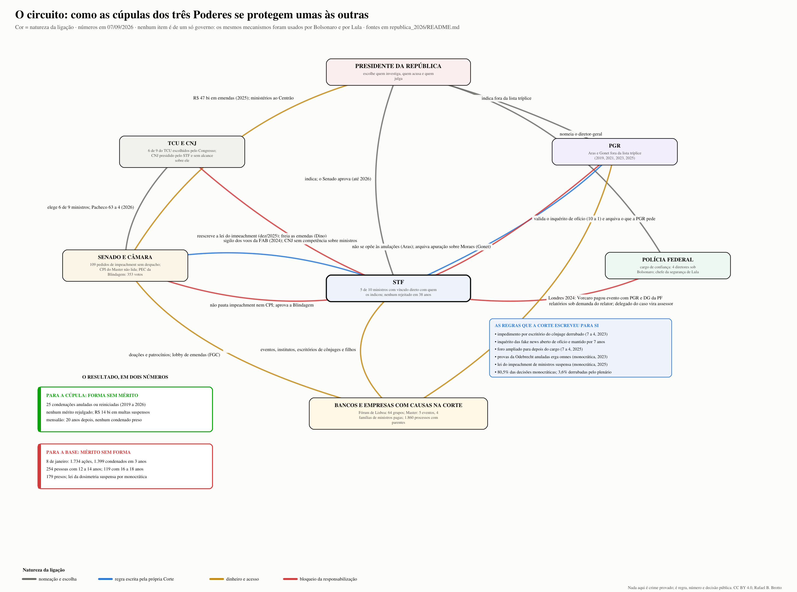

# A República em teste: existe um sistema de poder que se protege através dos três Poderes? (1985 a 2026)

**Estado em 07/09/2026.** Os dossiês anteriores deste repositório descreveram pessoas e casos: [o consolidado dos cinco casos](../consolidado_2005_2026/README.md), [os ministros do STF um a um](../ministros_stf_2026/README.md), [a família Bolsonaro diante da Justiça](../bolsonaro_2026/README.md). Este documento faz a pergunta que está por trás de todos eles e tenta respondê-la com fatos públicos: **há, hoje, uma deturpação da democracia e da República no Brasil, no sentido de um sistema de poder que atravessa os três Poderes e protege a si mesmo?** Se há, como se formou, por quais mecanismos opera, como reconhecê-lo, e o que um cidadão pode fazer.

**Os dois únicos compromissos declarados deste texto.** Ele não é de esquerda nem de direita, não é de Lula nem de Bolsonaro, e trata as duas cúpulas com a mesma régua. Assume só dois valores, ditos aqui para que o leitor os desconte se quiser: a busca constante pela verdade, que obriga a distinguir fato de alegação e a corrigir o próprio erro em público; e a busca da ação virtuosa, que obriga a perguntar, ao fim, o que se deve fazer, e não só o que se deve denunciar. Todo o resto é fato com fonte, graduado pela régua do repositório: **[P]** prova ou ato formal; **[R]** relato documentado; **[A]** alegação; **[N]** refutado; **[O]** arquivado, anulado ou absolvido.

---

## 1. A pergunta em forma testável

Uma pergunta como "a cúpula tomou conta do Judiciário" não pode ser respondida com fatos se não for antes transformada em afirmações que os fatos possam confirmar ou negar. Duas hipóteses rivais:

- **H1, o sistema.** Existe um arranjo estável, que atravessa governos, no qual quem nomeia, quem investiga, quem acusa, quem julga e quem poderia punir estão ligados por interesses, e usam as regras (competência, foro, prescrição, sigilo, impeachment não pautado) para proteger a si mesmos e a quem lhes dá acesso. O sinal característico de H1 não é a corrupção em si, é a **assimetria**: para a cúpula, a forma anula o mérito; para a base, o mérito vem sem forma.
- **H0, as instituições funcionando.** O que parece sistema é o funcionamento normal de instituições sob tensão: excessos de uma operação (Lava Jato) corrigidos por garantias constitucionais; uma tentativa de ruptura (2022 e 2023) punida com dureza; conflitos de interesse que existem em qualquer corte e são tratados por regras de impedimento; e a polarização, que faz cada lado ver captura no que o outro decide.

O que contaria a favor de H1 e contra H0, e que este documento vai procurar:
1. **Circuito fechado de nomeações**: quem julga foi nomeado por quem é julgado ou por quem tem interesse direto no resultado, e com vínculo prévio (advogado, ministro, chefe de segurança).
2. **Assimetria de resultados por classe de réu**: condenações de agentes públicos e empresários de topo anuladas por vício de forma, sem rejulgamento do mérito, ao lado de condenações rápidas e pesadas de pessoas sem poder.
3. **Bloqueio dos mecanismos de responsabilização da cúpula**: impeachment de ministros jamais pautado; CNJ sem alcance; PGR que arquiva; a própria Corte legislando sobre o seu impeachment.
4. **Compra de acesso documentada e tolerada**: eventos, institutos e escritórios de parentes financiados por partes com causas na Corte, com resposta institucional de que "não há conflito".
5. **Autoinvestigação**: a Corte abrindo e conduzindo os inquéritos em que é vítima, investigadora e juíza.
6. **Orçamento como moeda de proteção**: emendas sem rastreabilidade trocadas por apoio, e CPIs não instaladas quando atingem a cúpula.

O que contaria a favor de H0: anulações fundadas em vícios reais e reconhecidos (juiz parcial, prova ilícita), condenações da cúpula que se mantiveram, investigações que atingiram quem nomeou os investigadores, e instituições que corrigiram a si mesmas quando expostas.

A resposta está na seção 6. Antes dela, os fatos.

---

## 2. Como chegamos aqui: o arco de 1985 a 2026

Uma linha por marco. Onde o fato está detalhado em outro dossiê deste repositório, o ponteiro substitui a fonte; onde não, a fonte segue inline. Todos [P], salvo indicação.

| Ano | Marco | O que muda nas regras do jogo |
|---|---|---|
| 1985 a 1988 | Fim do regime militar; Constituição de 1988: STF com 11 ministros escolhidos pelo presidente, sabatinados pelo Senado, vitalícios até a aposentadoria compulsória (70 anos; 75 desde 2015) | A cúpula do Judiciário passa a ser escolhida pelo chefe do Executivo, sem mandato |
| 1992 | Impeachment de Collor (renúncia em 29/12/1992); em 1994 o STF o absolve no processo criminal por provas consideradas ilícitas | Primeira vez que o Senado afasta um presidente e a Corte, depois, o absolve por forma |
| 2005 a 2014 | Mensalão: revelação (2005), julgamento no STF (2012), embargos que absolvem oito réus de quadrilha e reduzem penas (2014). Toffoli, ex-subordinado de Dirceu, vota pela absolvição do ex-chefe | A primeira grande condenação de uma cúpula partidária pelo Supremo, e a primeira redução por manobra processual (ver [quem se repete](../quem_se_repete_2005_2026/README.md)) |
| 2013 | Protestos de junho | Crise de representação que alimenta o antipoliticismo dos anos seguintes |
| 2014 a 2018 | Lava Jato: 285 condenações em Curitiba; delações de Youssef, Costa, Odebrecht; Teori Zavascki relator no STF até morrer (19/01/2017); Fachin o sucede; "lista de Fachin" com 9 ministros, 29 senadores, 42 deputados (abr/2017) | O Judiciário de primeira instância passa a alcançar a cúpula política e empresarial; o STF torna-se o gargalo pelo foro |
| 2016 | Moro divulga grampo Dilma–Lula (16/03); Gilmar suspende a nomeação de Lula (18/03); impeachment de Dilma (31/08) presidido por Lewandowski com o "fatiamento"; Temer assume | O Supremo entra na disputa presidencial pelos dois lados |
| 2017 | Delação da JBS; duas denúncias contra Temer barradas pela Câmara; Moraes nomeado por Temer | A Câmara mostra que barra denúncia contra presidente aliado |
| 2018 | STF nega HC a Lula por 6 a 5 com desempate de Cármen Lúcia (04/04); Lula preso (07/04) e impedido de concorrer; Bolsonaro eleito; Moro aceita o Ministério da Justiça (nov); Toffoli preside o STF | O juiz do caso vira ministro do vencedor da eleição que o caso decidiu |
| 2019 | Toffoli abre de ofício o inquérito das fake news e escolhe Moraes relator (14/03); a PGR pede o arquivamento e é ignorada; Vaza Jato (jun); Toffoli suspende os processos com dados do Coaf a pedido de Flávio Bolsonaro (jul); Bolsonaro ignora a lista tríplice e nomeia Aras (set); Lei de Abuso de Autoridade (set); STF proíbe prisão após segunda instância (nov, 6 a 5) | A Corte cria o instrumento com que vai se defender; o Executivo captura a PGR; a Lava Jato perde o motor |
| 2020 | Pandemia: competência concorrente (abr); Moro rompe com Bolsonaro e acusa interferência na PF (abr); Fux preside o STF; Fux suspende o juiz das garantias | O Executivo tenta capturar a PF e é contido; a Corte governa a pandemia |
| 2021 | Força-tarefa da Lava Jato encerrada sob Aras (fev); prisão do deputado Daniel Silveira (fev); Fachin anula as condenações de Lula por incompetência (mar) e a 2ª Turma declara Moro suspeito (mar; plenário 7 a 4 em jun); delação de Cabral anulada; CPI da Covid instalada por ordem de Barroso; Mendonça nomeado (dez) | Ano do desmonte: a Lava Jato é revertida por forma, e Lula volta a ser elegível |
| 2022 | Fachin e depois Moraes presidem o TSE; Resolução 23.714 entre os turnos (out); Lula eleito; orçamento secreto declarado inconstitucional (dez) | O TSE assume poder de polícia sobre o discurso eleitoral |
| 2023 | 8 de janeiro; Moraes relator de tudo; Zanin, ex-advogado de Lula, nomeado (ago); STF derruba a regra que impedia juiz de julgar cliente do escritório do cônjuge (ago, 7 a 4); Toffoli anula as provas da Odebrecht (set) e suspende a multa da J&F (dez); Barroso preside; Gonet nomeado fora da lista (dez); Dino indicado (nov) | A Corte julga o atentado contra si mesma; afrouxa as próprias regras de impedimento; o Executivo repete a captura da PGR |
| 2024 | Dino toma posse (fev); X suspenso (ago a out); maconha descriminalizada (jun); Gilmar anula Dirceu (out); relatório da PF do golpe (nov); Braga Netto preso (dez); Lewandowski ministro da Justiça enquanto o escritório da família recebe do Master | Concentração de poder em Moraes; o Executivo coloca um ex-ministro do STF no comando da PF |
| 2025 | Denúncia do golpe (fev); foro ampliado (mar); vacina arquivada (mar); Marco Civil (jun); EUA sancionam Moraes (jul) e depois recuam (dez); Bolsonaro condenado (set); Fachin preside (set); Barroso se aposenta (out); Fux vai à 2ª Turma (out); Vorcaro preso e o Master liquidado (nov); Bolsonaro em preventiva (nov); Messias indicado (nov); Gilmar suspende a lei do impeachment de ministros (dez); dosimetria aprovada (dez) | A Corte condena o ex-presidente, sofre sanção externa, e legisla sobre o próprio impeachment |
| 2026 | Veto à dosimetria (jan) derrubado (abr); Toffoli deixa a relatoria do Master após o relatório da PF (fev); Vorcaro preso de novo (mar); Messias rejeitado pelo Senado (abr); Kassio preside o TSE (mai); Eduardo condenado (jun); Dark Horse (jul); emendas de líder nulas (ago); as 218 páginas sobre Moraes e a crise Moraes–Mendonça (set); eleição em 04/10 | O caso Master expõe ao mesmo tempo o STF, a PGR, a PF, o Senado e o governo, e a Corte se investiga a si mesma |

O arco mostra três movimentos que se repetem: a Corte é chamada a decidir a disputa presidencial (2016, 2018, 2021, 2023, 2025); o Executivo captura a PGR e a PF pela nomeação (2019 e 2023); e as condenações da cúpula são revertidas por forma (2014, 2021, 2023, 2024), enquanto as da base (8/1) são mantidas.

---

## 3. As anulações, uma a uma: quem cancelou os julgamentos, por quê, e quem ganhou

Esta é a peça central da hipótese H1, porque é onde se vê a assimetria. A força-tarefa de Curitiba encerrou em 01/02/2021 com 278 condenações de 174 pessoas e 2.611 anos de pena. O que segue é a lista do que caiu desde então, com quem decidiu, por quê, a pedido de quem, com que posição da PGR, quem ganhou e se o mérito chegou a ser rejulgado. Depois, o outro lado: os abusos da operação que foram formalmente reconhecidos. Fonte do balanço: https://www.poder360.com.br/justica/mpf-anuncia-fim-da-forca-tarefa-da-operacao-lava-jato-no-parana/

### 3.1 Os quatro caminhos pelos quais as condenações caíram

**Caminho 1: incompetência do juízo.** Em 08/03/2021 Fachin, sozinho, anulou as quatro ações de Lula (tríplex, Atibaia, duas do Instituto Lula) porque Curitiba só podia julgar fatos ligados à Petrobras; mandou tudo ao DF e preservou as provas. A PGR de Aras recorreu; o plenário confirmou por 8 a 3 em 15/04/2021 (Fachin, Moraes, Barroso, Rosa Weber, Toffoli, Lewandowski, Cármen Lúcia, Gilmar; contra Kassio, Marco Aurélio e Fux). Em 27/01/2022 a 12ª Vara do DF declarou o tríplex prescrito, a pedido do próprio MPF: com a pena do STJ como teto, reduzida à metade pela idade de Lula, e os marcos interruptivos apagados pela anulação, o crime deixou de ser punível. Atibaia teve a denúncia rejeitada em 2021. **O mérito nunca foi rejulgado.** [P] Fontes: https://portal.stf.jus.br/noticias/verNoticiaDetalhe.asp?idConteudo=464261&ori=1 ; https://conjur.com.br/2021-abr-15/stf-forma-maioria-declarar-incompetencia-curitiba-julgar-lula/ ; https://conjur.com.br/2022-jan-28/justica-df-declara-prescricao-arquiva-acao-triplex-guaruja/
O mesmo caminho levou Mantega a Brasília (Gilmar, 2019; a Zelotes prescreveu em 2025), Cunha, Delúbio, Bumlai e Vaccari à Justiça Eleitoral (STJ 2021 e 2023; 2ª Turma 2023 por 3 a 2, Kassio, Mendonça e Gilmar contra Fachin e Lewandowski), Cabral ao TRF-2 e à Justiça Estadual (2024) e Jacob Barata à Justiça Estadual (2021). Em cada um, os processos recomeçaram do zero ou prescreveram. [P] Fontes: https://portal.stf.jus.br/noticias/verNoticiaDetalhe.asp?idConteudo=428561 ; https://www.conjur.com.br/2023-mai-29/turma-supremo-anula-condenacao-eduardo-cunha-lava-jato/ ; https://www.conjur.com.br/2023-mar-03/stj-anula-condenacao-delubio-envia-justica-eleitoral/ ; https://agenciabrasil.ebc.com.br/justica/noticia/2024-03/justica-federal-anula-tres-condenacoes-do-ex-governador-sergio-cabral

**Caminho 2: suspeição do juiz.** Em 23/03/2021 a 2ª Turma declarou Moro parcial no caso do tríplex por 3 a 2: Gilmar, Lewandowski e Cármen Lúcia, que mudou o voto de 2018, contra Fachin e Kassio. Cármen listou quatro atos: a condução coercitiva de 2016, o grampo de Lula e dos advogados, a divulgação seletiva das escutas e o levantamento do sigilo da delação de Palocci na semana do primeiro turno de 2018. Gilmar sustentou que o voto se baseava em fatos públicos, não nas mensagens hackeadas. O plenário manteve por 7 a 4 em 23/06/2021; Fux chamou as mensagens de "prova absolutamente ilícita, roubada e depois lavada". A suspeição tem efeito mais amplo que a incompetência: apaga tudo o que o juiz fez. Por extensão, Gilmar anulou todas as condenações de Dirceu em 28/10/2024 (a pedido de Roberto Podval; Moro: "não existe base convincente"), e Toffoli anulou, por "conluio" entre Moro e a força-tarefa, os atos contra Marcelo Odebrecht (mai/2024, mantido 3 a 2 na 2ª Turma), Léo Pinheiro (set/2024), 23 alvos ligados a Beto Richa (mar/2024), Raul Schmidt (set/2024), Palocci (fev/2025, mantido 3 a 2), Youssef (jul/2025), Vaccari (ago/2025) e Eduardo Musa (mai/2026). Em todos, as delações foram preservadas: o Estado ficou com a confissão e perdeu a condenação. A PGR de Gonet recorreu em Odebrecht e Palocci, dizendo que cada caso devia ser revisto na instância própria; foi vencida. [P] Fontes: https://www.conjur.com.br/2021-mar-23/mudanca-voto-carmen-turma-stf-declara-moro-suspeito/ ; https://conjur.com.br/2021-jun-23/moro-suspeito-julgar-lula-decide-stf-votos/ ; https://agenciabrasil.ebc.com.br/justica/noticia/2024-10/gilmar-mendes-anula-condenacoes-de-dirceu-na-lava-jato ; https://www.conjur.com.br/2024-set-06/stf-mantem-decisao-de-toffoli-que-anulou-atos-da-lava-jato-contra-marcelo-odebrecht/ ; https://www.conjur.com.br/2025-ago-15/supremo-mantem-anulacao-de-atos-da-lava-jato-contra-palocci/ ; https://conjur.com.br/2025-jul-15/toffoli-anula-condenacoes-de-youssef-e-abre-brecha-a-outros-reus-da-lava-jato/

**Caminho 3: a prova em si.** Em 06/09/2023 Toffoli, sozinho, numa reclamação da defesa de Lula herdada de Lewandowski, declarou nulas "em definitivo e com efeitos erga omnes" todas as provas dos sistemas Drousys e My Web Day da Odebrecht, "em qualquer âmbito ou grau de jurisdição", por quebra da cadeia de custódia e falta de pedido formal de cooperação internacional; escreveu que a prisão de Lula foi "armação" e "um dos maiores erros judiciários da história". A PGR e a associação dos procuradores recorreram; a 2ª Turma suspendeu o julgamento dos recursos em fev/2024 e eles seguem parados em 2026. Pela mesma via, o STJ reanulou Bendine (abr/2024). Em 20/10/2023 e em 01/04/2026 a OCDE registrou "preocupação": a decisão teve "efeito cascata" sobre as leniências e limita a cooperação internacional; a Transparência Internacional contou mais de cem réus com processos anulados e 28 beneficiados em oito jurisdições estrangeiras; das 35 recomendações do grupo antissuborno, 16 não foram implementadas. Toffoli: anulou "com muita tristeza", "o Estado andou errado". [P] Fontes: https://portal.stf.jus.br/noticias/verNoticiaDetalhe.asp?idConteudo=513517&ori=1 ; https://www.migalhas.com.br/quentes/402500/stf-analise-de-provas-da-leniencia-da-odebrecht-esperara-conciliacao ; https://www.gazetadopovo.com.br/republica/ocde-alerta-que-decisoes-do-stf-na-lava-jato-enfraquecem-combate-a-corrupcao-no-brasil/ (lida)

**Caminho 4: os acordos e o dinheiro.** Em 19/12/2023, quatro meses depois de votar pela queda da regra do CPC que o impediria de julgar clientes do escritório da esposa, Toffoli suspendeu a multa de R$ 10,3 bilhões da leniência da J&F por "dúvida razoável" sobre a voluntariedade e deu à empresa o material da Spoofing; em 31/01/2024 fez o mesmo com os pagamentos da leniência da Odebrecht (R$ 3,8 bilhões nominais, R$ 8,5 bilhões na conta do STF). Em 04/11/2025 um juiz federal do DF anulou a cláusula penal da J&F e mandou recalcular a multa. Em paralelo, na conciliação conduzida por Mendonça, sete empreiteiras que devem R$ 11,8 bilhões à União negociam desconto de até metade. No total, cerca de R$ 14 bilhões em multas foram suspensos e R$ 11,8 bilhões estão em repactuação. [P] Fontes: https://www.conjur.com.br/2023-dez-20/toffoli-ve-indicios-de-irregularidades-em-leniencia-da-jf-e-suspende-multa/ ; https://www.conjur.com.br/2024-fev-01/toffoli-suspende-pagamento-do-acordo-de-leniencia-da-odebrecht-com-a-lava-jato/ ; https://www.migalhas.com.br/quentes/443706/juiz-ve-coacao-em-acordo-de-leniencia-da-j-f-e-reduz-multa-bilionaria ; https://www.cnnbrasil.com.br/politica/agu-e-cgu-concluem-acordos-de-leniencia-com-empresas-da-lava-jato/

**Fora da Lava Jato, o mesmo padrão.** As provas da rachadinha de Flávio Bolsonaro caíram por quebra de sigilo sem fundamentação (STJ, fev/2021) e por relatórios do Coaf pedidos por encomenda (2ª Turma, Gilmar, nov/2021), e a denúncia foi rejeitada em 2022 a pedido do próprio MP-RJ; a denúncia contra Renan Calheiros foi rejeitada em 2023 por 3 a 2 por falta de corroboração e o último inquérito arquivado em 2025 a pedido de Gonet; a delação de Cabral foi anulada pelo plenário em 2021 a pedido de Aras; Temer foi absolvido sumariamente no caso dos Portos em 2021. [P] Fontes: https://www.conjur.com.br/2021-nov-30/anulados-relatorios-coaf-flavio-bolsonaro-rachadinhas/ ; https://www.conjur.com.br/2025-fev-26/ultimo-inquerito-contra-renan-calheiros-e-arquivado-no-stf/ ; https://agenciabrasil.ebc.com.br/justica/noticia/2021-05/supremo-anula-delacao-premiada-de-sergio-cabral

### 3.2 A tabela

| Caso | Quem anulou | Fundamento | A pedido de / PGR | Quem ganhou | Mérito rejulgado? |
|---|---|---|---|---|---|
| Lula, 4 ações | Fachin; plenário 8 a 3; 2ª Turma 3 a 2; plenário 7 a 4 (2021) | incompetência e suspeição | defesa (Zanin) / PGR recorreu e perdeu | Lula | não: tríplex prescreveu, Atibaia rejeitada |
| Provas da Odebrecht, erga omnes | Toffoli, monocrático (set/2023) | cadeia de custódia | defesa de Lula / PGR e ANPR recorreram; recursos parados | todos os réus alcançados | recursos suspensos desde fev/2024 |
| Leniência J&F, R$ 10,3 bi | Toffoli (dez/2023); juiz do DF (nov/2025) | voluntariedade | J&F / PGR não localizada | J&F (R$ 2,9 bi pagos) | recálculo em curso |
| Leniência Odebrecht, R$ 3,8 bi a R$ 8,5 bi | Toffoli (jan/2024) | voluntariedade | Novonor | Novonor | repactuação |
| Dirceu, 23 anos | Gilmar (out/2024) | parcialidade de Moro | defesa (Podval) | Dirceu | não |
| Cunha, 2 condenações | STF 2021; 2ª Turma 3 a 2 (2023) | competência eleitoral | defesa | Cunha | reiniciado, prescrição parcial |
| Delúbio, 5 anos | STJ (2023) | competência eleitoral | defesa | Delúbio | não localizado |
| Mantega | Gilmar (2019) | incompetência | defesa | Mantega | Zelotes prescreveu (2025) |
| Palocci, 12 anos | Toffoli; 2ª Turma 3 a 2 (2025) | conluio | defesa / PGR recorreu e perdeu | Palocci, delação mantida | não |
| Marcelo Odebrecht | Toffoli; 2ª Turma 3 a 2 (2024) | conluio | defesa / PGR recorreu e perdeu | pena já cumprida | não |
| Léo Pinheiro, mais de 30 anos | Toffoli; 2ª Turma (2024 a 2025) | conluio | defesa / PGR: instância própria | Léo Pinheiro | não |
| Youssef; Raul Schmidt; Musa; 23 alvos de Richa | Toffoli (2024 a 2026) | conluio | defesa | réus | não |
| Vaccari; Santana e Mônica Moura; Bumlai | STJ 2021; Fachin 2024; Toffoli 2025 | competência eleitoral; conluio | defesa | réus | Justiça Eleitoral |
| Bendine, 11 anos | 2ª Turma 3 a 1 (2019); STJ (2024) | ordem das alegações; provas da Odebrecht | defesa (Toron) | Bendine | recondenado e reanulado |
| Cabral, delação e 4 condenações | plenário 7 a 4; 2ª Turma; TRF-2 | anuência do MP; competência | PGR (delação); defesa | Cabral, solto desde dez/2022 | redistribuição; uma prescrita |
| Pezão, 99 anos | TRF-2 (2023) | sentença sem fundamentação | defesa | absolvido | sim, absolvido |
| Flávio Bolsonaro, provas | STJ; 2ª Turma 3 a 1 (2021) | quebra sem fundamentação; RIFs por encomenda | defesa | denúncia rejeitada (2022) | não |
| Renan, denúncia | 2ª Turma 3 a 2 (2023) | falta de corroboração | defesa / PGR pediu arquivar o resto | arquivado | não |
| Geddel | 2ª Turma (2021), parcial | sem prova de associação | defesa | lavagem mantida | mantida |
| Collor | mantida: plenário 6 a 4 (2025) | | | preso em abr/2025, domiciliar humanitária | pena em execução |
| Maluf | mantida; indulto (2023) | | PGR favorável | pena extinta | cumpriu 5 anos e 4 meses |

**Contagem.** Ao menos 25 condenações anuladas ou reiniciadas do zero, mais 23 alvos de Richa e as provas erga omnes da Odebrecht; **nenhuma teve o mérito rejulgado até 07/09/2026**, salvo Pezão, absolvido. Condenações da cúpula que se mantiveram: Collor e Maluf, ambos em domiciliar ou com pena extinta; Geddel em parte; e as penas já cumpridas por delatores antes da anulação. Vinte anos depois do mensalão, nenhum dos 24 condenados está preso. [R] Fonte: https://www.cnnbrasil.com.br/politica/mensalao-20-anos-depois-todos-os-condenados-estao-soltos/

### 3.3 O outro lado: o que a Lava Jato fez de errado, com reconhecimento formal

A lista acima só faz sentido ao lado desta. Os vícios apontados pelas anulações não foram inventados; parte deles foi reconhecida por órgãos que nada têm a ver com a defesa dos réus.
- [P] 14/06/2018: o plenário declarou inconstitucional a condução coercitiva para interrogatório, instrumento usado contra Lula em 2016. Fonte: https://portal.stf.jus.br/noticias/verNoticiaDetalhe.asp?idConteudo=381510
- [P] 15/03/2019: Moraes suspendeu o acordo em que a força-tarefa criaria uma fundação privada com R$ 2,5 bilhões da multa paga pela Petrobras nos EUA: o MPF "exorbitou". Fonte: https://www.conjur.com.br/2019-mar-15/alexandre-moraes-suspende-efeitos-acordo-lava-jato/
- [P] 08/09/2020: o CNMP censurou Deltan Dallagnol por posts contra a eleição de Renan; 27/01/2022: demitiu o procurador Diogo Castor pelo outdoor "Bem-vindo à República de Curitiba". Fontes: https://agenciabrasil.ebc.com.br/justica/noticia/2023-03/stf-rejeita-recurso-de-deltan-contra-punicao-do-cnmp ; https://www.conjur.com.br/2022-jan-27/cnmp-mantem-demissao-lavajatista-encomendou-outdoor/
- [P] 27/04/2022: o Comitê de Direitos Humanos da ONU concluiu que Moro violou o direito de Lula a um tribunal imparcial. Fonte: https://www.conjur.com.br/2022-abr-27/moro-foi-parcial-direitos-lula-foram-violados-conclui-comite-onu/
- [P] 16/05/2023: o TSE cassou por unanimidade o mandato de Dallagnol por "fraude à lei", por ter se exonerado com 15 procedimentos no CNMP que podiam virar processo disciplinar. Fonte: https://conjur.com.br/2023-mai-16/tse-cassa-mandato-lavajatista-deltan-dallagnol-fraude-lei/
- [P] 21/08/2023: Walter Delgatti, o hacker da Spoofing, condenado a 20 anos; o STF nunca julgou em tese se as mensagens são prova lícita, mas as usou. Fonte: https://www.gazetadopovo.com.br/republica/juiz-condena-hacker-delgatti-a-20-anos-de-prisao/
- [P] 21/09/2023: o TCU, por unanimidade, apontou que a força-tarefa movimentou mais de R$ 22 bilhões de leniências e delações sem transparência nem prestação de contas; Bruno Dantas: procuradores "viraram gestores públicos sem responsabilidade". Fonte: https://conjur.com.br/2023-set-22/lava-jato-movimentou-22-bilhoes-transparencia-tcu/ (não lida na origem)
- [P] Abr/2024: o CNJ afastou a juíza Gabriela Hardt por homologar repasses de cerca de R$ 2 bilhões a fundo da força-tarefa, com termos discutidos por WhatsApp; 03/06/2025: aposentou compulsoriamente Marcelo Bretas, da Lava Jato do Rio, por negociar delações e favorecer candidatos em 2018. Fontes: https://agenciabrasil.ebc.com.br/justica/noticia/2024-04/cnj-determina-afastamento-de-gabriela-hardt-ex-juiza-da-lava-jato ; https://agenciabrasil.ebc.com.br/justica/noticia/2025-06/cnj-condena-juiz-marcelo-bretas-aposentadoria-compulsoria
- [P] Sergio Moro aceitou o Ministério da Justiça do vencedor da eleição que a prisão de Lula decidiu (nov/2018) e depois acusou o mesmo presidente de interferir na PF (abr/2020); a PF concluiu duas vezes que não houve interferência.
- Cabral ficou seis anos preso sem trânsito em julgado; Lula, 580 dias.

### 3.4 As delações: o que sobreviveu

A outra metade desta seção é o que as delações disseram e o que se confirmou; está no [anexo das delações](anexo_delacoes_2026-09-07.md). O resultado em uma linha: 399 delações e 43 leniências homologadas em Curitiba, 101 políticos com foro atingidos, e três condenados com trânsito em julgado (Meurer, Geddel, Collor); os delatores trocaram séculos de pena por meses de prisão e mantiveram os acordos mesmo quando os atos contra eles foram anulados; as acusações contra ministros do STF (Barusco, Marcelo Odebrecht, Léo Pinheiro e Cabral sobre Toffoli) nunca viraram inquérito, e a delação que mais o citava foi anulada com o voto dele. O mesmo exercício, feito para um caso anulado do outro lado do espectro, está no [anexo do mérito da rachadinha](../bolsonaro_2026/merito_rachadinha_2026-09-07.md): indício por indício, o que era prova, o que caiu e o que sobreviveria.

### 3.5 O que a lista mostra, e o que não mostra

O que mostra [P]: os mesmos ministros aparecem em quase todas as anulações da cúpula (Gilmar em 2016, 2019, 2021, 2024; Toffoli em 2019, 2023, 2024, 2025, 2026; Lewandowski em 2019, 2020, 2021), em geral por decisão monocrática ou por 3 a 2 na 2ª Turma; a PGR de Aras não se opôs ao essencial e a de Gonet se opôs e perdeu; nenhum mérito foi rejulgado; cerca de R$ 14 bilhões em multas ficaram suspensos; e as delações, isto é, as confissões, foram todas mantidas. Os beneficiários vêm de todos os partidos: PT (Lula, Dirceu, Palocci, Vaccari), MDB (Cunha, Cabral, Temer, Renan, Geddel), PL (Flávio Bolsonaro), PSDB (Richa), e as maiores empreiteiras e o maior frigorífico do país.

O que não mostra: que as anulações tenham sido juridicamente erradas. Parte dos vícios era real e foi reconhecida por ONU, CNMP, TSE, TCU e CNJ. A pergunta que a lista deixa não é "as anulações foram legais", é outra: **por que o Estado brasileiro, tendo as confissões, as provas dos sistemas e os acordos, nunca refez um único processo com as regras certas?** A resposta a essa pergunta é o que separa H0 de H1, e ela aparece nos mecanismos da seção 4.

---

## 4. Os mecanismos: como o sistema opera nos três Poderes

O diagrama resume esta seção: quem nomeia quem, que regras a Corte escreveu para si, por onde entra o dinheiro, onde a responsabilização trava, e o resultado em dois números. Gerador: [mapa/gen_circuito.py](mapa/gen_circuito.py).

Os seis sinais da seção 1, um a um, com número, data e fonte. Onde a instituição respondeu, a resposta está registrada.

### 4.1 O circuito de nomeações

- **A PGR deixou de ser escolhida pela carreira.** A lista tríplice da associação dos procuradores é costume desde 2003, não lei. Bolsonaro a ignorou em 2019 (Aras, 68 a 10) e em 2021 (recondução, 55 a 10); Lula a ignorou em 2023 (Gonet, 65 a 11, relator Jaques Wagner) e antecipou a recondução em 2025 (45 a 26, quatro votos acima do mínimo) para evitar a formação de nova lista. Gonet é coautor de Gilmar Mendes num curso de direito constitucional e cofundador do IDP. Fontes: https://www12.senado.leg.br/noticias/materias/2019/09/25/senado-aprova-indicacao-de-augusto-aras-para-a-pgr ; https://www.cnnbrasil.com.br/politica/lula-repete-bolsonaro-e-ignora-lista-de-associacao-ao-indicar-gonet-para-chefiar-a-pgr/ ; https://www12.senado.leg.br/noticias/materias/2025/11/12/por-45-votos-a-26-senado-aprova-reconducao-de-gonet
- **A PF é cargo de confiança do presidente.** Quatro diretores-gerais sob Bolsonaro em quatro anos (Valeixo, Rolando, Maiurino, Márcio Nunes), depois de o STF barrar a nomeação de Ramagem; Andrei Rodrigues, chefe da segurança da campanha de Lula, desde 02/01/2023. Fonte: https://pt.wikipedia.org/wiki/Lista_de_chefes_e_diretores-gerais_da_Pol%C3%ADcia_Federal_do_Brasil
- **O STF é escolhido pelo presidente, e cinco dos dez ministros atuais tinham vínculo direto com quem os indicou**: Toffoli (AGU de Lula), Moraes (ministro da Justiça de Temer), Mendonça (AGU e ministro da Justiça de Bolsonaro), Zanin (advogado de Lula), Dino (ministro da Justiça de Lula). O Senado aprovou todos os indicados desde 1988 até rejeitar Messias, o AGU de Lula, em 29/04/2026 por 42 a 34. Fontes: https://www.cnnbrasil.com.br/politica/senado-aprovou-todos-os-nomes-indicados-ao-stf-desde-1988-veja-placares/ ; https://www12.senado.leg.br/noticias/materias/2026/04/29/indicacao-de-jorge-messias-ao-stf-e-rejeitada-pelo-senado
- **O TSE das eleições de 2026** é presidido por Kassio Nunes Marques, indicado por Bolsonaro, com Mendonça, indicado por Bolsonaro, como vice; dois dos sete membros são advogados escolhidos pelo presidente da República. Fonte: https://agenciabrasil.ebc.com.br/justica/noticia/2026-05/nunes-marques-toma-posse-na-presidencia-do-tse-e-vai-comandar-eleicoes
- **O Congresso é presidido por quem o Centrão e o governo escolhem juntos.** Alcolumbre (2019, 42 votos, candidatura articulada pelo governo Bolsonaro; 2025, 73 votos), Pacheco (2021 e 2023, com apoio simultâneo de PT e PL), Lira (2023, 464 votos, bloco de 20 partidos com PT e PL), Motta (2025, 444 votos). Fontes: https://www12.senado.leg.br/noticias/materias/2021/02/01/rodrigo-pacheco-e-o-novo-presidente-do-senado ; https://www.camara.leg.br/noticias/936487-arthur-lira-e-reeleito-presidente-da-camara-com-464-votos/
- **O TCU, que fiscaliza o dinheiro, é escolhido por quem gasta**: seis dos nove ministros são indicados pelo Congresso; em 2023 a Câmara elegeu um deputado de 39 anos, filho de senador; em 2026 o Senado aprovou por 63 a 4 o ex-presidente do Senado Rodrigo Pacheco, em vaga aberta pela renúncia de Bruno Dantas aos 48 anos. O CNJ, que disciplina juízes, é presidido pelo presidente do STF e não alcança ministros do STF. Fontes: https://www12.senado.leg.br/noticias/materias/2026/09/01/senado-aprova-ex-presidente-rodrigo-pacheco-para-o-tcu ; https://www.cnj.jus.br/composicao-atual/

Leitura: o sinal 1 de H1 está documentado em todos os pontos. Não é de um governo: Bolsonaro e Lula usaram a mesma chave na PGR e na PF, e o Senado nunca disse não a um indicado ao STF em 38 anos, até 2026. Defesa institucional: a Constituição autoriza a escolha pelo presidente e o Senado sabatina; a lista tríplice não é obrigatória.

### 4.2 A assimetria: forma para a cúpula, mérito para a base

- Na seção 3: ao menos 25 condenações da cúpula anuladas ou reiniciadas do zero de 2019 a 2026, nenhuma rejulgada no mérito; cerca de R$ 14 bilhões em multas suspensos; vinte anos depois do mensalão, nenhum condenado preso. [P]
- No 8 de janeiro: 1.734 ações penais, 1.399 condenados, 179 presos em 08/01/2026; 254 pessoas com 12 a 14 anos e 119 com 16 a 18 anos de pena, julgadas pelo Supremo sem foro, em turmas de cinco ou quatro ministros, com pouco mais de um ano entre o fato e as primeiras condenações. O Congresso reagiu com a lei da dosimetria (veto derrubado por 318 e 49 votos em 30/04/2026); Moraes suspendeu a lei em 09/05/2026 e o plenário não a julgou até 07/09. [P] Fontes: https://agenciabrasil.ebc.com.br/justica/noticia/2026-01/stf-condenou-1399-pessoas-por-atos-golpistas-179-estao-presas ; https://www.conjur.com.br/2026-mai-09/alexandre-suspende-efeitos-da-lei-da-dosimetria-ate-analise-no-stf/
- O foro: a decisão de 2018 que restringiu o foro reduziu o acervo penal do STF de 527 para 89 casos em quatro anos (menos 80%); a de 11/03/2025, relatada por Gilmar, devolveu à Corte os casos de quem já deixou o cargo, por 7 a 4. [P] Fontes: https://portal.stf.jus.br/noticias/verNoticiaDetalhe.asp?idConteudo=489564&ori=1 ; https://noticias.stf.jus.br/postsnoticias/acoes-contra-autoridades-permanecem-no-stf-mesmo-apos-saida-do-cargo/

Leitura: o sinal 2 está documentado. A defesa de H0 é que os dois conjuntos não se comparam: um é prova ilícita corrigida por garantia; o outro é crime contra a democracia com prova farta. A pergunta que resta é a da seção 3.4: por que ninguém refez os processos da cúpula com as regras certas.

### 4.3 O bloqueio da responsabilização

- **Impeachment de ministros: nenhum pedido despachado em oito anos.** Pelo sistema do Senado, 91 pedidos de 2021 a 2025 (41 só em 2025), 68 ativos em dez/2025, 32 contra Moraes; pela contagem do Poder360, 80 desde 2021, 46 contra Moraes; Alcolumbre falou em 109 em setembro de 2026. Alcolumbre arquivou todos em bloco em 04/01/2021; Pacheco não despachou nenhum em quatro anos; Alcolumbre não pautou nenhum desde 2025. [R] Fontes: https://www.congressoemfoco.com.br/noticia/114511/pedidos-de-impeachment-de-ministro-batem-recorde-em-2025 ; https://www.poder360.com.br/poder-justica/ministros-do-stf-sao-alvos-de-80-pedidos-de-impeachment-no-senado/
- **A Corte legislou sobre o próprio impeachment.** Em 03/12/2025 Gilmar, sozinho, suspendeu trechos da lei de 1950: só a PGR poderia denunciar, quórum de dois terços, decisão judicial não fundamenta denúncia; recuou da exclusividade da PGR em 10/12 a pedido do Senado; o plenário não referendou até setembro de 2026. Alcolumbre: "não me falta coragem"; Moro: "11 ministros, e não 11 imperadores". [P] Fonte: https://agenciabrasil.ebc.com.br/justica/noticia/2025-12/gilmar-decide-que-so-pgr-pode-pedir-impeachment-de-ministro-do-stf ; https://www.migalhas.com.br/quentes/455135/impeachment-de-ministros-do-stf-volta-ao-radar-liminar-barra-avanco
- **O CNJ não alcança o STF**, por jurisprudência da própria Corte desde 2004; o código de ética anunciado por Fachin em fev/2026 virou, em ago/2026, minuta do CNJ "sem punição" que "não afetará ministros do STF". [P] Fontes: https://agenciabrasil.ebc.com.br/justica/noticia/2026-08/ministro-fachin-apresenta-novas-regras-de-conduta-para-magistrados ; https://www.gazetadopovo.com.br/republica/fachin-propoe-codigo-de-etica-sem-punicao-e-que-exclui-ministros-do-stf/
- **A Corte derrubou a regra que a impedia de julgar clientes dos escritórios de cônjuges** (ADI 5953, 21/08/2023, 7 a 4: Gilmar, Toffoli, Fux, Moraes, Kassio, Mendonça, Zanin; contra Fachin, Barroso, Rosa Weber, Cármen Lúcia), com o fundamento de que "a lei não deu ao juiz meios para pesquisar a carteira de clientes do escritório de seu familiar". Em 2026, 13 parentes de 8 ministros advogam no STF e STJ, em 1.860 processos, 571 iniciados depois da posse do parente. [P] Fontes: https://portal.stf.jus.br/noticias/verNoticiaDetalhe.asp?idConteudo=512602 ; https://www.gazetadopovo.com.br/republica/quem-sao-os-ministros-do-stf-com-parentes-advogados-atuando-na-corte/
- **As CPIs que atingem a cúpula não são instaladas ou terminam sem relatório.** A CPI do Master teve 42 assinaturas no Senado (mínimo 27) e 201 na Câmara e não foi lida por Alcolumbre nem por Motta; um mandado de segurança no STF caiu com Toffoli, que se declarou suspeito. A CPMI do INSS rejeitou o relatório por 19 a 12. A CPI do Crime Organizado rejeitou por 6 a 4, com votos do PT, o relatório que pedia o indiciamento de Toffoli, Moraes, Gilmar e Gonet. [P] Fontes: https://www.congressoemfoco.com.br/noticia/116212/cpi-do-master-veja-os-signatarios-dos-requerimentos ; https://www12.senado.leg.br/noticias/materias/2026/04/14/cpi-do-crime-organizado-termina-sem-relatorio-final
- **A PEC da Blindagem** (autorização prévia e voto secreto para processar parlamentares) passou na Câmara com 353 votos em setembro de 2025 e caiu na CCJ do Senado por 26 a 0 depois de protestos em 27 capitais. [P] Fonte: https://agenciabrasil.ebc.com.br/politica/noticia/2025-09/ccj-do-senado-rejeita-pec-da-blindagem-por-unanimidade

Leitura: o sinal 3 está documentado em todas as pontas, e é o mais forte dos seis. A única vez em que o mecanismo funcionou de baixo para cima foi a queda da PEC da Blindagem, por pressão de rua.

### 4.4 A compra de acesso

- O 13º Fórum de Lisboa (2025), organizado pelo IDP de Gilmar, deu palco a 64 grupos privados com causas no STF, entre eles a Aprosoja-MT (marco temporal, relator Gilmar), a Aegea (duas ações, relator Dino), BTG, JBS, Vale, Meta; foram seis ministros do STF, oito do STJ e cinco do TCU; os patrocínios não são divulgados. O Master patrocinou cinco eventos com ministros entre 2022 e 2024; o STF "não vai se manifestar". [R] Fontes: https://apublica.org/nota/quem-nao-foi-perdeu-gilmarpalooza-deu-palco-a-64-empresas-e-entidades-privadas/ ; https://www.poder360.com.br/poder-justica/vorcaro-do-banco-master-financiou-eventos-com-ministros-do-stf/
- Escritórios: o do escritório da esposa de Moraes recebia R$ 3,6 milhões por mês do Master; o da família de Lewandowski, R$ 250 mil; parentes de Fux, Toffoli, Gilmar e Zanin advogam na Corte. A resposta institucional é que "as regras de suspeição e impedimento estão previstas na legislação", a mesma legislação que a Corte afrouxou em 2023. [R] Fonte: https://www.brasilagro.com.br/conteudo/oito-ministros-do-stf-tem-parentes-advogados-com-processos-na-corte.html
- Recursos públicos sob sigilo: ao menos 154 voos da FAB de ministros entre 2023 e fev/2025, mais de 70% com um só ministro, com lista de passageiros sigilosa por decisão do TCU de 2024, corrigida em parte em abr/2026. [R] Fonte: https://jornaldebrasilia.com.br/noticias/politica-e-poder/stf-descumpre-prazos-de-lei-e-omite-duracao-de-sigilo-sobre-voos-de-ministros-pela-fab/
- Remuneração: magistrados receberam R$ 7 bilhões acima do teto em 2023 e R$ 10,5 bilhões em 2024; R$ 20 bilhões nos três Poderes entre ago/2024 e jul/2025, 80% no Judiciário; a tese do STF de mar/2026 limitou os "penduricalhos" e o CNJ e o CNMP responderam com resolução que "contrariou pontos centrais" da tese; em jun/2026 o plenário virtual liberou o passivo com limite de 35% do teto, por 7 a 4. O subsídio de ministro foi de R$ 33,7 mil (2018) a R$ 46,4 mil (2025), com efeito cascata sobre todo o serviço público. [R] Fontes: https://www.cnnbrasil.com.br/blogs/iuri-pitta/politica/supersalarios-no-setor-publico-custam-ao-brasil-r-20-bi-em-12-meses/ ; https://republica.org/2026/05/08/organizacoes-da-coalizao-de-combate-aos-supersalarios-cobram-controle-sobre-penduricalhos/

Leitura: o sinal 4 está documentado e é tolerado por regra própria da Corte. A defesa institucional é sempre a mesma: "dialogar com as partes de um processo não gera conflito de interesses".

### 4.5 A autoinvestigação

- O inquérito das fake news (INQ 4781) foi aberto de ofício pelo presidente do STF em 14/03/2019, contra o parecer da PGR, com relator escolhido a dedo; foi validado pela própria Corte por 10 a 1 em 2020; em 2026 "o número completo de investigados e crimes envolvidos não é de conhecimento público"; a OAB pediu o fim pelo "caráter perpétuo". Em setembro de 2026 Moraes tentou usar o mesmo inquérito contra Mendonça, e Fachin retirou o pedido e o levou a procedimento da Presidência. A Corte é, no mesmo processo, vítima, investigadora, acusadora e juíza. [P] Fontes: https://pt.wikipedia.org/wiki/Inqu%C3%A9rito_das_Fake_News ; https://www.metropoles.com/brasil/moraes-x-mendonca-entenda-o-que-e-o-inquerito-das-fake-news
- 80,5% das cerca de 116 mil decisões do STF em 2025 foram monocráticas; as liminares individuais em ações de controle de constitucionalidade foram de 6 (2007) a 92 (2020) e 71 (2024); de 389 liminares levadas ao plenário desde 2020, 14 foram derrubadas (3,6%). A PEC 8/2021, que limita monocráticas contra leis, passou no Senado por 52 a 18 em nov/2023 e está parada na Câmara desde a CCJ de out/2024. [P/R] Fontes: https://www.cnnbrasil.com.br/politica/mais-de-80-das-decisoes-do-stf-em-2025-foram-monocraticas/ ; https://jornaldebrasilia.com.br/noticias/politica-e-poder/decisoes-monocraticas-no-stf-disparam-em-15-anos-com-picos-sob-bolsonaro/ ; https://www.camara.leg.br/noticias/1101762-COMISSAO-DE-CONSTITUICAO-E-JUSTICA-APROVA-PROPOSTA-QUE-LIMITA-DECISAO-MONOCRATICA-NO-STF
- Sobre o discurso: 51 ordens sigilosas de Moraes e 37 do TSE ao X publicadas pela Câmara dos EUA (abr/2024); em 2022 o TSE atendeu 60 de 93 representações do PT contra conteúdos; em 2024 o sistema do TSE recebeu 5.250 denúncias. A defesa: ameaças reais à Corte e à eleição; a crítica: o juiz da causa decide o que se pode dizer sobre ele. [R] Fontes: https://www.correiobraziliense.com.br/politica/2024/04/6840218-comite-da-camara-dos-eua-publica-decisoes-sigilosas-de-moraes.html ; https://www.gazetadopovo.com.br/eleicoes/2022/tse-ja-removeu-60-conteudos-que-ligam-lula-a-corrupcao-pcc-ortega-e-temas-sensiveis-ao-pt/

Leitura: o sinal 5 está documentado. Ele é o que distingue o Brasil de 2019 a 2026 de qualquer democracia comparável: em nenhuma outra corte constitucional o presidente abre inquérito de ofício, escolhe o relator e mantém o caso por sete anos sem denúncia.

### 4.6 O orçamento como moeda

- As emendas parlamentares foram de uma média anual de R$ 12 bilhões (2014 a 2019) a R$ 35,5 bilhões (2020 a 2023), segundo o TCU; R$ 47 bilhões empenhados em 2025 e R$ 61 bilhões no orçamento de 2026; 83% impositivas; mais de 90% do que se empenha não se paga no ano, o que cria um estoque de favores. O "orçamento secreto" (RP-9) chegou a R$ 16,5 bilhões em 2022 e foi declarado inconstitucional por 6 a 5 em dez/2022; voltou como "emendas de comissão paralelas" (R$ 8,5 bilhões em 2025) e "emendas Pix" (R$ 7 a 8 bilhões por ano, R$ 22 bilhões de 2020 a 2024 sob auditoria do TCU). [P/R] Fontes: https://portal.tcu.gov.br/imprensa/noticias/tcu-identifica-desafios-na-execucao-orcamentaria-de-emendas-parlamentares ; https://www.cnnbrasil.com.br/politica/governo-encerra-2025-com-pagamento-recorde-de-r-315-bilhoes-em-emendas/ ; https://www.transparencia.org.br/noticias/emendas-de-comissao-paralelas-somam-r-85-bilhoes-em-2025-e-repetem-a-pratica-do-orcamento-secreto/
- Quem controla esse dinheiro decide se CPIs são lidas, se pedidos de impeachment são despachados e se uma PEC de blindagem vai a voto. O STF, por Dino, tornou-se o único freio: bloqueios, rastreabilidade, nulidade das emendas de líder (ago/2026), e por isso é atacado pelo Congresso como invasor do orçamento. O mesmo Congresso que não instala a CPI do Master aprovou a PEC da Blindagem. [P]
- O Executivo compra a governabilidade com ministérios: Turismo, Esporte e Portos foram ao Centrão em 2023 "após derrotas em votações". [R] Fonte: https://exame.com/brasil/centrao-avanca-no-governo-lula-e-pressiona-por-mais-ministerios-saiba-quais/

Leitura: o sinal 6 está documentado. É o mecanismo que liga o Legislativo aos outros dois: o dinheiro compra a omissão.

### 4.7 O que os mecanismos dizem juntos

Os seis sinais de H1 estão presentes e documentados, e nenhum é de um só governo ou de um só partido. O circuito é este: o presidente escolhe quem investiga (PF), quem acusa (PGR) e quem julga (STF); o STF escolhe as regras do seu próprio impedimento, do seu impeachment, do foro e da prova; o Senado, que poderia pautar o impeachment e a CPI, depende do orçamento que o Executivo libera e das decisões que o STF toma sobre emendas; o TCU é escolhido pelo Congresso; o CNJ é presidido pelo STF. Quem está fora do circuito, o réu do 8 de janeiro, o servidor de base, o cidadão, recebe o mérito sem a forma. Quem está dentro recebe a forma sem o mérito. A hipótese H0 explica cada peça isoladamente; não explica o conjunto.

---

## 5. Os indicadores: como reconhecer a deturpação, e onde o Brasil está

### 5.1 O checklist do cidadão: sete perguntas que não dependem de partido

Qualquer decisão, nomeação ou notícia pode ser testada com estas perguntas. Se a resposta for "sim" em três ou mais, o mecanismo está operando, seja quem for o beneficiado.

1. **Quem decidiu foi nomeado por quem se beneficia, ou tem vínculo pessoal com ele?** (indicação sem lista, advogado do presidente, chefe de segurança, sócio de instituto)
2. **A decisão foi individual, e o colegiado a referendou sem examinar?** (monocrática; 3,6% derrubadas em cinco anos)
3. **O resultado favorece a cúpula pela forma, sem que o mérito seja julgado, ou pune a base pelo mérito, sem a forma completa?**
4. **Quem poderia responsabilizar o decisor tem interesse em não fazê-lo?** (Senado que não pauta; PGR que arquiva; CNJ que não alcança; Corte que legisla sobre si)
5. **Há dinheiro privado no caminho, e a resposta oficial é "não há conflito"?** (evento patrocinado, escritório de parente, contrato com banco)
6. **O órgão que decide é parte do caso?** (vítima, investigadora e juíza no mesmo processo)
7. **O mesmo tratamento seria dado ao outro lado da polarização?** Se a resposta é não, o problema não é o lado; é o mecanismo.

### 5.2 Como o Brasil aparece nos índices internacionais, 2015 a 2025

Os índices medem coisas diferentes e discordam entre si; por isso entram juntos, com o que cada um mede. Números com a fonte no relatório de pesquisa; posições em parênteses.

| Índice | O que mede | 2016 | 2019 | 2022 | 2024 | 2025 | Leitura |
|---|---|---|---|---|---|---|---|
| V-Dem, democracia liberal (0 a 1) | eleições, liberdades civis, freios ao Executivo, por painel de especialistas | 0,65 | 0,53 | 0,54 | 0,71 | 0,70 | queda de 2016 a 2021, recuperação forte desde 2023; o relatório de 2026 chama o Brasil de "U-turn", com ressalva sobre "normalização de medidas excepcionais" como inquéritos de ofício |
| Freedom House (0 a 100) | direitos políticos e liberdades civis | 79 | 75 | 73 | 72 | 72 (73 em 2026) | "Free" sempre; queda lenta; em 2025 cita o bloqueio do X e "corrupção endêmica no topo" |
| World Justice Project, Estado de direito (posição) | freios ao governo, ausência de corrupção, direitos, justiça | 58º (2019) | | 81º | 80º | 78º | "um dos maiores declínios desde 2016"; em 2024, imparcialidade judicial em 0,10 e Legislativo entre os mais corruptos do mundo; melhora leve em 2024 e 2025 |
| Transparência Internacional, percepção de corrupção (0 a 100; posição) | percepção de especialistas e empresários | 40 | 35 (106º) | 38 (94º) | 34 (107º) | 35 (107º) | estagnado abaixo da média global desde 2015; pior nota da série em 2024; o relatório de 2026 cita emendas de R$ 60 bilhões, "vulnerabilidades no STF" (Moraes e Toffoli), INSS e Master |
| EIU, democracia (0 a 10) | processo eleitoral, governo, participação, cultura, liberdades | 6,90 | 6,86 | 6,78 | 6,49 (57º) | 6,76 | "democracia imperfeita" sempre; queda de seis posições em 2024, citando o bloqueio do X como "sem paralelo entre democracias" |
| RSF, liberdade de imprensa (posição) | ambiente para jornalistas | 104º | 105º | 110º | 82º | 63º (52º em 2026) | pior sob Bolsonaro, melhor sob Lula: "normalização das relações entre Estado e imprensa"; ao menos 30 jornalistas mortos na década |

O que os índices dizem em conjunto: o Brasil melhorou onde o problema era o Executivo (pluralismo, imprensa, ataque às urnas) e não melhorou, ou piorou, onde o problema é a cúpula (corrupção percebida, freios ao poder, imparcialidade judicial). É exatamente o desenho de H1: uma democracia eleitoral com uma república capturada no topo. Ressalva metodológica: todos são índices de percepção de especialistas, com viés conhecido; a Transparência Internacional considera "estatisticamente insignificante" uma variação de um ponto.

### 5.3 Como outras democracias fazem

| País | Mandato e escolha da corte constitucional | Remoção | Conflito de interesse |
|---|---|---|---|
| Alemanha | 12 anos sem recondução; metade eleita pelo Bundestag e metade pelo Bundesrat, por dois terços; idade mínima 40 | a própria Corte, por dois terços | regras de incompatibilidade |
| Portugal | 9 anos não renováveis; 10 eleitos pelo Parlamento por dois terços, 3 cooptados | inamovíveis; disciplina interna | estatuto de incompatibilidades |
| Espanha | 9 anos, renovação por terços; Congresso, Senado (três quintos), governo e conselho da magistratura | o pleno, por maioria ou três quartos | incompatibilidades |
| Itália | 9 anos não renováveis; um terço Presidente, um terço Parlamento (dois terços), um terço magistraturas | a própria Corte, por dois terços | proibidas outras atividades profissionais |
| França | 9 anos não renováveis; três autoridades; veto parlamentar por três quintos | o próprio Conselho | incompatibilidade profissional total desde 2013 |
| Colômbia | 8 anos sem reeleição; Senado elege de ternas | Câmara acusa, Senado julga, mesmo após o cargo | regime geral |
| África do Sul | 12 anos não renováveis; lista de comissão independente | comissão apura e dois terços do Parlamento removem; dois juízes removidos em 2024 | código de conduta |
| Estados Unidos | vitalício; presidente e maioria do Senado | impeachment; só um caso, em 1804, absolvido | código de conduta de 2023 sem mecanismo de aplicação; escândalo dos presentes a Clarence Thomas |
| **Brasil** | **vitalício até 75 anos; presidente e maioria absoluta do Senado; nenhum rejeitado em 38 anos até 2026** | **Senado, por lei de 1950 que a própria Corte suspendeu em parte; zero pedidos despachados** | **regra do CPC derrubada pela própria Corte; CNJ sem alcance; código em minuta, sem sanção** |

O Brasil é, entre os comparados, o único com mandato vitalício, escolha exclusiva do presidente com aprovação por maioria simples absoluta, e sem qualquer órgão externo de conduta. Os Estados Unidos, o outro caso vitalício, vivem crise semelhante de presentes e viagens não declarados; a diferença é que lá a imprensa e o Senado abriram apuração formal.

---

## 6. Resposta provisória à pergunta

**Existe deturpação da República? Sim, no sentido preciso que os fatos permitem: o topo dos três Poderes não responde a ninguém, e usa as regras para que continue assim. Não, no sentido de uma ditadura ou de uma conspiração única.** Ponto a ponto:

**O que está provado [P] e documentado [R].**
1. Os seis sinais de H1 estão todos presentes, e nenhum depende de quem governa. O circuito de nomeações (PGR fora da lista, PF de confiança, STF com vínculo pessoal) foi usado igualmente por Bolsonaro e por Lula. As anulações beneficiaram PT, MDB, PL e PSDB e as maiores empresas do país. O bloqueio do impeachment atravessou Alcolumbre e Pacheco. A compra de acesso reúne, nos mesmos eventos, ministros indicados por FHC, Lula, Dilma, Temer e Bolsonaro.
2. A assimetria é o coração do problema. Para a cúpula, 25 condenações anuladas por forma e nenhum mérito rejulgado, com R$ 14 bilhões em multas suspensos; para a base, 1.399 condenações do 8 de janeiro em menos de três anos, com penas de 12 a 18 anos, julgadas por quatro ou cinco ministros. Um Estado que tem as confissões e não refaz um único processo com as regras certas não está corrigindo abusos; está escolhendo quem pune.
3. A Corte decide sobre si mesma em tudo o que importa: abre o inquérito em que é vítima e o mantém por sete anos, derruba a regra que a impedia de julgar clientes dos parentes, reescreve a lei do seu próprio impeachment, mantém o CNJ fora do seu alcance, expande o foro que a torna juiz da cúpula política, e agora apura, ela mesma, a crise entre dois de seus ministros sobre um banqueiro que pagava famílias de outros quatro.
4. O Legislativo trocou a fiscalização pelo orçamento: R$ 47 bilhões em emendas em 2025, a CPI do Master não lida com o triplo das assinaturas necessárias, 109 pedidos de impeachment sem despacho, e uma PEC de blindagem aprovada por 353 deputados.

**O que não está provado.**
1. Que exista uma organização única, um "sistema" com comando. O que existe é convergência de interesses sob regras que cada peça ajudou a escrever; funciona sem que ninguém precise combinar nada.
2. Que a maioria dos ministros tenha se enriquecido ilicitamente. Há patrimônios sem apuração (Moraes, Barroso), conflitos documentados (Gilmar, Toffoli, Fux, Mendonça, Kassio) e dinheiro do Master a quatro famílias; não há condenação, nem investigação formal, sobre nenhum.
3. Que as anulações tenham sido juridicamente erradas. Parte dos vícios da Lava Jato era real e foi reconhecida por ONU, CNMP, TSE, TCU e CNJ. A crítica sustentável não é à anulação; é à ausência de rejulgamento.
4. Que a democracia na base tenha parado. Houve três eleições com alternância (2018, 2022 e a de 2026 em curso), a imprensa expôs tudo o que está neste documento, o Senado rejeitou um indicado ao STF pela primeira vez em 132 anos, a rua derrubou a PEC da Blindagem em uma semana, e o próprio STF, por Dino, é hoje o único freio às emendas. O sistema é vulnerável a pressão, e isso é o que a seção 8 explora.

**Em uma frase.** O Brasil de 2026 é uma democracia eleitoral com uma república capturada no topo: as urnas trocam quem governa, mas não alcançam quem julga, quem acusa e quem investiga, e esses três, com o Senado que deveria vigiá-los, construíram em sete anos um conjunto de regras que os protege uns aos outros. A polarização é o combustível que mantém isso invisível: cada lado só enxerga a captura quando ela favorece o outro, e por isso nenhum dos dois a combate.

**Sobre a hipótese que motivou tudo.** "A cúpula está conspurcada" é verdadeiro como descrição de conflitos de interesse e de irresponsabilidade, e falso como acusação de crime provado. "Um sistema de poder tomou conta do Judiciário" é verdadeiro como descrição de mecanismos e falso como descrição de um comando. A diferença importa porque as duas versões pedem remédios diferentes: uma pede prisão, a outra pede regras. Os fatos pedem regras.

---

## 7. O que ficar atento agora (setembro de 2026 a 2027)

Cada item abaixo é um teste: o desfecho dirá se H1 se aprofunda ou se H0 recupera terreno. Datas conhecidas em 07/09/2026.

1. **A Corte julgando a si mesma (PET 16.704).** Prazo de Fachin até 11/09; depois, o que ele fará com as respostas de Moraes, Mendonça, Gonet e Andrei. Sinal de H1: arquivamento interno, sem plenário, sem apuração externa. Sinal de H0: encaminhamento à PGR de fora do circuito, ou ao Senado, com publicidade.
2. **As delações do Master (Freixo e Mansur).** Se forem homologadas e o que disserem sobre ministros, PGR e PF; se a PGR de Gonet, citado no caso, continuar à frente; se o vice-PGR assumir. Quem julga a homologação é Mendonça, ex-sócio do Iter que recebeu Vorcaro.
3. **A vaga do STF.** Quem o presidente eleito em outubro indicar, e com que vínculo pessoal; se o Senado repetirá a rejeição de abril. Um indicado sem vínculo com o presidente seria a primeira quebra do circuito em muitos anos.
4. **A dosimetria e a revisão criminal.** Se o plenário julgará a Lei 15.402 e a RVC 6.021 antes ou depois da eleição, e como. Aqui se mede a assimetria: a mesma Corte que anulou 25 condenações da cúpula por forma decidirá se reduz penas da base por lei do Congresso.
5. **O impeachment de ministros.** Se o plenário referenda a liminar de Gilmar sobre a lei de 1950; se Alcolumbre despacha algum dos 109 pedidos; se o Senado vota o PL 1.388/2023.
6. **A CPI do Master.** Se será lida depois da eleição, e por quem; se atingirá o STF ou parará no banco.
7. **As emendas em ano eleitoral.** Os R$ 61 bilhões de 2026, a auditoria do TCU sobre as emendas Pix, a resposta dos partidos à nulidade das emendas de líder, e a reação do Congresso a Dino.
8. **O TSE de Kassio.** Se as remoções e suspensões serão simétricas entre as campanhas; o caso da pesquisa AtlasIntel e dos vídeos de Flávio e Eduardo já mostrou o plenário corrigindo o presidente.
9. **O inquérito das fake news.** Fachin prometeu encerrá-lo; se e como. É o teste do sinal 5.
10. **O código de conduta.** Se a minuta do CNJ, que exclui o STF e não prevê sanção, será tudo o que sai da crise do Master.
11. **As nomeações do próximo governo.** Lista tríplice para a PGR (o costume, abandonado por Bolsonaro e Lula) e diretor-geral da PF sem vínculo de campanha seriam sinais de H0; a repetição do padrão, de H1.
12. **Os recursos parados.** Os agravos contra a anulação das provas da Odebrecht estão suspensos desde fev/2024; a repactuação de R$ 11,8 bilhões com as empreiteiras; a OCDE volta a avaliar o Brasil.

O que não observar: o barulho. Cada um desses itens vai chegar embrulhado em narrativa partidária. O teste é sempre o mesmo: quem decidiu, com que regra, quem se beneficiou, e se o mesmo tratamento seria dado ao outro lado.

---

## 8. O que fazer: a parte da ação virtuosa

A resposta da seção 6 termina em "os fatos pedem regras". Esta seção diz quais regras já existem no papel, onde estão paradas, o que outras democracias fizeram, e o que cabe a cada pessoa. Nada aqui é programa de partido; tudo tem número de proposição ou link.

### 8.1 As regras que já estão escritas e paradas

| O que muda | Proposta | Onde parou | Quem move |
|---|---|---|---|
| Mandato de 8 a 15 anos para ministro do STF, fim da vitaliciedade | PEC 16/2019 (Plínio Valério; substitutivo de 12 anos), PEC 51/2023 (Flávio Arns: 15 anos, idade mínima 50, quarentena de 3 anos), PEC 45/2025 (Portinho: 10 anos, lista sêxtupla do CNJ) | CCJ do Senado, sem relator há quase dois anos | senadores de vários partidos; bloqueio por omissão |
| Fim das decisões monocráticas contra leis e atos dos Poderes | PEC 8/2021 (aprovada no Senado por 52 a 18 em 22/11/2023; CCJ da Câmara 39 a 18 em 09/10/2024); PL 3.640/2023 | "aguardando criação de comissão temporária pela Mesa" da Câmara desde 2024, com três requerimentos sem resposta | Hugo Motta decide se anda |
| Fim do foro privilegiado para crimes comuns | PEC 333/2017 | "pronta para pauta no plenário" da Câmara desde 2018; três requerimentos de inclusão em set/2025 | Hugo Motta |
| Nova lei do impeachment de ministros | PL 1.388/2023 (Pacheco; relator Weverton) | CCJ do Senado adiou para 2026; a liminar de Gilmar continua sem referendo | Alcolumbre e a CCJ |
| Lista tríplice obrigatória para a PGR | PEC 47/2013 arquivada em 2018; anúncios de novas PECs em 2023 sem tramitação | nenhuma em andamento | ninguém, hoje |
| Autonomia da PF e mandato do diretor-geral | PEC 412/2009; PL 2.167/2020 (lista tríplice, mandato de 2 anos) | CCJ da Câmara sem relator desde jan/2026 | ninguém, hoje |
| Teto salarial real, sem penduricalhos | EC 135/2024 (exige lei nacional); PL 3.328/2025 | a lei nacional não foi aprovada; a tese do STF de mar/2026 fixou o teto com 35% de indenizatórias, que a Transparência Brasil chama de "novo teto" | Câmara (comissão de administração) |
| Emendas com autor e rastreabilidade | LC 210/2024; ADPF 854 (Dino) | parte só existe por decisão judicial; emendas de comissão e bancada seguem sem autor na lei | Congresso, que resiste |
| Conduta, presentes e eventos para o STF | Resolução CNJ 650/2025 (patrocínio até 30%; regras para magistrados em eventos) não alcança ministros do STF; minuta de código de Fachin (ago/2026) sem sanção | nenhuma regra vinculante para ministros do STF | o próprio STF |
| Transparência de voos, diárias e passagens | Resolução CNJ 215/2015 (LAI no Judiciário); acórdão do TCU de abr/2026 | STF ficou 16 meses sem publicar diárias e passagens; listas da FAB sob sigilo | STF e TCU |

Fontes: https://www25.senado.leg.br/web/atividade/materias/-/materia/135817 ; https://www.camara.leg.br/proposicoesWeb/fichadetramitacao?idProposicao=2410488 ; https://www.camara.leg.br/proposicoesWeb/fichadetramitacao?idProposicao=2140446 ; https://www25.senado.leg.br/web/atividade/materias/-/materia/156460 ; https://atos.cnj.jus.br/atos/detalhar/6343 ; https://www.metropoles.com/colunas/andreza-matais/stf-sigilo-viagens

Leitura: o país já escreveu quase todas as regras de que precisa. O que falta não é ideia, é decisão de duas pessoas, os presidentes da Câmara e do Senado, e a vontade do STF de submeter-se a uma regra externa. As duas coisas só se movem com pressão pública, e a PEC da Blindagem mostrou em 2025 que uma semana de rua muda um voto de 353 para zero.

### 8.2 O que cabe a cada pessoa, com o link

A ação virtuosa começa por não repetir o método do sistema: não aceitar alegação como fato, não escolher lado antes de olhar o mecanismo, não desistir porque a regra ainda não existe.

1. **Cobrar as regras pelo nome.** Perguntar a cada candidato a deputado, senador e presidente em 2026 o que fará com a PEC 8/2021, a PEC 16/2019, a PEC 333/2017, o PL 1.388/2023, a lista tríplice da PGR e a lei do teto. Resposta vaga é resposta.
2. **Usar a Lei de Acesso à Informação.** Qualquer pessoa pode pedir ao STF, ao TSE, ao TCU e a qualquer órgão as viagens, diárias, contratos e agendas, pelo Fala.BR (http://falabr.cgu.gov.br), com prazo de 20 dias. O STF descumpre prazos; pedidos repetidos e publicados são a única pressão que funciona.
3. **Ler o dinheiro na origem.** O Portal da Transparência publica, por ordem judicial, quem pediu cada emenda de relator e de comissão de 2020 a 2025 (https://portaldatransparencia.gov.br/emendas/adpf854). Quem mora num município pode conferir o que chegou e o que foi feito.
4. **Representar contra quem pode ser alcançado.** Juízes e desembargadores: ouvidoria e corregedoria do CNJ. Procuradores e promotores: ouvidoria do CNMP (https://www.cnmp.mp.br/portal/ouvidoria). Gastos públicos: ouvidoria do TCU (0800 644 2300) e Fala.BR. Ministros do STF: só o Senado, por pedido de impeachment, que qualquer cidadão pode protocolar.
5. **Ação popular.** Qualquer cidadão com título de eleitor pode pedir a anulação de ato lesivo ao patrimônio público (art. 5º, LXXIII, da Constituição; Lei 4.717/1965). Foi assim que a mansão de Flávio Bolsonaro foi levada à Justiça, e é assim que se testa um contrato sem licitação.
6. **Iniciativa popular.** Um por cento do eleitorado, em cinco estados, apresenta projeto de lei; a Ficha Limpa nasceu assim em 2010, com mais de 1,3 milhão de assinaturas. Uma lei do mandato do STF ou do teto pode nascer do mesmo jeito.
7. **Sustentar quem fiscaliza.** O que está neste dossiê veio de reportagem e de dados abertos: Agência Pública (https://apublica.org/apoie/), Fiquem Sabendo (https://fiquemsabendo.com.br/), Transparência Brasil (https://www.transparencia.org.br/), Contas Abertas, Observatório Social do Brasil (https://osbrasil.org.br/). Sem elas, nada disto seria público.
8. **Praticar a régua.** Antes de compartilhar qualquer acusação, aplicar as sete perguntas da seção 5.1 e a régua de prova. Corrigir o próprio erro em público, como este repositório fez com os seus. A captura vive da polarização; a única coisa que a desmonta é gente dos dois lados exigindo a mesma regra para todos.

### 8.3 O que não fazer

Não trocar um capturador por outro. A história de 1985 a 2026 mostra que cada campo, ao chegar ao poder, usou a mesma chave: Bolsonaro e Lula na PGR e na PF; Temer, Bolsonaro e Lula nas indicações com vínculo pessoal; Alcolumbre e Pacheco no impeachment. Quem promete "limpar" o Supremo indicando os seus está propondo trocar o dono do circuito, não desligá-lo. O sinal de boa fé é um só: aceitar regra que limite o próprio lado.

---

## 9. Ressalvas e método

Este documento não afirma que qualquer pessoa cometeu crime. Registra atos, decisões, números e falas documentados, com a crítica e a defesa de cada um. Decisões judiciais são atos legítimos de quem tem competência; entram aqui porque mudaram regras e por seus efeitos, não por suspeita sobre quem as tomou. As duas hipóteses da seção 1 foram testadas com a mesma régua, e a resposta da seção 6 diz o que os fatos sustentam e o que não sustentam. Onde a fonte de origem não pôde ser lida, está marcado. Corte em 07/09/2026. Licença CC BY 4.0. Correções por issue ou pull request.
